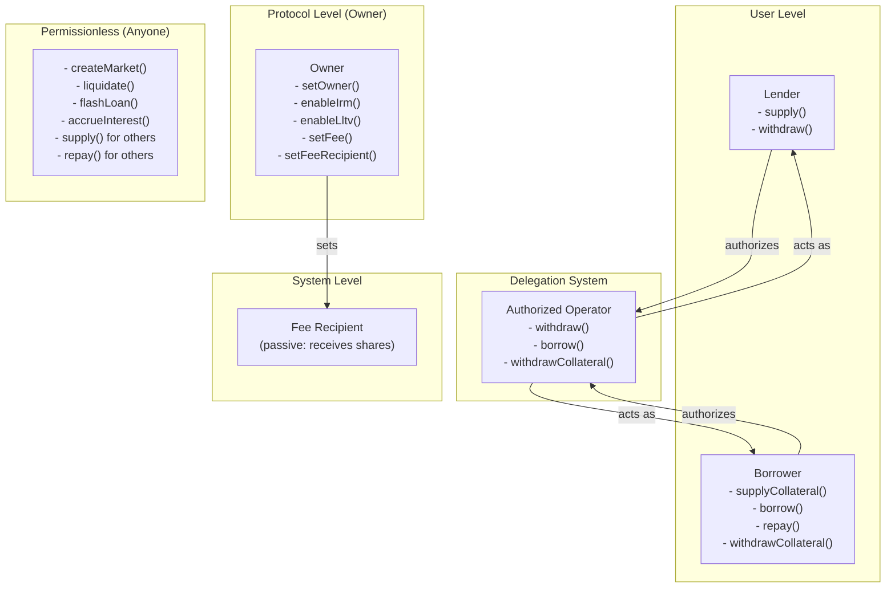
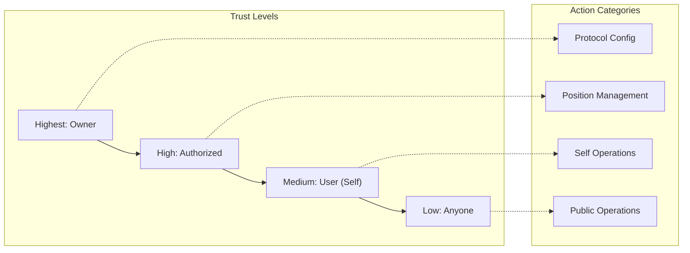
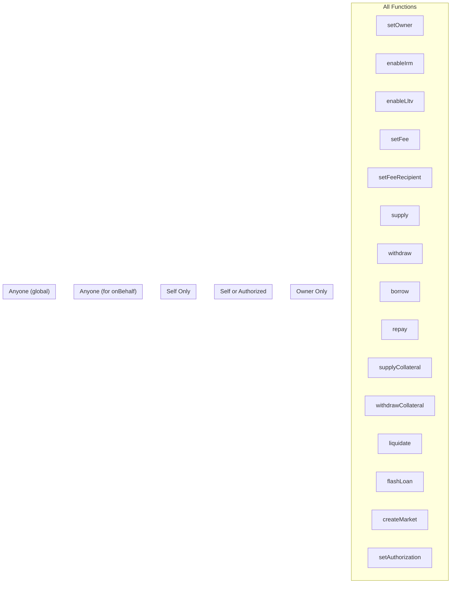

# Access Control Diagram

## Permission Hierarchy

```mermaid
graph TD
    subgraph Protocol["Protocol Level (Owner)"]
        Owner["Owner<br/>- setOwner()<br/>- enableIrm()<br/>- enableLltv()<br/>- setFee()<br/>- setFeeRecipient()"]
    end

    subgraph Users["User Level"]
        Lender["Lender<br/>- supply()<br/>- withdraw()"]
        Borrower["Borrower<br/>- supplyCollateral()<br/>- borrow()<br/>- repay()<br/>- withdrawCollateral()"]
    end

    subgraph Delegation["Delegation System"]
        Authorized["Authorized Operator<br/>- withdraw()<br/>- borrow()<br/>- withdrawCollateral()"]
    end

    subgraph System["System Level"]
        FeeRecipient["Fee Recipient<br/>(passive: receives shares)"]
    end

    subgraph Permissionless["Permissionless (Anyone)"]
        Anyone["- createMarket()<br/>- liquidate()<br/>- flashLoan()<br/>- accrueInterest()<br/>- supply() for others<br/>- repay() for others"]
    end

    Owner -->|sets| FeeRecipient
    Lender -->|authorizes| Authorized
    Borrower -->|authorizes| Authorized
    Authorized -->|acts as| Lender
    Authorized -->|acts as| Borrower
```

## Role Relationships

```mermaid
graph LR
    subgraph Trust["Trust Levels"]
        direction TB
        T1["Highest: Owner"]
        T2["High: Authorized"]
        T3["Medium: User (Self)"]
        T4["Low: Anyone"]
    end

    T1 --> T2 --> T3 --> T4

    subgraph Actions["Action Categories"]
        direction TB
        A1["Protocol Config"]
        A2["Position Management"]
        A3["Self Operations"]
        A4["Public Operations"]
    end

    T1 -.-> A1
    T2 -.-> A2
    T3 -.-> A3
    T4 -.-> A4
```

## Function Access by Role

```mermaid
graph TD
    subgraph Functions["All Functions"]
        F1[setOwner]
        F2[enableIrm]
        F3[enableLltv]
        F4[setFee]
        F5[setFeeRecipient]
        F6[supply]
        F7[withdraw]
        F8[borrow]
        F9[repay]
        F10[supplyCollateral]
        F11[withdrawCollateral]
        F12[liquidate]
        F13[flashLoan]
        F14[createMarket]
        F15[setAuthorization]
    end

    subgraph OwnerOnly["Owner Only"]
        F1
        F2
        F3
        F4
        F5
    end

    subgraph SelfOrAuth["Self or Authorized"]
        F7
        F8
        F11
    end

    subgraph SelfOnly["Self Only"]
        F15
    end

    subgraph AnyoneForBehalf["Anyone (for onBehalf)"]
        F6
        F9
        F10
    end

    subgraph AnyoneGlobal["Anyone (global)"]
        F12
        F13
        F14
    end
```
