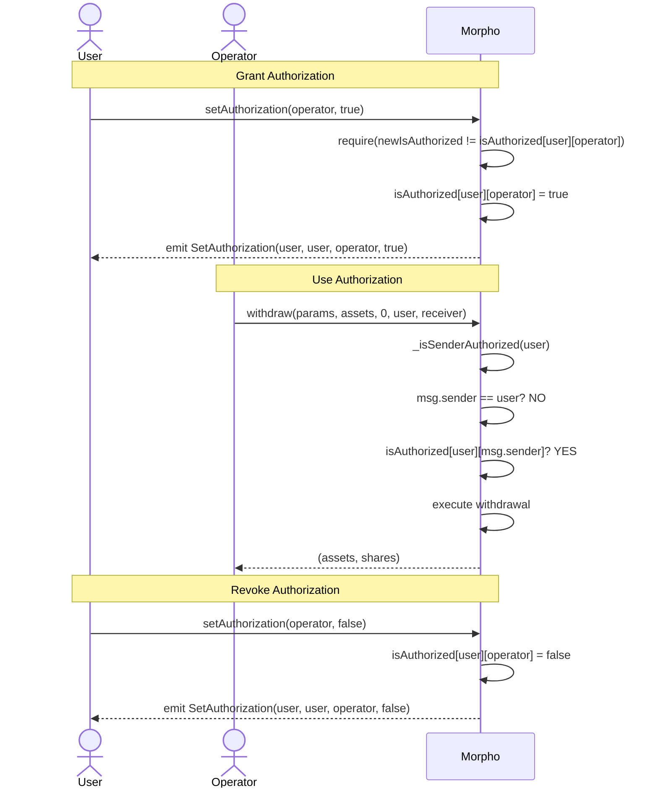
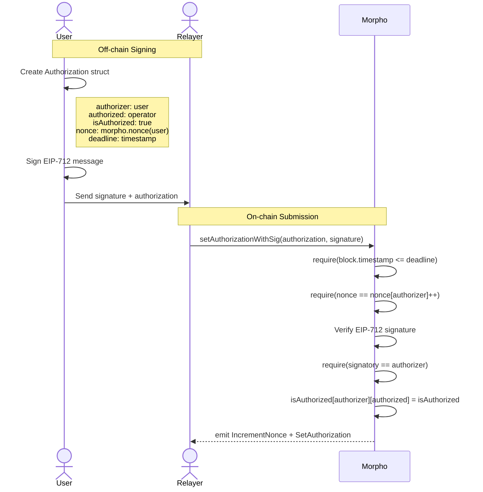
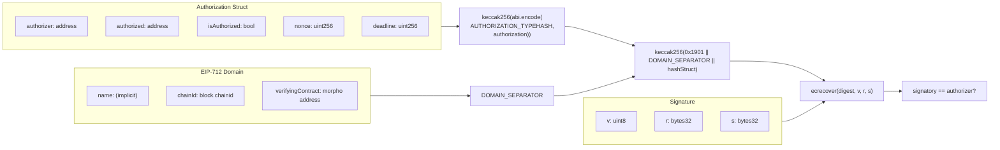
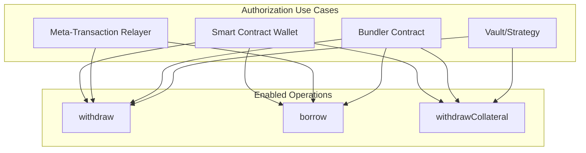
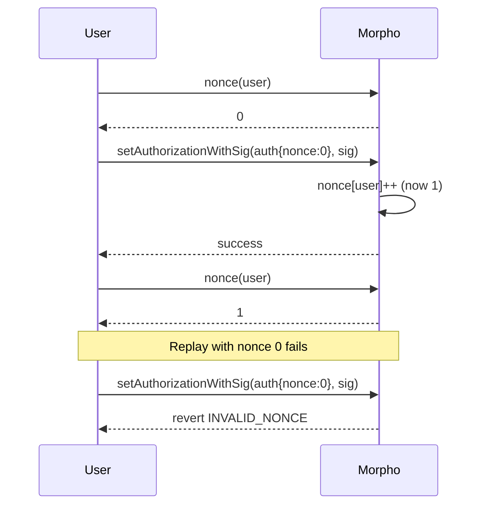

# Authorization Flow

## Direct Authorization



## Signature-Based Authorization (EIP-712)



## Authorization Check Flow

```mermaid
flowchart TD
    A[Function Call with onBehalf] --> B{msg.sender == onBehalf?}
    B -->|Yes| C[Authorized - Proceed]
    B -->|No| D{isAuthorized[onBehalf][msg.sender]?}
    D -->|Yes| C
    D -->|No| E[Revert: UNAUTHORIZED]
```

## EIP-712 Domain and Types



## Use Cases



## Nonce Management


