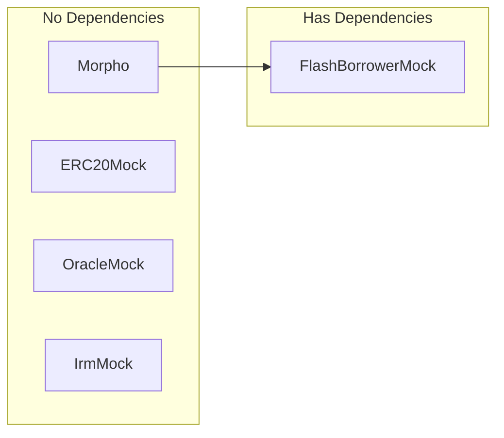
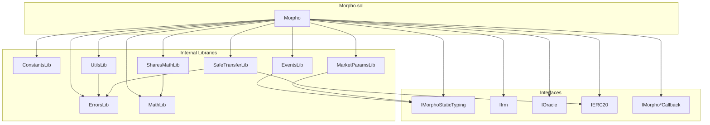
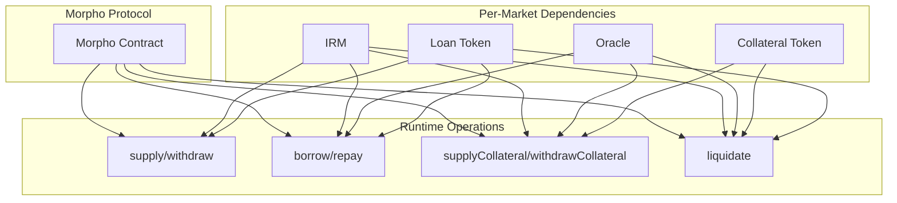

# Contract Dependencies

## Deployment Dependencies

```mermaid
graph LR
    subgraph Standalone["No Dependencies"]
        Morpho
        ERC20Mock
        OracleMock
        IrmMock
    end

    subgraph Dependent["Has Dependencies"]
        FlashBorrowerMock
    end

    Morpho --> FlashBorrowerMock
```

## Library Dependencies

```mermaid
graph TD
    subgraph Core["Morpho.sol"]
        M[Morpho]
    end

    subgraph Interfaces["Interfaces"]
        IMorpho[IMorphoStaticTyping]
        IIrm[IIrm]
        IOracle[IOracle]
        IERC20[IERC20]
        Callbacks[IMorpho*Callback]
    end

    subgraph Libraries["Internal Libraries"]
        Constants[ConstantsLib]
        Utils[UtilsLib]
        Errors[ErrorsLib]
        Events[EventsLib]
        Math[MathLib]
        SharesMath[SharesMathLib]
        MarketParams[MarketParamsLib]
        SafeTransfer[SafeTransferLib]
    end

    M --> IMorpho
    M --> IIrm
    M --> IOracle
    M --> IERC20
    M --> Callbacks

    M --> Constants
    M --> Utils
    M --> Errors
    M --> Events
    M --> Math
    M --> SharesMath
    M --> MarketParams
    M --> SafeTransfer

    Utils --> Errors
    SharesMath --> Math
    SafeTransfer --> IERC20
    SafeTransfer --> Errors
    Events --> IMorpho
    MarketParams --> IMorpho
```

## Runtime Dependencies

```mermaid
graph TD
    subgraph Protocol["Morpho Protocol"]
        Morpho[Morpho Contract]
    end

    subgraph Market["Per-Market Dependencies"]
        LoanToken[Loan Token]
        CollToken[Collateral Token]
        Oracle[Oracle]
        IRM[IRM]
    end

    subgraph Operations["Runtime Operations"]
        Supply[supply/withdraw]
        Borrow[borrow/repay]
        Collateral[supplyCollateral/withdrawCollateral]
        Liquidate[liquidate]
    end

    LoanToken --> Supply
    LoanToken --> Borrow
    LoanToken --> Liquidate

    CollToken --> Collateral
    CollToken --> Liquidate

    Oracle --> Borrow
    Oracle --> Collateral
    Oracle --> Liquidate

    IRM --> Supply
    IRM --> Borrow
    IRM --> Collateral
    IRM --> Liquidate

    Morpho --> Supply
    Morpho --> Borrow
    Morpho --> Collateral
    Morpho --> Liquidate
```
