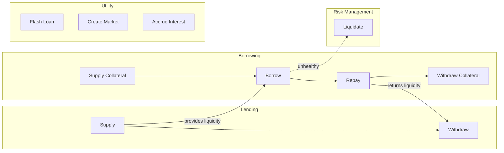

# Flow Quick Reference

## Overview Diagram



## Action Reference

| I want to... | Call | Prerequisites | Authorization |
|--------------|------|---------------|---------------|
| Earn yield | `supply(params, assets, 0, me, "")` | Approve tokens | None |
| Stop earning | `withdraw(params, assets, 0, me, me)` | Have shares, liquidity | Self or authorized |
| Earn for someone | `supply(params, assets, 0, them, "")` | Approve tokens | None |
| Get a loan | `supplyCollateral()` then `borrow()` | Approve collateral | Self or authorized |
| Increase loan | `borrow(params, assets, 0, me, me)` | Stay healthy | Self or authorized |
| Reduce loan | `repay(params, assets, 0, me, "")` | Approve loan tokens | None |
| Close loan | `repay(all)` then `withdrawCollateral()` | Approve tokens | Self or authorized |
| Liquidate | `liquidate(params, borrower, seized, 0, "")` | Target unhealthy | None |
| Create market | `createMarket(params)` | IRM & LLTV enabled | None |
| Flash loan | `flashLoan(token, assets, data)` | Implement callback | None |
| Authorize operator | `setAuthorization(op, true)` | None | Self |
| Revoke operator | `setAuthorization(op, false)` | None | Self |

---

## Function Signatures Quick Reference

### Lending
```solidity
// Supply: exactly one of assets/shares must be 0
supply(MarketParams memory params, uint256 assets, uint256 shares, address onBehalf, bytes calldata data)
    returns (uint256 assetsSupplied, uint256 sharesSupplied)

// Withdraw: exactly one of assets/shares must be 0
withdraw(MarketParams memory params, uint256 assets, uint256 shares, address onBehalf, address receiver)
    returns (uint256 assetsWithdrawn, uint256 sharesWithdrawn)
```

### Borrowing
```solidity
supplyCollateral(MarketParams memory params, uint256 assets, address onBehalf, bytes calldata data)

borrow(MarketParams memory params, uint256 assets, uint256 shares, address onBehalf, address receiver)
    returns (uint256 assetsBorrowed, uint256 sharesBorrowed)

repay(MarketParams memory params, uint256 assets, uint256 shares, address onBehalf, bytes calldata data)
    returns (uint256 assetsRepaid, uint256 sharesRepaid)

withdrawCollateral(MarketParams memory params, uint256 assets, address onBehalf, address receiver)
```

### Liquidation
```solidity
// Exactly one of seizedAssets/repaidShares must be 0
liquidate(MarketParams memory params, address borrower, uint256 seizedAssets, uint256 repaidShares, bytes calldata data)
    returns (uint256 seizedAssets, uint256 repaidAssets)
```

### Utility
```solidity
flashLoan(address token, uint256 assets, bytes calldata data)

createMarket(MarketParams memory params)

accrueInterest(MarketParams memory params)
```

### Authorization
```solidity
setAuthorization(address authorized, bool newIsAuthorized)

setAuthorizationWithSig(Authorization memory authorization, Signature calldata signature)
```

---

## Common Patterns

### Supply with Callback (JIT Liquidity)
```solidity
morpho.supply(params, assets, 0, me, abi.encode(someData));
// In callback: acquire tokens just-in-time
function onMorphoSupply(uint256 assets, bytes calldata data) external {
    // Get tokens from somewhere
    token.approve(address(morpho), assets);
}
```

### Liquidate with Flash Loan Pattern
```solidity
morpho.liquidate(params, borrower, seizedAssets, 0, abi.encode(data));
// In callback: use seized collateral to get repayment tokens
function onMorphoLiquidate(uint256 repaidAssets, bytes calldata data) external {
    // Swap collateral for loan tokens
    // Approve morpho to pull loan tokens
}
```

### Leverage Loop
```solidity
// 1. Supply collateral
morpho.supplyCollateral(params, initialCollateral, me, "");

// 2. Borrow
morpho.borrow(params, borrowAmount, 0, me, me);

// 3. Swap borrowed for more collateral
// 4. Supply more collateral
// 5. Repeat until desired leverage
```

### Flash Loan Leverage
```solidity
// Use flash loan to achieve leverage in one tx
morpho.flashLoan(loanToken, flashAmount, abi.encode(params, leverage));

function onMorphoFlashLoan(uint256 assets, bytes calldata data) external {
    // Swap for collateral
    // Supply collateral
    // Borrow to repay flash loan
}
```

---

## Health Check

```
isHealthy = (borrowedValue <= maxBorrowValue)

borrowedValue = borrowShares.toAssetsUp(totalBorrowAssets, totalBorrowShares)

maxBorrowValue = collateral * oraclePrice / ORACLE_PRICE_SCALE * lltv / WAD
```

---

## Key Constants

| Constant | Value | Usage |
|----------|-------|-------|
| WAD | 1e18 | Precision for rates, LLTV |
| ORACLE_PRICE_SCALE | 1e36 | Oracle price precision |
| MAX_FEE | 0.25e18 | Maximum protocol fee (25%) |
| MAX_LIQUIDATION_INCENTIVE_FACTOR | 1.15e18 | Max liquidation bonus (15%) |
| LIQUIDATION_CURSOR | 0.3e18 | LIF calculation param |
| VIRTUAL_SHARES | 1e6 | Inflation attack protection |
| VIRTUAL_ASSETS | 1 | Inflation attack protection |
