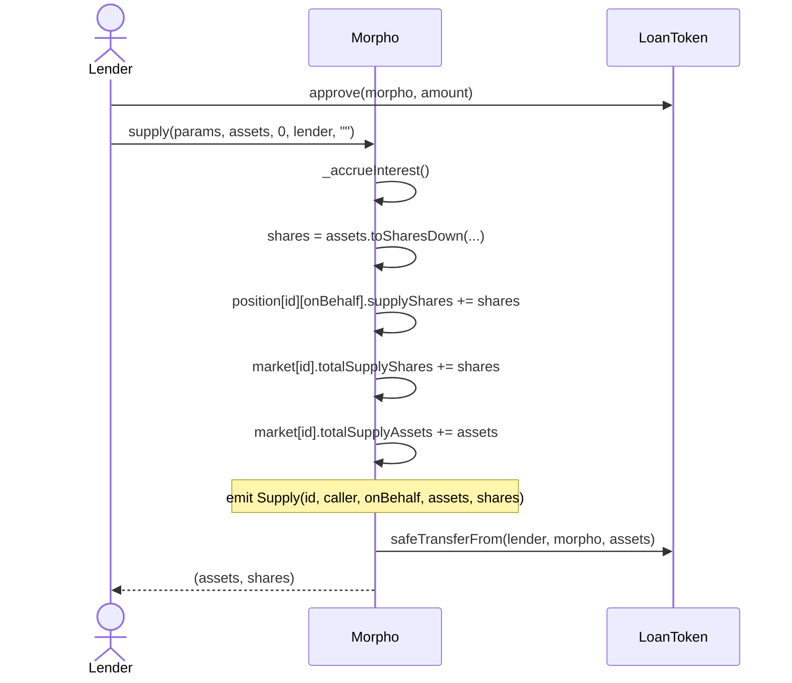
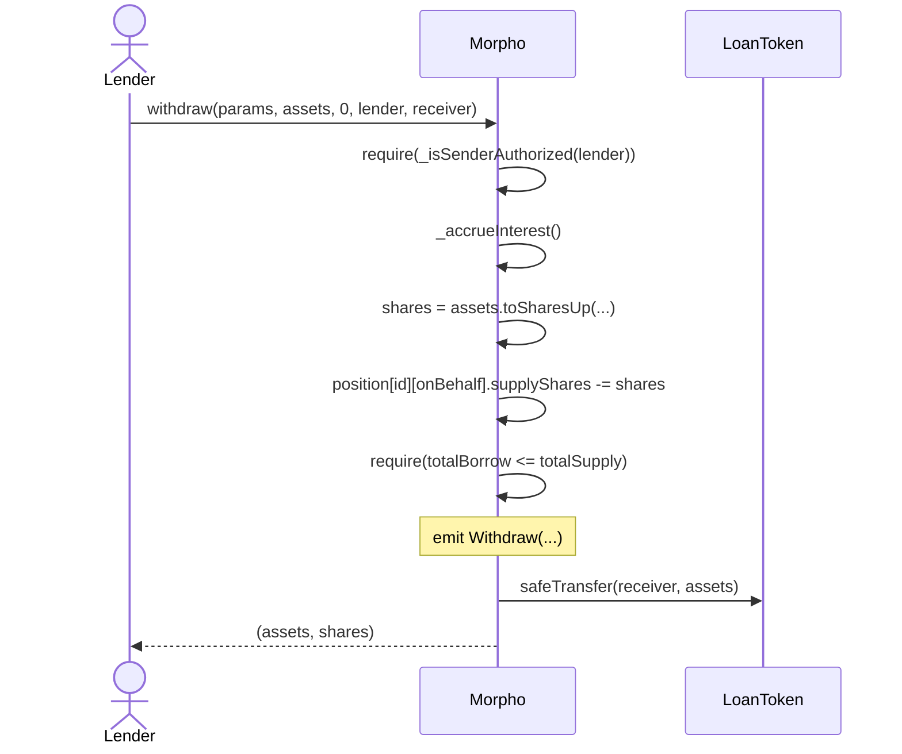
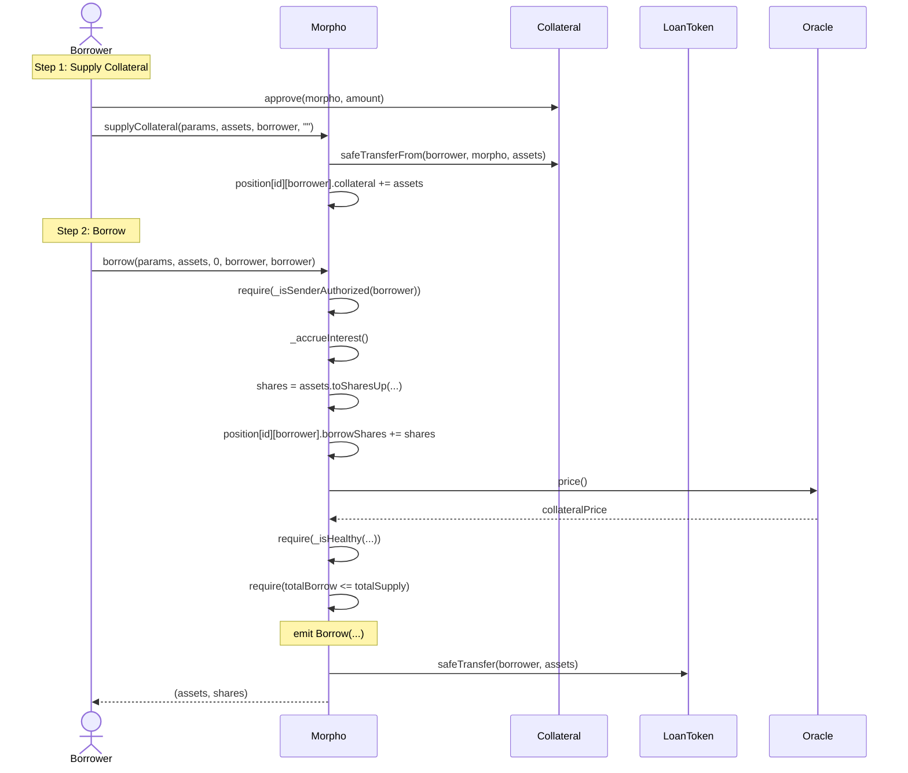
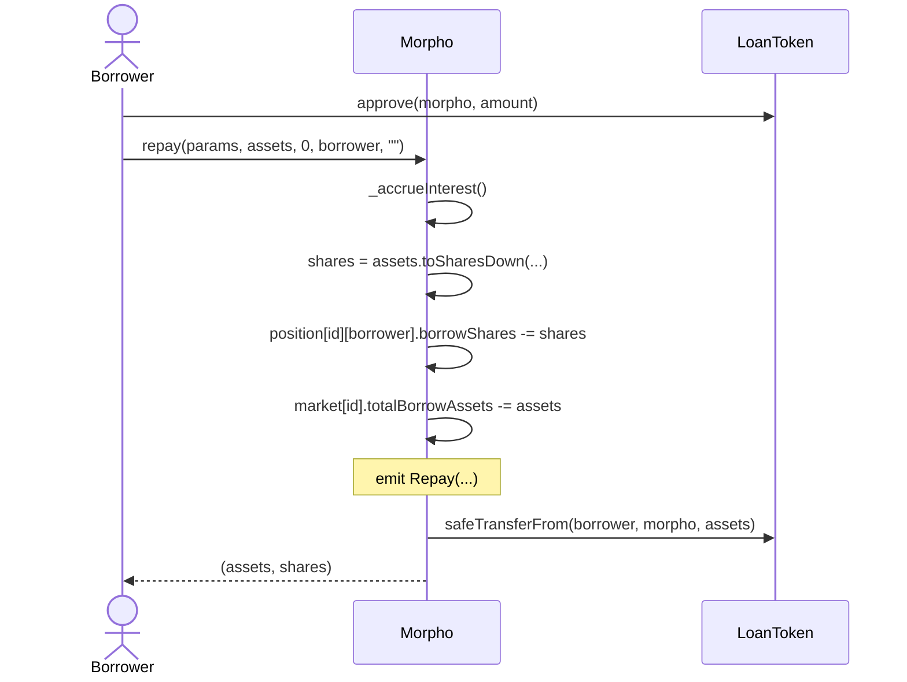
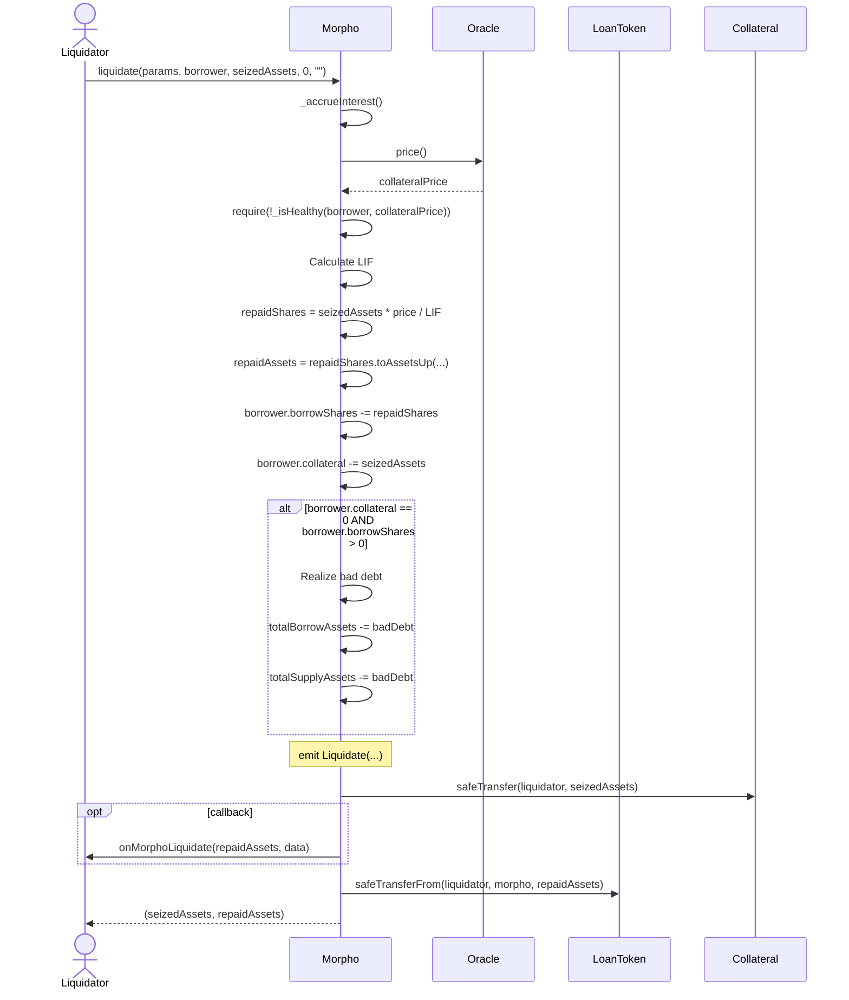
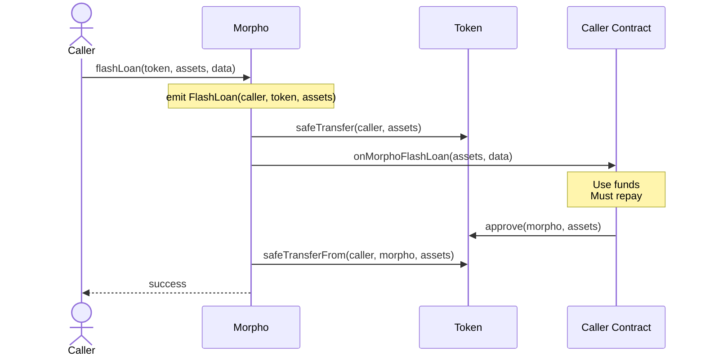
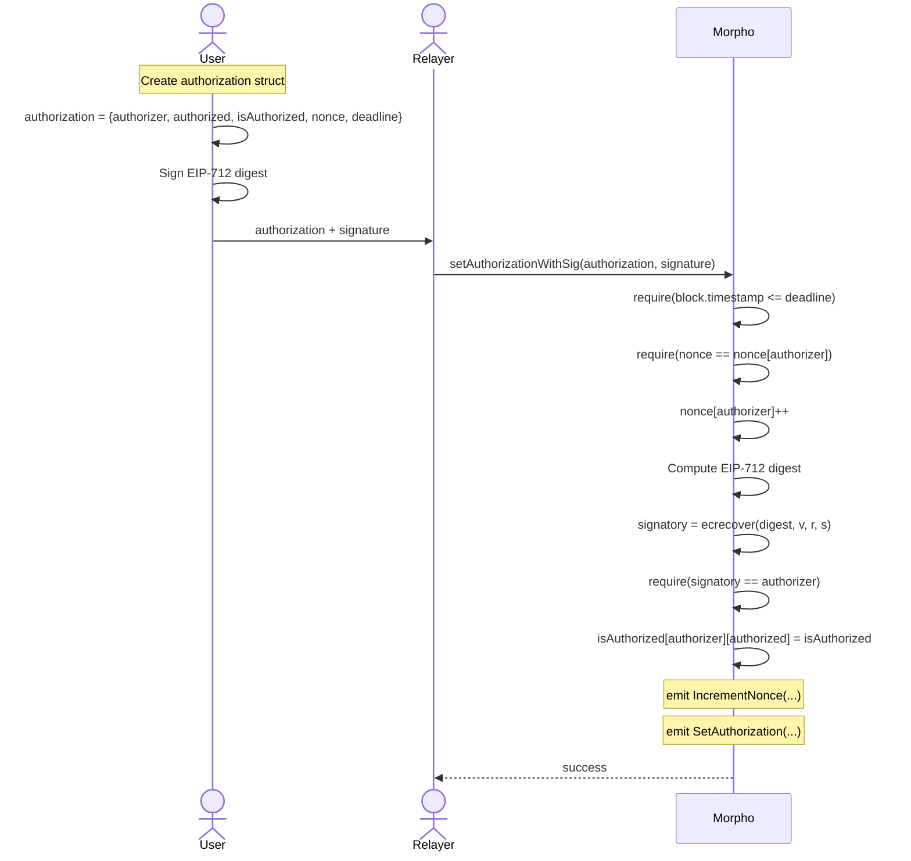
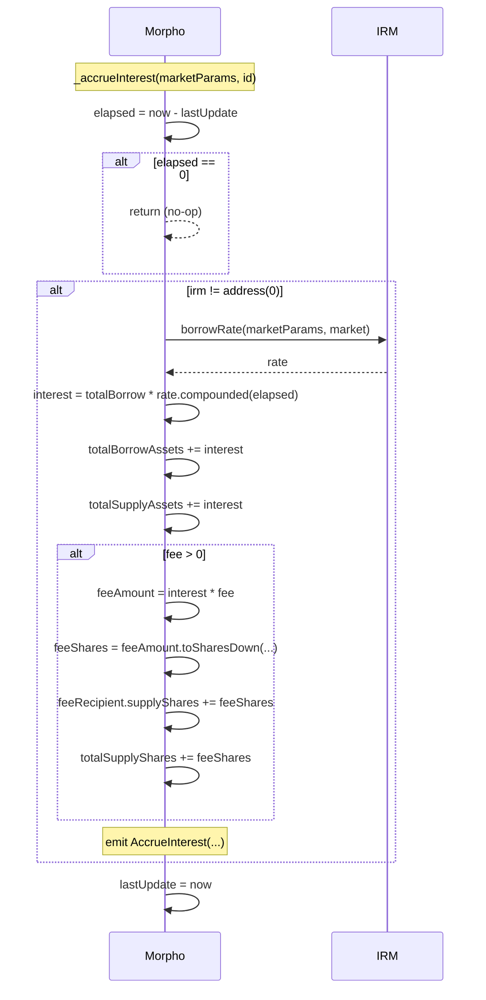

# Sequence Diagrams

## Supply Flow

## Withdraw Flow

## Borrow Flow

## Repay Flow

## Liquidation Flow

## Flash Loan Flow

## Authorization with Signature Flow

## Interest Accrual Flow

