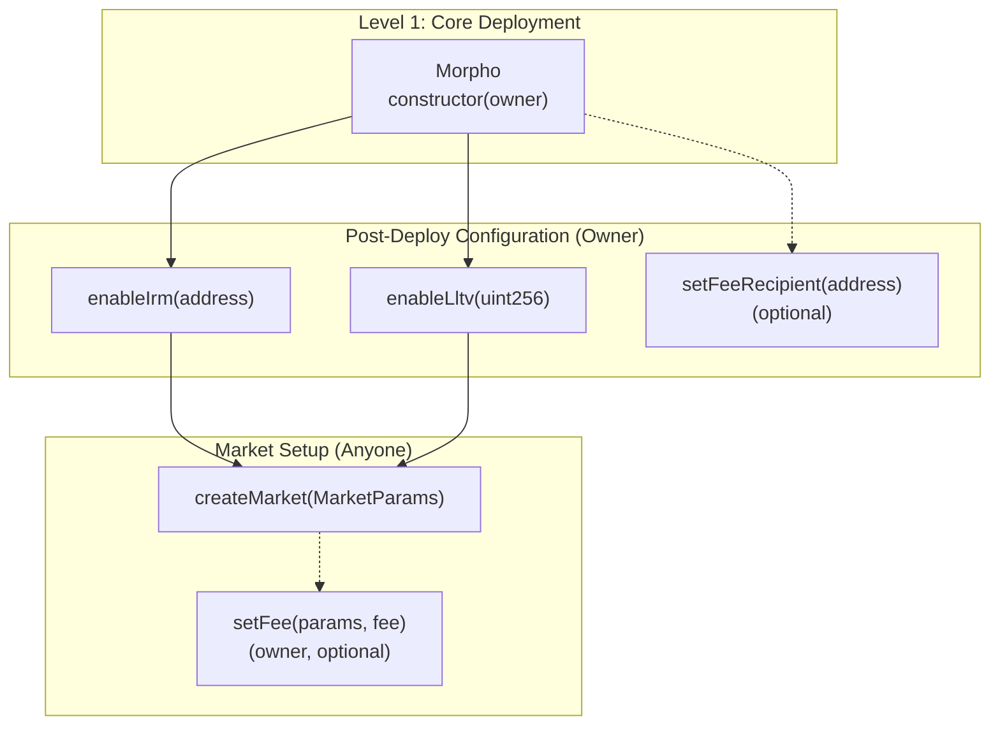
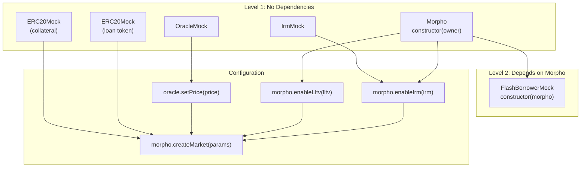
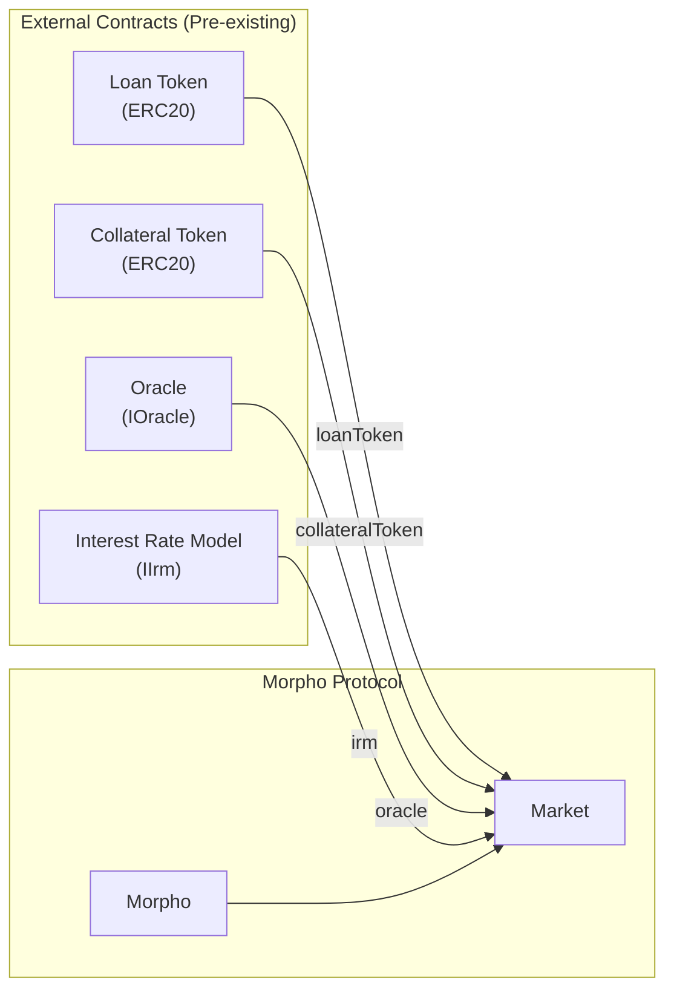

# Setup Flow Chart

## Deployment Flow

```mermaid
graph TD
    subgraph Level1["Level 1: Core Deployment"]
        Morpho["Morpho<br/>constructor(owner)"]
    end

    subgraph PostDeploy["Post-Deploy Configuration (Owner)"]
        EnableIRM["enableIrm(address)"]
        EnableLLTV["enableLltv(uint256)"]
        SetFeeRecipient["setFeeRecipient(address)<br/>(optional)"]
    end

    subgraph MarketSetup["Market Setup (Anyone)"]
        CreateMarket["createMarket(MarketParams)"]
        SetFee["setFee(params, fee)<br/>(owner, optional)"]
    end

    Morpho --> EnableIRM
    Morpho --> EnableLLTV
    Morpho -.-> SetFeeRecipient

    EnableIRM --> CreateMarket
    EnableLLTV --> CreateMarket

    CreateMarket -.-> SetFee
```

## Test Environment Flow

```mermaid
graph TD
    subgraph Level1["Level 1: No Dependencies"]
        Morpho["Morpho<br/>constructor(owner)"]
        LoanToken["ERC20Mock<br/>(loan token)"]
        CollateralToken["ERC20Mock<br/>(collateral)"]
        Oracle["OracleMock"]
        IRM["IrmMock"]
    end

    subgraph Level2["Level 2: Depends on Morpho"]
        FlashBorrower["FlashBorrowerMock<br/>constructor(morpho)"]
    end

    subgraph Config["Configuration"]
        SetPrice["oracle.setPrice(price)"]
        EnableIRM["morpho.enableIrm(irm)"]
        EnableLLTV["morpho.enableLltv(lltv)"]
        CreateMarket["morpho.createMarket(params)"]
    end

    Morpho --> FlashBorrower
    Morpho --> EnableIRM
    Morpho --> EnableLLTV

    Oracle --> SetPrice
    IRM --> EnableIRM

    EnableIRM --> CreateMarket
    EnableLLTV --> CreateMarket
    SetPrice --> CreateMarket
    LoanToken --> CreateMarket
    CollateralToken --> CreateMarket
```

## External Dependencies Flow

```mermaid
graph LR
    subgraph External["External Contracts (Pre-existing)"]
        ERC20_Loan["Loan Token<br/>(ERC20)"]
        ERC20_Coll["Collateral Token<br/>(ERC20)"]
        Oracle["Oracle<br/>(IOracle)"]
        IRM["Interest Rate Model<br/>(IIrm)"]
    end

    subgraph Morpho["Morpho Protocol"]
        M["Morpho"]
        Market["Market"]
    end

    ERC20_Loan -->|loanToken| Market
    ERC20_Coll -->|collateralToken| Market
    Oracle -->|oracle| Market
    IRM -->|irm| Market

    M --> Market
```
