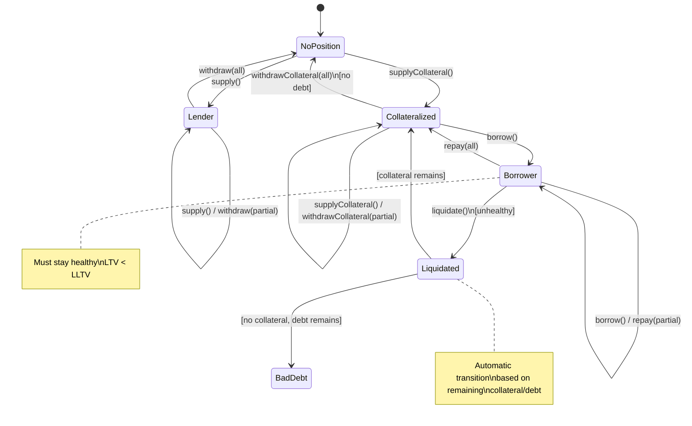
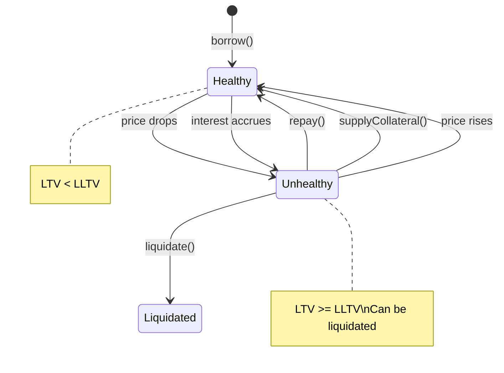
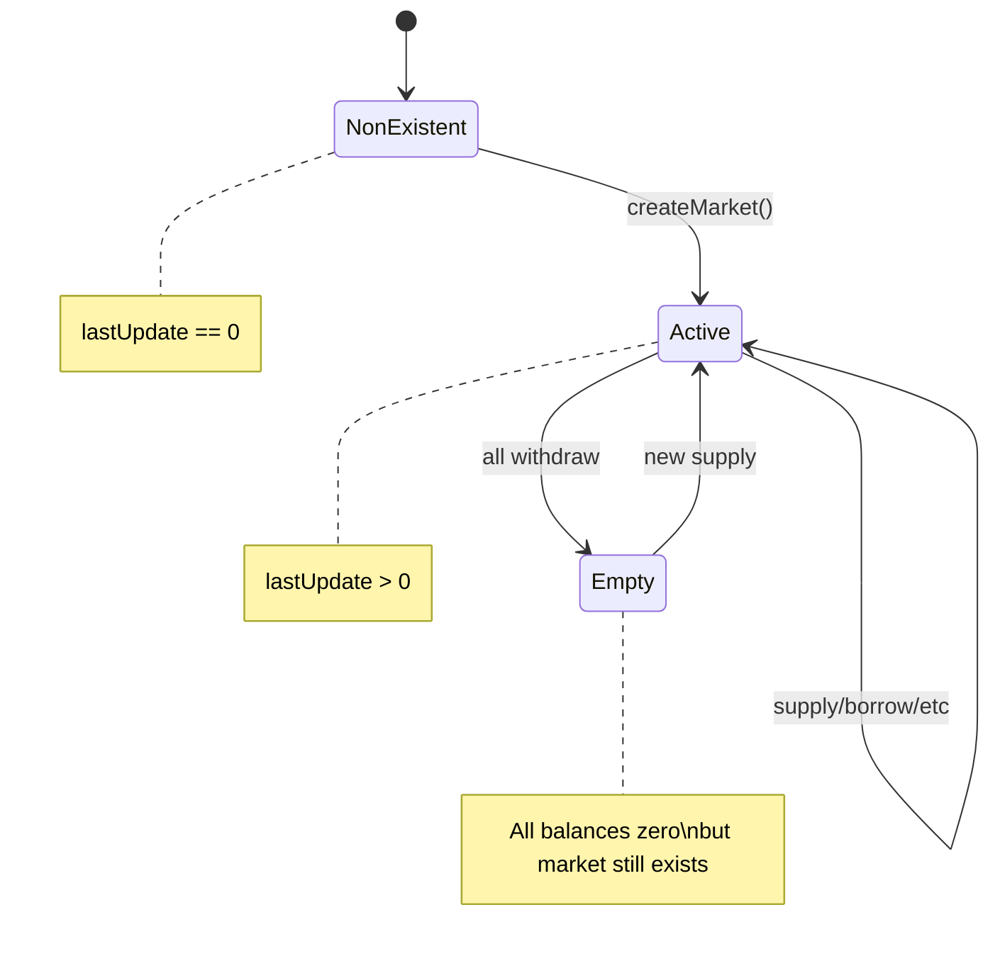
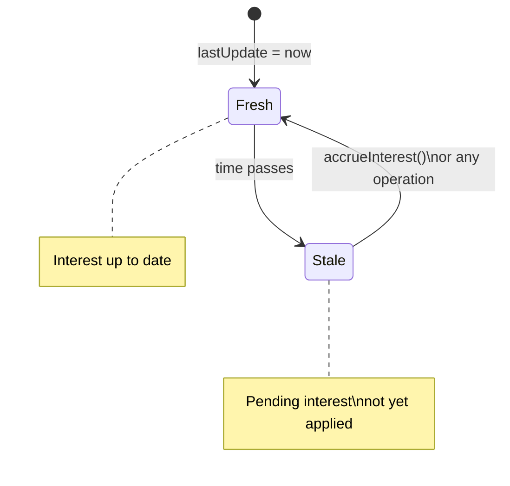
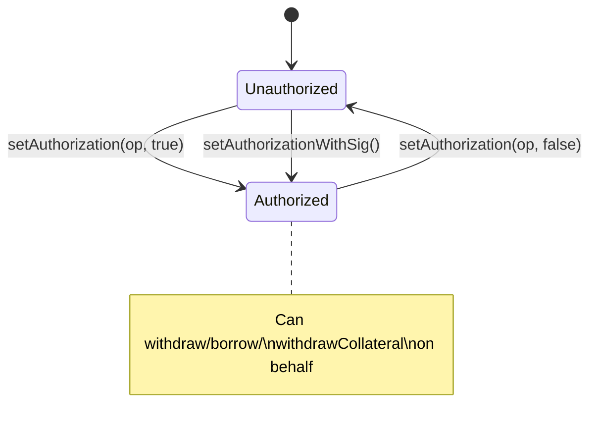

# State Machine Diagram

## Position States



## Health States (Borrowers Only)



## Market Lifecycle



## Combined User Journey

```mermaid
stateDiagram-v2
    direction LR

    state "User States" as user {
        [*] --> None

        state "Lender Path" as lender_path {
            None --> HasSupply: supply()
            HasSupply --> None: withdraw(all)
        }

        state "Borrower Path" as borrower_path {
            None --> HasCollateral: supplyCollateral()
            HasCollateral --> HasDebt: borrow()
            HasDebt --> HasCollateral: repay(all)
            HasCollateral --> None: withdrawCollateral(all)
        }

        state "Liquidation" as liq {
            HasDebt --> Liquidating: [unhealthy]
            Liquidating --> HasCollateral: [partial liq]
            Liquidating --> None: [full liq]
        }
    }
```

## Interest Accrual States



## Authorization States


