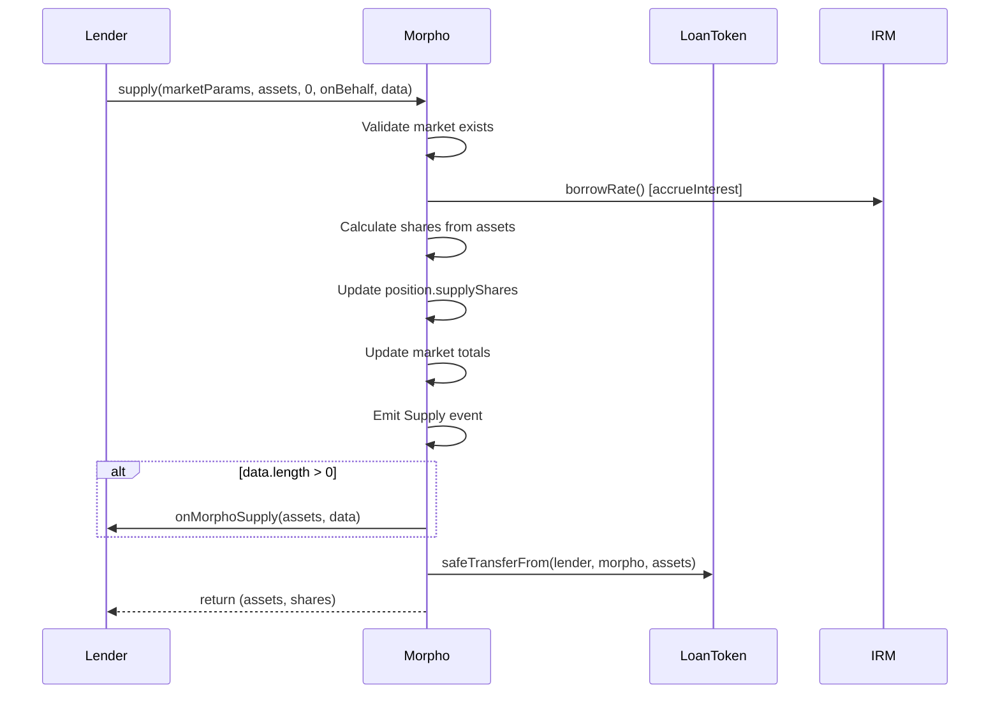
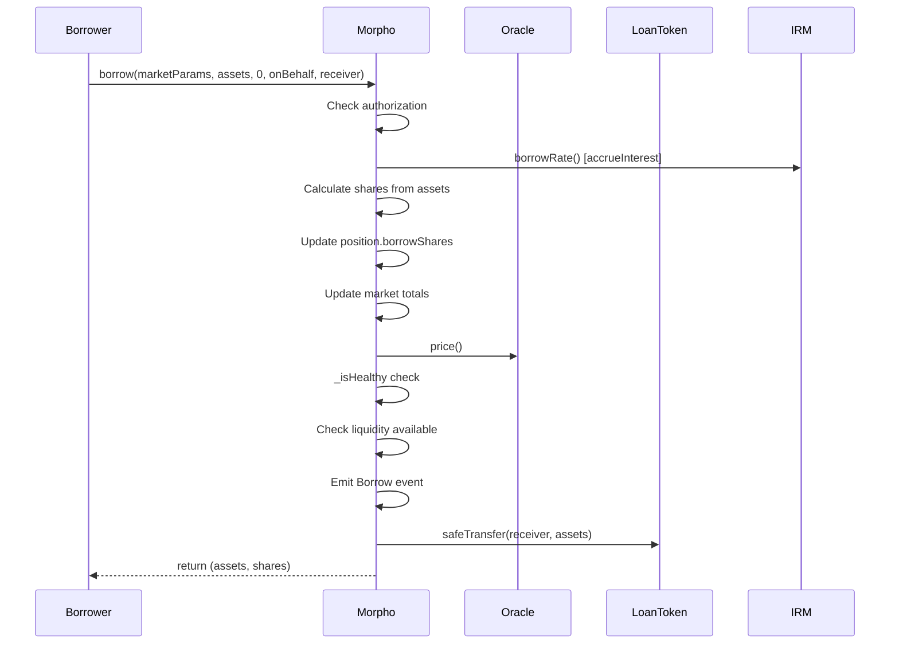
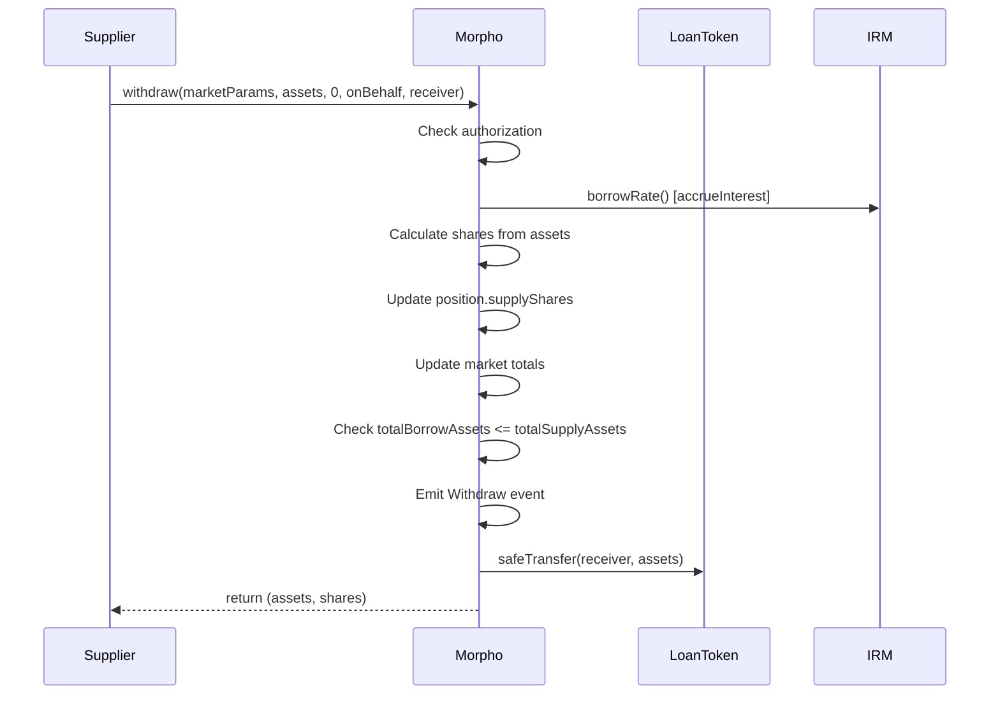
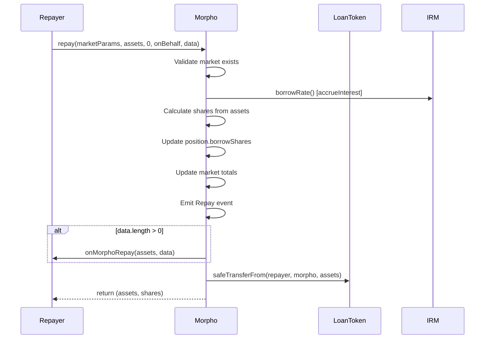
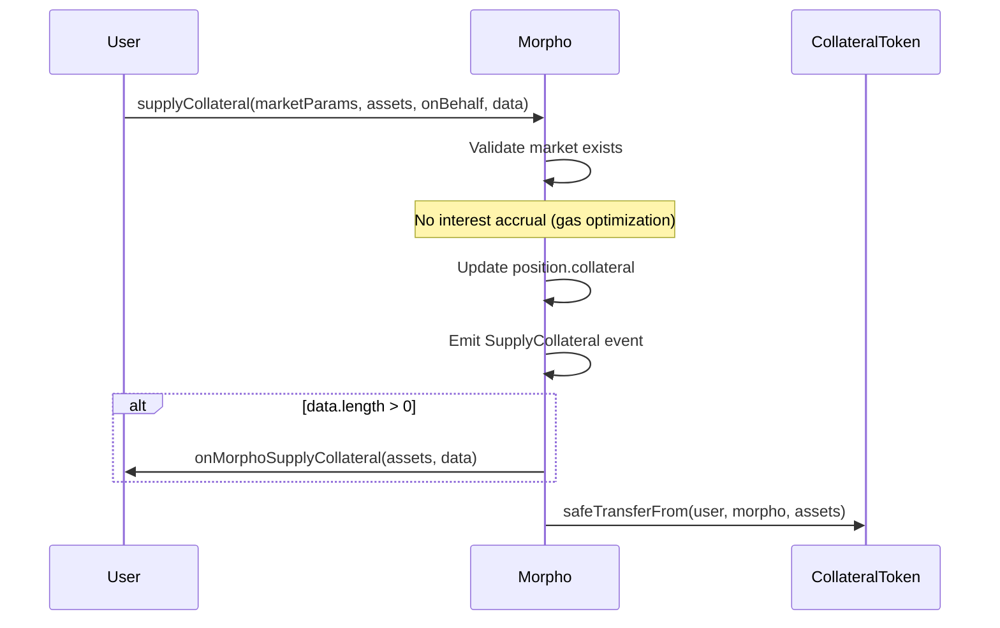
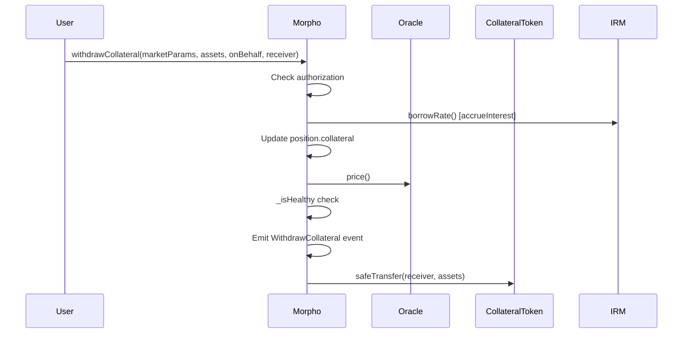
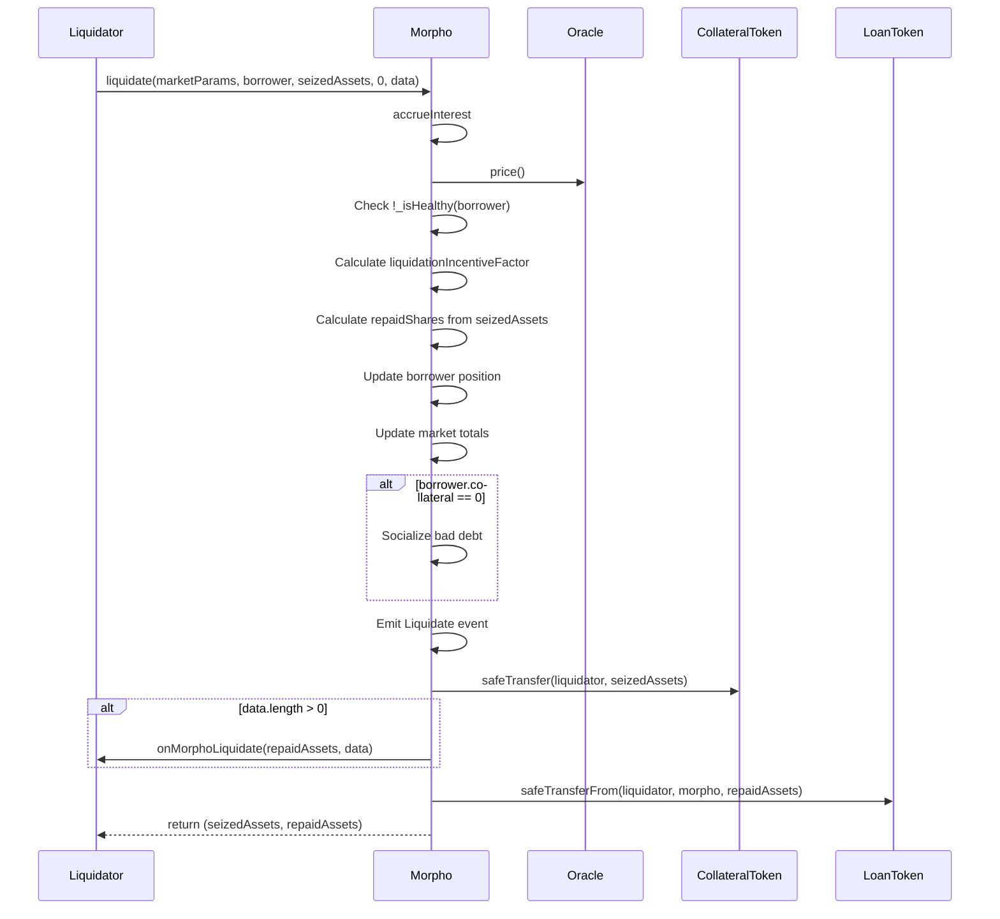
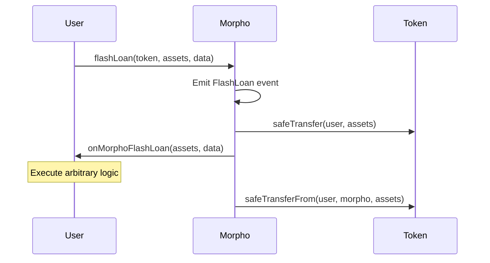

# First Phase Charts - Audit Analysis Template

## Prompt Instructions

Use this prompt to analyze any Solidity codebase for auditing purposes:

```markdown
Analyze this Solidity codebase for auditing purposes.

Generate:
1. Protocol Overview (type, architecture, entry points)
2. Setup Chart (deployment, initialization)
3. Role Chart (all privileged roles, permissions)
4. Usage Flows (all major user-facing operations)
5. Knowledge Base (state, invariants, external deps)

Use Mermaid diagrams. Include file:line references.
```

---

# Morpho Blue - Audit Charts & Knowledge Base

## 1. Protocol Overview

| Attribute | Value |
|-----------|-------|
| **Protocol Type** | Lending/Borrowing (Isolated Markets) |
| **Architecture** | Singleton contract with permissionless market creation |
| **Entry Point** | `src/Morpho.sol` |
| **Core Pattern** | Share-based accounting for supply/borrow positions |

**Description**: Morpho Blue is a minimalist, immutable lending protocol that allows permissionless market creation. Each market is defined by a unique combination of (loanToken, collateralToken, oracle, IRM, LLTV). Markets are isolated - no cross-collateralization.

---

## 2. Setup Chart

```mermaid
flowchart TD
    subgraph Deployment
        A[Deploy Morpho] -->|constructor: newOwner| B[Set owner]
        B --> C[DOMAIN_SEPARATOR computed]
    end

    subgraph Owner Configuration
        D[owner] -->|enableIrm| E[Whitelist IRM contract]
        D -->|enableLltv| F[Whitelist LLTV value]
        D -->|setFeeRecipient| G[Set fee recipient address]
    end

    subgraph Market Creation
        H[Anyone] -->|createMarket| I{Validate}
        I -->|IRM enabled?| J{Check}
        I -->|LLTV enabled?| J
        I -->|Market exists?| J
        J -->|Pass| K[Market created]
        K --> L[IRM.borrowRate called to initialize]
    end

    subgraph Post-Market Setup
        D -->|setFee| M[Set market fee up to 25%]
    end

    Deployment --> Owner Configuration
    Owner Configuration --> Market Creation
    Market Creation --> Post-Market Setup
```

**Deployment Sequence**:
1. Deploy `Morpho(newOwner)` - `src/Morpho.sol:75-82`
2. Owner calls `enableIrm(address)` - `src/Morpho.sol:104-110`
3. Owner calls `enableLltv(uint256)` - `src/Morpho.sol:113-120`
4. Owner calls `setFeeRecipient(address)` - `src/Morpho.sol:139-145`
5. Anyone calls `createMarket(MarketParams)` - `src/Morpho.sol:150-164`
6. Owner calls `setFee(marketParams, fee)` per market - `src/Morpho.sol:123-136`

---

## 3. Role Chart

```mermaid
flowchart TD
    subgraph Roles
        O[Owner]
        FR[Fee Recipient]
        AU[Authorized User]
        U[Any User]
        L[Liquidator]
    end

    subgraph Owner Powers
        O -->|setOwner| O1[Transfer ownership]
        O -->|enableIrm| O2[Whitelist IRM - IRREVERSIBLE]
        O -->|enableLltv| O3[Whitelist LLTV - IRREVERSIBLE]
        O -->|setFee| O4[Set market fee ≤25%]
        O -->|setFeeRecipient| O5[Change fee recipient]
    end

    subgraph Fee Recipient Powers
        FR -->|passive| FR1[Receives fee shares on interest accrual]
    end

    subgraph Authorized User Powers
        AU -->|withdraw| AU1[Withdraw on behalf of authorizer]
        AU -->|borrow| AU2[Borrow on behalf of authorizer]
        AU -->|withdrawCollateral| AU3[Withdraw collateral on behalf]
    end

    subgraph Any User Powers
        U -->|createMarket| U1[Create new market]
        U -->|supply| U2[Supply loan tokens]
        U -->|supplyCollateral| U3[Supply collateral]
        U -->|repay| U4[Repay debt for anyone]
        U -->|setAuthorization| U5[Authorize others]
        U -->|flashLoan| U6[Free flash loans]
    end

    subgraph Liquidator Powers
        L -->|liquidate| L1[Liquidate unhealthy positions]
    end
```



**Role Details**:

| Role | Set By | Permissions | Reference |
|------|--------|-------------|-----------|
| **Owner** | Constructor / `setOwner` | Enable IRMs, enable LLTVs, set fees, set fee recipient, transfer ownership | `src/Morpho.sol:54,87-145` |
| **Fee Recipient** | Owner via `setFeeRecipient` | Passive - accumulates supply shares from interest fees | `src/Morpho.sol:56,499` |
| **Authorized** | User via `setAuthorization` or `setAuthorizationWithSig` | Withdraw, borrow, withdrawCollateral on behalf of authorizer | `src/Morpho.sol:66,436-468` |

**Authorization Check**: `src/Morpho.sol:466-468`
```solidity
function _isSenderAuthorized(address onBehalf) internal view returns (bool) {
    return msg.sender == onBehalf || isAuthorized[onBehalf][msg.sender];
}
```

---

## 4. Usage Flows

### 4.1 Supply Flow (Lender)



**Reference**: `src/Morpho.sol:169-197`

### 4.2 Borrow Flow



**Reference**: `src/Morpho.sol:235-266`

### 4.3 Withdraw Flow



**Reference**: `src/Morpho.sol:200-230`

### 4.4 Repay Flow



**Reference**: `src/Morpho.sol:269-298`

### 4.5 Supply Collateral Flow



**Reference**: `src/Morpho.sol:303-320`

### 4.6 Withdraw Collateral Flow



**Reference**: `src/Morpho.sol:323-342`

### 4.7 Liquidation Flow



**Reference**: `src/Morpho.sol:347-416`

**Liquidation Incentive Formula**:
```
liquidationIncentiveFactor = min(
    MAX_LIQUIDATION_INCENTIVE_FACTOR,  // 1.15e18
    WAD / (WAD - LIQUIDATION_CURSOR * (WAD - lltv))
)
```

### 4.8 Flash Loan Flow



**Reference**: `src/Morpho.sol:421-431`

**Key Features**:
- Zero fee flash loans
- Access to entire contract balance (all markets + donations)
- Not ERC-3156 compliant but easily adaptable

---

## 5. Knowledge Base

### 5.1 Key Data Structures

| Struct | Fields | Purpose | Reference |
|--------|--------|---------|-----------|
| `MarketParams` | loanToken, collateralToken, oracle, irm, lltv | Defines a unique market | `src/interfaces/IMorpho.sol:6-12` |
| `Position` | supplyShares, borrowShares, collateral | User's position in a market | `src/interfaces/IMorpho.sol:16-20` |
| `Market` | totalSupplyAssets, totalSupplyShares, totalBorrowAssets, totalBorrowShares, lastUpdate, fee | Market state | `src/interfaces/IMorpho.sol:26-33` |
| `Authorization` | authorizer, authorized, isAuthorized, nonce, deadline | EIP-712 authorization data | `src/interfaces/IMorpho.sol:35-41` |
| `Signature` | v, r, s | ECDSA signature components | `src/interfaces/IMorpho.sol:43-47` |

### 5.2 Key State Variables

| Variable | Type | Purpose | Reference |
|----------|------|---------|-----------|
| `DOMAIN_SEPARATOR` | bytes32 (immutable) | EIP-712 domain separator | `src/Morpho.sol:49` |
| `owner` | address | Protocol admin | `src/Morpho.sol:54` |
| `feeRecipient` | address | Receives protocol fees | `src/Morpho.sol:56` |
| `position` | mapping(Id => mapping(address => Position)) | User positions per market | `src/Morpho.sol:58` |
| `market` | mapping(Id => Market) | Market state | `src/Morpho.sol:60` |
| `isIrmEnabled` | mapping(address => bool) | Whitelisted IRMs | `src/Morpho.sol:62` |
| `isLltvEnabled` | mapping(uint256 => bool) | Whitelisted LLTVs | `src/Morpho.sol:64` |
| `isAuthorized` | mapping(address => mapping(address => bool)) | Authorization mapping | `src/Morpho.sol:66` |
| `nonce` | mapping(address => uint256) | EIP-712 replay protection | `src/Morpho.sol:68` |
| `idToMarketParams` | mapping(Id => MarketParams) | Reverse lookup for L2 gas optimization | `src/Morpho.sol:70` |

### 5.3 Constants

| Constant | Value | Purpose | Reference |
|----------|-------|---------|-----------|
| `MAX_FEE` | 25% (0.25e18) | Maximum market fee | `src/libraries/ConstantsLib.sol:5` |
| `ORACLE_PRICE_SCALE` | 1e36 | Oracle price scaling | `src/libraries/ConstantsLib.sol:8` |
| `LIQUIDATION_CURSOR` | 30% (0.3e18) | Liquidation incentive parameter | `src/libraries/ConstantsLib.sol:11` |
| `MAX_LIQUIDATION_INCENTIVE_FACTOR` | 115% (1.15e18) | Max liquidation bonus | `src/libraries/ConstantsLib.sol:14` |
| `WAD` | 1e18 | Fixed-point math unit | `src/libraries/MathLib.sol` |

### 5.4 Key Invariants

1. **Liquidity Constraint**: `totalBorrowAssets <= totalSupplyAssets`
   - Checked in: `borrow()` at line 259, `withdraw()` at line 223

2. **Health Invariant**: For any borrower with `borrowShares > 0`:
   ```
   collateral * oraclePrice / ORACLE_PRICE_SCALE * lltv >= borrowedAssets
   ```
   - Checked in: `borrow()`, `withdrawCollateral()`, `liquidate()`

3. **Share Accounting**:
   - `sum(position[id][*].supplyShares) == market[id].totalSupplyShares`
   - `sum(position[id][*].borrowShares) == market[id].totalBorrowShares`

4. **Market Uniqueness**: `Id = keccak256(abi.encode(MarketParams))`
   - Same params always produce same Id

5. **Authorization Scope**: Authorized users can only perform actions that reduce value for the authorizer (withdraw, borrow, withdrawCollateral) - never increase obligations

6. **Fee Bound**: `market[id].fee <= MAX_FEE` (25%)

7. **LLTV Bound**: `lltv < WAD` (< 100%)

### 5.5 External Dependencies

| Dependency | Interface | Purpose | Trust Assumptions |
|------------|-----------|---------|-------------------|
| **Oracle** | `IOracle.price()` | Collateral pricing | Must return price scaled to 1e36, no instant manipulation allowing price drop > LLTV*LIF |
| **IRM** | `IIrm.borrowRate(MarketParams, Market)` | Interest rate calculation | Must not reenter, must not return extreme rates causing overflow |
| **Loan Token** | `IERC20` | Lending asset | No fee-on-transfer, no reentrance on transfer, standard balance changes |
| **Collateral Token** | `IERC20` | Collateral asset | Same assumptions as loan token |

### 5.6 Callback Interfaces

| Callback | Function | Called By | When | Reference |
|----------|----------|-----------|------|-----------|
| `IMorphoSupplyCallback` | `onMorphoSupply(uint256 assets, bytes data)` | `supply()` | If data.length > 0 | `src/Morpho.sol:192` |
| `IMorphoRepayCallback` | `onMorphoRepay(uint256 assets, bytes data)` | `repay()` | If data.length > 0 | `src/Morpho.sol:293` |
| `IMorphoSupplyCollateralCallback` | `onMorphoSupplyCollateral(uint256 assets, bytes data)` | `supplyCollateral()` | If data.length > 0 | `src/Morpho.sol:317` |
| `IMorphoLiquidateCallback` | `onMorphoLiquidate(uint256 repaidAssets, bytes data)` | `liquidate()` | If data.length > 0 | `src/Morpho.sol:411` |
| `IMorphoFlashLoanCallback` | `onMorphoFlashLoan(uint256 assets, bytes data)` | `flashLoan()` | Always | `src/Morpho.sol:428` |

### 5.7 Interest Accrual Mechanism

**Reference**: `src/Morpho.sol:482-508`

```
elapsed = block.timestamp - lastUpdate
borrowRate = IRM.borrowRate(marketParams, market)
interest = totalBorrowAssets * (e^(borrowRate * elapsed) - 1)  // Taylor approximation

totalBorrowAssets += interest
totalSupplyAssets += interest

if (fee > 0):
    feeAmount = interest * fee
    feeShares = toShares(feeAmount, totalSupplyAssets - feeAmount, totalSupplyShares)
    position[feeRecipient].supplyShares += feeShares
    totalSupplyShares += feeShares
```

### 5.8 Bad Debt Socialization

**Reference**: `src/Morpho.sol:389-402`

When a borrower is fully liquidated (collateral becomes 0) but still has debt:
```
badDebtShares = position[borrower].borrowShares
badDebtAssets = toAssets(badDebtShares)

totalBorrowAssets -= badDebtAssets
totalSupplyAssets -= badDebtAssets  // Socialized across all suppliers
totalBorrowShares -= badDebtShares
position[borrower].borrowShares = 0
```

---

## 6. File Structure

```
src/
├── Morpho.sol                          # Main contract (555 lines)
├── interfaces/
│   ├── IMorpho.sol                     # Main interface + structs
│   ├── IMorphoCallbacks.sol            # Callback interfaces
│   ├── IIrm.sol                        # Interest rate model interface
│   ├── IOracle.sol                     # Oracle interface
│   └── IERC20.sol                      # Token interface
├── libraries/
│   ├── ConstantsLib.sol                # Protocol constants
│   ├── MathLib.sol                     # Fixed-point math (WAD)
│   ├── SharesMathLib.sol               # Share/asset conversions
│   ├── UtilsLib.sol                    # Utility functions
│   ├── SafeTransferLib.sol             # Safe ERC20 transfers
│   ├── MarketParamsLib.sol             # MarketParams -> Id
│   ├── ErrorsLib.sol                   # Error messages
│   ├── EventsLib.sol                   # Event definitions
│   └── periphery/                      # Helper libs for integrators
│       ├── MorphoLib.sol
│       ├── MorphoBalancesLib.sol
│       └── MorphoStorageLib.sol
└── mocks/                              # Test mocks (out of scope)
```
