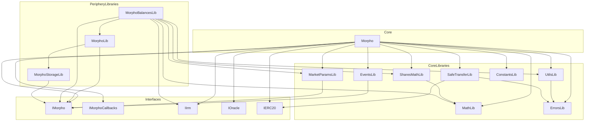

# Dependency Analysis

## Contract: Morpho
**File:** `src/Morpho.sol`

| Type | Dependency | Purpose |
|------|------------|---------|
| Import | IMorpho.sol | Types: Id, MarketParams, Position, Market, Authorization, Signature |
| Import | IMorphoCallbacks.sol | Callback interfaces for user interactions |
| Import | IIrm.sol | Interest rate model interface |
| Import | IERC20.sol | Token interface (empty, forces SafeTransferLib) |
| Import | IOracle.sol | Price oracle interface |
| Import | ConstantsLib.sol | Protocol constants (MAX_FEE, ORACLE_PRICE_SCALE, etc.) |
| Import | UtilsLib.sol | Utility functions |
| Import | EventsLib.sol | Event definitions |
| Import | ErrorsLib.sol | Error messages |
| Import | MathLib.sol | Fixed-point arithmetic |
| Import | SharesMathLib.sol | Share/asset conversion |
| Import | MarketParamsLib.sol | Market ID computation |
| Import | SafeTransferLib.sol | Safe token transfers |
| Inherits | IMorphoStaticTyping | Interface implementation |
| Uses | MathLib for uint128 | Arithmetic extensions |
| Uses | MathLib for uint256 | Arithmetic extensions |
| Uses | UtilsLib for uint256 | Utility extensions |
| Uses | SharesMathLib for uint256 | Share math extensions |
| Uses | SafeTransferLib for IERC20 | Safe transfer extensions |
| Uses | MarketParamsLib for MarketParams | ID computation |
| Runtime Call | IIrm | borrowRate() - interest calculation |
| Runtime Call | IOracle | price() - collateral pricing |
| Runtime Call | IERC20 | safeTransfer, safeTransferFrom |
| Runtime Call | IMorphoSupplyCallback | onMorphoSupply() |
| Runtime Call | IMorphoRepayCallback | onMorphoRepay() |
| Runtime Call | IMorphoLiquidateCallback | onMorphoLiquidate() |
| Runtime Call | IMorphoSupplyCollateralCallback | onMorphoSupplyCollateral() |
| Runtime Call | IMorphoFlashLoanCallback | onMorphoFlashLoan() |
| Constructor | address newOwner | Initial owner |

## Library Dependencies

### SharesMathLib
| Type | Dependency | Purpose |
|------|------------|---------|
| Import | MathLib.sol | mulDivDown, mulDivUp |
| Uses | MathLib for uint256 | Math operations |

### UtilsLib
| Type | Dependency | Purpose |
|------|------------|---------|
| Import | ErrorsLib.sol | Error messages for toUint128 |

### SafeTransferLib
| Type | Dependency | Purpose |
|------|------------|---------|
| Import | IERC20.sol | Token interface |
| Import | ErrorsLib.sol | Error messages |

### EventsLib
| Type | Dependency | Purpose |
|------|------------|---------|
| Import | IMorpho.sol | Id, MarketParams types |

### MarketParamsLib
| Type | Dependency | Purpose |
|------|------------|---------|
| Import | IMorpho.sol | Id, MarketParams types |

### Periphery: MorphoLib
| Type | Dependency | Purpose |
|------|------------|---------|
| Import | IMorpho.sol | Id type |
| Import | MorphoStorageLib.sol | Slot computation |

### Periphery: MorphoBalancesLib
| Type | Dependency | Purpose |
|------|------------|---------|
| Import | IMorpho.sol, IIrm.sol | Types, IRM interface |
| Import | MathLib, UtilsLib, MorphoLib, SharesMathLib, MarketParamsLib | Various |

## Dependency Graph

## External Runtime Dependencies

| Contract | External Call | When Called |
|----------|--------------|-------------|
| Morpho | IIrm.borrowRate() | _accrueInterest(), createMarket() |
| Morpho | IOracle.price() | _isHealthy(), liquidate() |
| Morpho | IERC20.transfer/transferFrom | All token movements |
| Morpho | Callback interfaces | When data.length > 0 |
