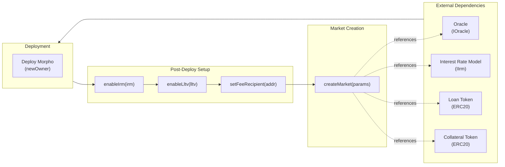
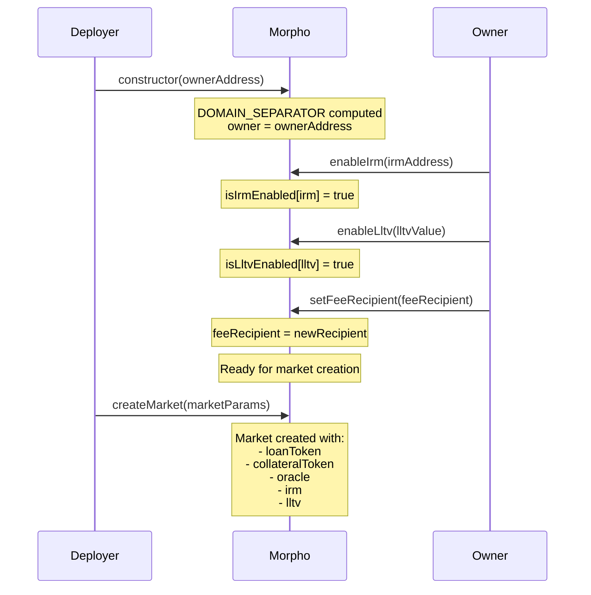

# Deployment Pattern

## Deployment Order

### Phase 1: External Dependencies (Not Part of Protocol)
- **Oracle** - Implements IOracle, returns price scaled by 1e36
- **IRM** - Implements IIrm, returns borrow rate per second scaled by WAD
- **Loan Token** - ERC20 compliant token
- **Collateral Token** - ERC20 compliant token

### Phase 2: Protocol Contract
- **Morpho** - Single deployable contract (singleton pattern)

## Constructor Parameters

### Morpho
| Parameter | Type | Source | Validation |
|-----------|------|--------|------------|
| newOwner | address | Deployer decides | `!= address(0)` |

**Immutables set in constructor:**
| Variable | Value |
|----------|-------|
| DOMAIN_SEPARATOR | `keccak256(abi.encode(DOMAIN_TYPEHASH, block.chainid, address(this)))` |

## Post-Deployment Setup

| Step | Contract | Function | Purpose | Caller |
|------|----------|----------|---------|--------|
| 1 | Morpho | enableIrm(address irm) | Whitelist IRM for market creation | Owner |
| 2 | Morpho | enableLltv(uint256 lltv) | Whitelist LLTV for market creation | Owner |
| 3 | Morpho | setFeeRecipient(address) | Set protocol fee recipient (optional) | Owner |
| 4 | Morpho | createMarket(MarketParams) | Create lending market | Anyone |
| 5 | Morpho | setFee(MarketParams, fee) | Set market fee (optional, max 25%) | Owner |

**Notes:**
- IRMs and LLTVs cannot be disabled once enabled
- Multiple IRMs and LLTVs can be enabled
- Markets are created permissionlessly (by anyone) once IRM and LLTV are enabled
- Fee recipient can be zero address (fees will be lost)

## Deployment Diagram



## Deployment Sequence



## Market Creation Requirements

For `createMarket(MarketParams)` to succeed:
1. `marketParams.irm` must be enabled via `enableIrm()`
2. `marketParams.lltv` must be enabled via `enableLltv()` and < WAD (100%)
3. Market with same params must not already exist

## Configuration Constraints

| Parameter | Constraint | Error |
|-----------|-----------|-------|
| newOwner (constructor) | `!= address(0)` | ZERO_ADDRESS |
| irm (enableIrm) | Not already enabled | ALREADY_SET |
| lltv (enableLltv) | Not already enabled, < WAD | ALREADY_SET, MAX_LLTV_EXCEEDED |
| fee (setFee) | <= MAX_FEE (25%), market exists | MAX_FEE_EXCEEDED, MARKET_NOT_CREATED |

## Test Setup Reference

From `test/recon/Setup.sol`:
```solidity
function setup() internal virtual override {
    morpho = new Morpho(); // TODO: Add parameters here
}
```

Typical test setup pattern:
1. Deploy mock tokens (ERC20Mock)
2. Deploy mock oracle (OracleMock)
3. Deploy mock IRM (IrmMock)
4. Deploy Morpho(ownerAddress)
5. Enable IRM and LLTV
6. Create market
