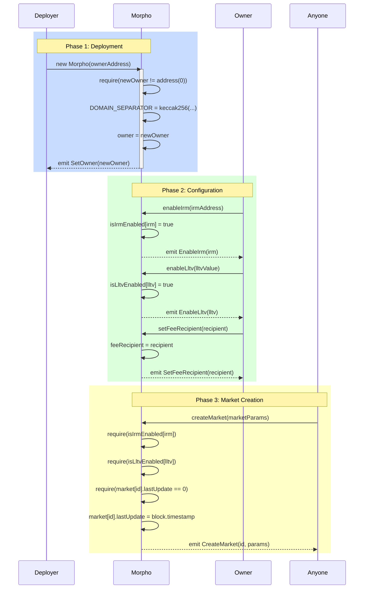
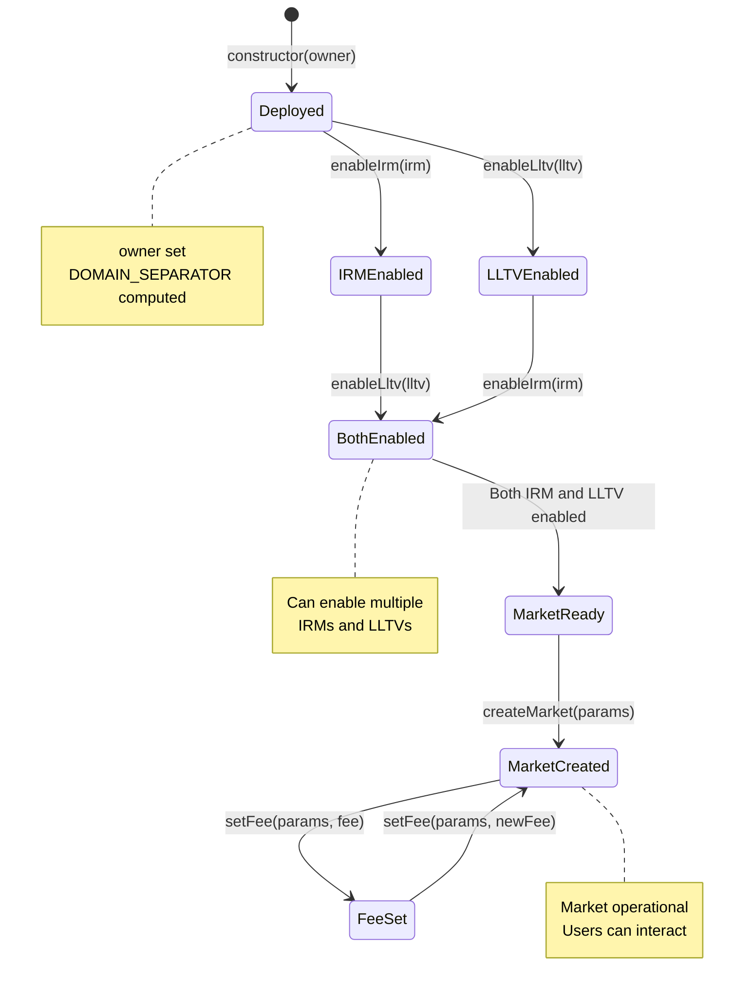
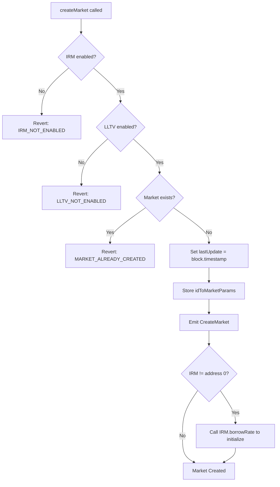
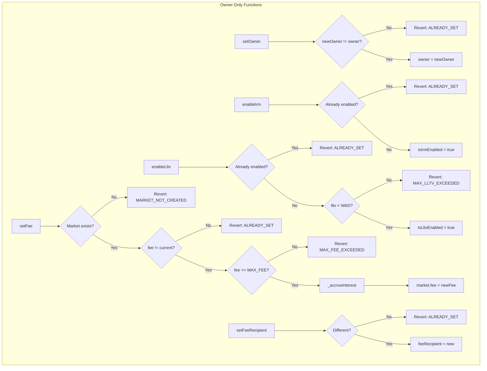
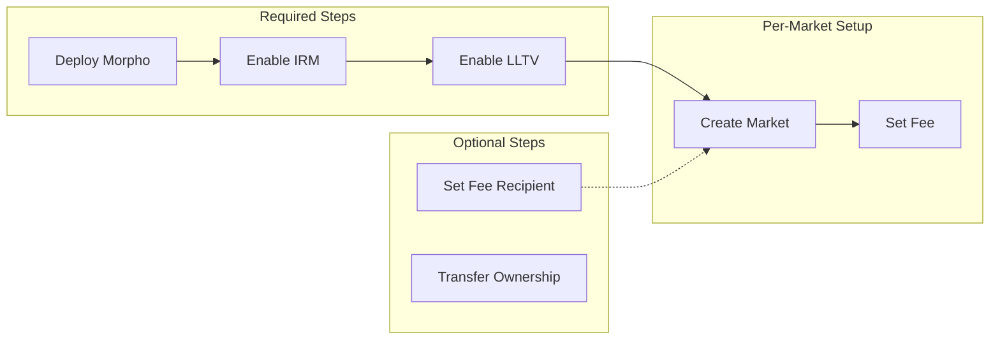

# Setup Charts

## Deployment Sequence

```mermaid
sequenceDiagram
    participant Deployer
    participant Morpho
    participant Owner
    participant Anyone

    rect rgb(200, 220, 255)
        Note over Deployer,Morpho: Phase 1: Deployment
        Deployer->>Morpho: new Morpho(ownerAddress)
        activate Morpho
        Morpho->>Morpho: require(newOwner != address(0))
        Morpho->>Morpho: DOMAIN_SEPARATOR = keccak256(...)
        Morpho->>Morpho: owner = newOwner
        Morpho-->>Deployer: emit SetOwner(newOwner)
        deactivate Morpho
    end

    rect rgb(220, 255, 220)
        Note over Owner,Morpho: Phase 2: Configuration
        Owner->>Morpho: enableIrm(irmAddress)
        Morpho->>Morpho: isIrmEnabled[irm] = true
        Morpho-->>Owner: emit EnableIrm(irm)

        Owner->>Morpho: enableLltv(lltvValue)
        Morpho->>Morpho: isLltvEnabled[lltv] = true
        Morpho-->>Owner: emit EnableLltv(lltv)

        Owner->>Morpho: setFeeRecipient(recipient)
        Morpho->>Morpho: feeRecipient = recipient
        Morpho-->>Owner: emit SetFeeRecipient(recipient)
    end

    rect rgb(255, 255, 200)
        Note over Anyone,Morpho: Phase 3: Market Creation
        Anyone->>Morpho: createMarket(marketParams)
        Morpho->>Morpho: require(isIrmEnabled[irm])
        Morpho->>Morpho: require(isLltvEnabled[lltv])
        Morpho->>Morpho: require(market[id].lastUpdate == 0)
        Morpho->>Morpho: market[id].lastUpdate = block.timestamp
        Morpho-->>Anyone: emit CreateMarket(id, params)
    end
```

## Configuration State Machine

```mermaid
stateDiagram-v2
    [*] --> Deployed: constructor(owner)

    Deployed --> IRMEnabled: enableIrm(irm)
    Deployed --> LLTVEnabled: enableLltv(lltv)

    IRMEnabled --> BothEnabled: enableLltv(lltv)
    LLTVEnabled --> BothEnabled: enableIrm(irm)

    BothEnabled --> MarketReady: Both IRM and LLTV enabled

    MarketReady --> MarketCreated: createMarket(params)

    MarketCreated --> FeeSet: setFee(params, fee)
    FeeSet --> MarketCreated: setFee(params, newFee)

    note right of Deployed: owner set<br/>DOMAIN_SEPARATOR computed
    note right of BothEnabled: Can enable multiple<br/>IRMs and LLTVs
    note right of MarketCreated: Market operational<br/>Users can interact
```

## Market Creation Flow

```mermaid
flowchart TD
    A[createMarket called] --> B{IRM enabled?}
    B -->|No| C[Revert: IRM_NOT_ENABLED]
    B -->|Yes| D{LLTV enabled?}
    D -->|No| E[Revert: LLTV_NOT_ENABLED]
    D -->|Yes| F{Market exists?}
    F -->|Yes| G[Revert: MARKET_ALREADY_CREATED]
    F -->|No| H[Set lastUpdate = block.timestamp]
    H --> I[Store idToMarketParams]
    I --> J[Emit CreateMarket]
    J --> K{IRM != address 0?}
    K -->|Yes| L[Call IRM.borrowRate to initialize]
    K -->|No| M[Market Created]
    L --> M
```

## Owner Functions Flow

```mermaid
flowchart TD
    subgraph OnlyOwner["Owner-Only Functions"]
        SO[setOwner] --> SO1{newOwner != owner?}
        SO1 -->|No| SO2[Revert: ALREADY_SET]
        SO1 -->|Yes| SO3[owner = newOwner]

        EI[enableIrm] --> EI1{Already enabled?}
        EI1 -->|Yes| EI2[Revert: ALREADY_SET]
        EI1 -->|No| EI3[isIrmEnabled = true]

        EL[enableLltv] --> EL1{Already enabled?}
        EL1 -->|Yes| EL2[Revert: ALREADY_SET]
        EL1 -->|No| EL3{lltv < WAD?}
        EL3 -->|No| EL4[Revert: MAX_LLTV_EXCEEDED]
        EL3 -->|Yes| EL5[isLltvEnabled = true]

        SF[setFee] --> SF1{Market exists?}
        SF1 -->|No| SF2[Revert: MARKET_NOT_CREATED]
        SF1 -->|Yes| SF3{fee != current?}
        SF3 -->|No| SF4[Revert: ALREADY_SET]
        SF3 -->|Yes| SF5{fee <= MAX_FEE?}
        SF5 -->|No| SF6[Revert: MAX_FEE_EXCEEDED]
        SF5 -->|Yes| SF7[_accrueInterest]
        SF7 --> SF8[market.fee = newFee]

        SFR[setFeeRecipient] --> SFR1{Different?}
        SFR1 -->|No| SFR2[Revert: ALREADY_SET]
        SFR1 -->|Yes| SFR3[feeRecipient = new]
    end
```

## Protocol Initialization Checklist

```mermaid
flowchart LR
    subgraph Required["Required Steps"]
        R1[Deploy Morpho] --> R2[Enable IRM]
        R2 --> R3[Enable LLTV]
    end

    subgraph Optional["Optional Steps"]
        O1[Set Fee Recipient]
        O2[Transfer Ownership]
    end

    subgraph PerMarket["Per-Market Setup"]
        PM1[Create Market] --> PM2[Set Fee]
    end

    R3 --> PM1
    O1 -.-> PM1
```
