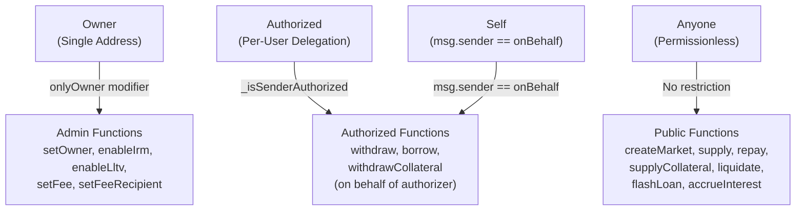
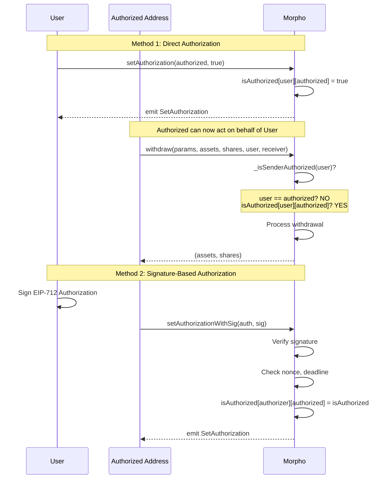
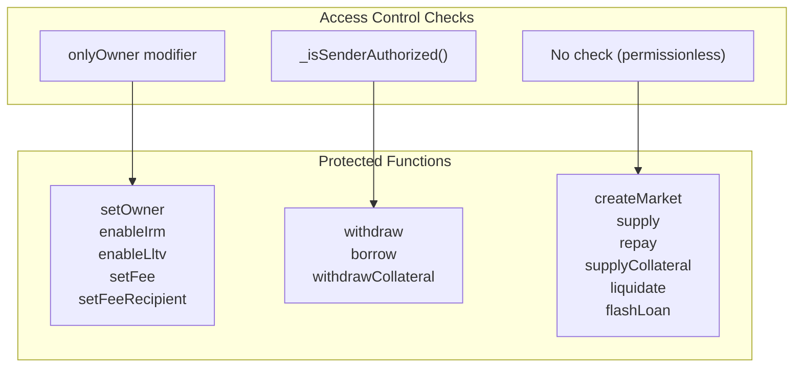

# Role Charts

## Roles Identified

| Role | Description | How Assigned | Can Be Revoked |
|------|-------------|--------------|----------------|
| Owner | Protocol administrator | constructor, setOwner() | Yes (transfer only) |
| Authorized | Delegated manager for specific user | setAuthorization(), setAuthorizationWithSig() | Yes |
| Anyone | Permissionless access | N/A | N/A |

## Permission Matrix

| Function | Owner | Authorized | Self | Anyone |
|----------|-------|------------|------|--------|
| **Admin Functions** |
| setOwner | ✅ | ❌ | ❌ | ❌ |
| enableIrm | ✅ | ❌ | ❌ | ❌ |
| enableLltv | ✅ | ❌ | ❌ | ❌ |
| setFee | ✅ | ❌ | ❌ | ❌ |
| setFeeRecipient | ✅ | ❌ | ❌ | ❌ |
| **Market Functions** |
| createMarket | ✅ | ✅ | ✅ | ✅ |
| supply | ✅ | ✅ | ✅ | ✅ |
| withdraw | ✅ | ✅ (for authorizer) | ✅ | ❌ |
| borrow | ✅ | ✅ (for authorizer) | ✅ | ❌ |
| repay | ✅ | ✅ | ✅ | ✅ |
| supplyCollateral | ✅ | ✅ | ✅ | ✅ |
| withdrawCollateral | ✅ | ✅ (for authorizer) | ✅ | ❌ |
| liquidate | ✅ | ✅ | ✅ | ✅ |
| flashLoan | ✅ | ✅ | ✅ | ✅ |
| **Authorization** |
| setAuthorization | ✅ | ✅ | ✅ | ✅ |
| setAuthorizationWithSig | ✅ | ✅ | ✅ | ✅ |
| **View** |
| accrueInterest | ✅ | ✅ | ✅ | ✅ |
| extSloads | ✅ | ✅ | ✅ | ✅ |

## Authorization Logic

```solidity
function _isSenderAuthorized(address onBehalf) internal view returns (bool) {
    return msg.sender == onBehalf || isAuthorized[onBehalf][msg.sender];
}
```

Functions requiring authorization for `onBehalf`:
- `withdraw(onBehalf)` - withdraw from another's supply position
- `borrow(onBehalf)` - borrow against another's collateral
- `withdrawCollateral(onBehalf)` - withdraw another's collateral

## Role Hierarchy



## Authorization Flow



## Access Control Summary



## EIP-712 Authorization Struct

```solidity
struct Authorization {
    address authorizer;    // The address granting authorization
    address authorized;    // The address receiving authorization
    bool isAuthorized;     // True to grant, false to revoke
    uint256 nonce;         // Prevents replay attacks
    uint256 deadline;      // Signature expiration timestamp
}
```

## Key Security Notes

1. **Owner Powers:**
   - Can enable IRMs and LLTVs (cannot disable)
   - Can set fees up to 25%
   - Can transfer ownership (no two-step)
   - Cannot steal user funds directly

2. **Authorization Risks:**
   - Authorized address can drain authorizer's positions
   - Revocation is immediate via `setAuthorization(addr, false)`
   - Signatures have deadlines for time-limited authorization

3. **Permissionless Functions:**
   - Anyone can supply on behalf of any address
   - Anyone can repay on behalf of any address
   - Anyone can liquidate unhealthy positions
