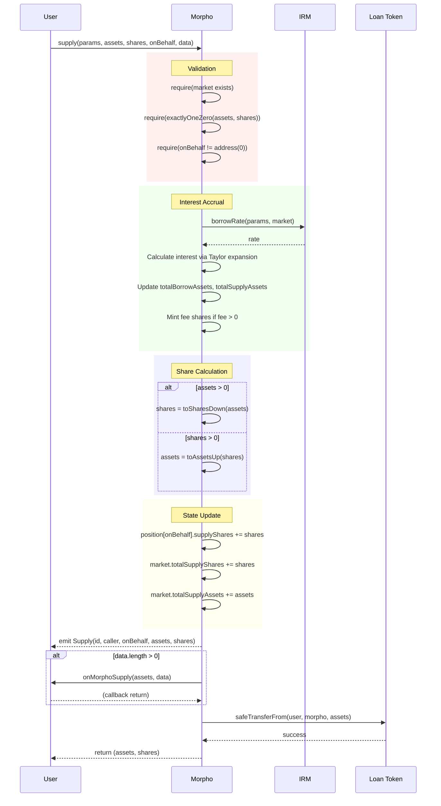
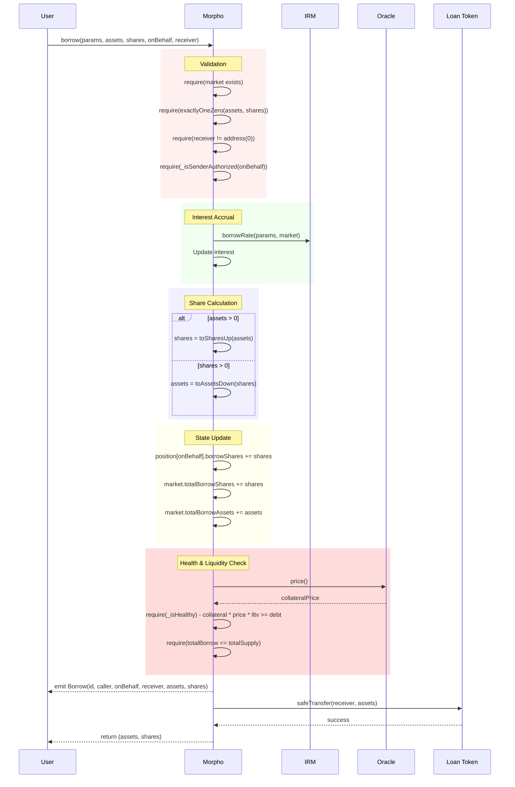
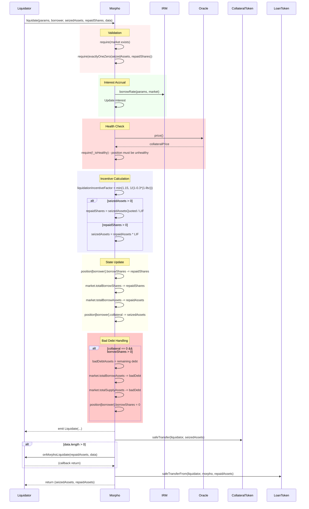
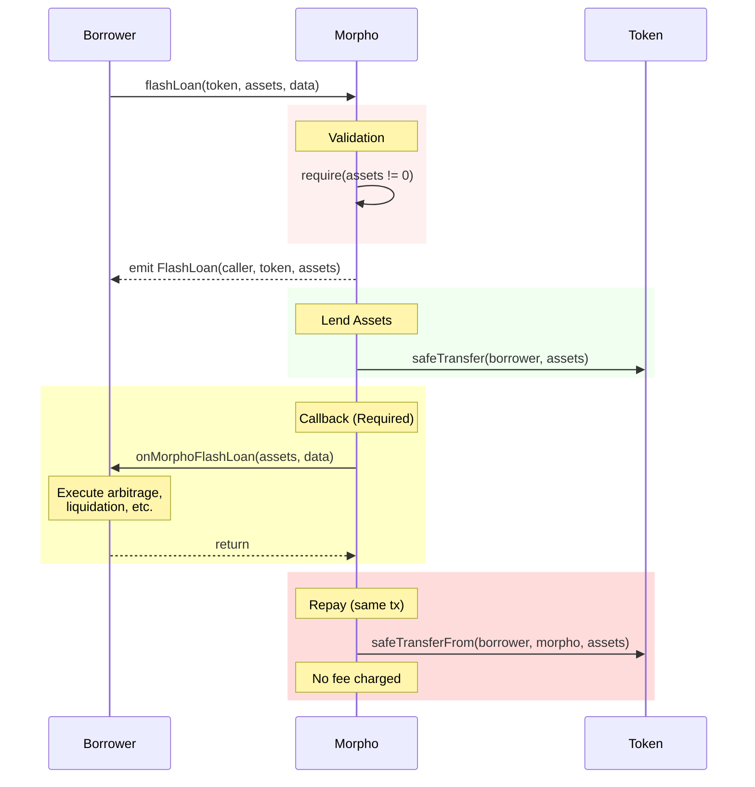

# Usage Flows

## Overview

| Operation | Function | Actors | Authorization | Callback |
|-----------|----------|--------|---------------|----------|
| Supply | supply() | Anyone | None | Optional |
| Withdraw | withdraw() | Self/Authorized | Required | None |
| Borrow | borrow() | Self/Authorized | Required | None |
| Repay | repay() | Anyone | None | Optional |
| Supply Collateral | supplyCollateral() | Anyone | None | Optional |
| Withdraw Collateral | withdrawCollateral() | Self/Authorized | Required | None |
| Liquidate | liquidate() | Anyone | None | Optional |
| Flash Loan | flashLoan() | Anyone | None | Required |

## Supply Flow

## Borrow Flow

## Liquidation Flow

## Flash Loan Flow

## State Changes Summary

| Operation | User State Changes | Market State Changes |
|-----------|-------------------|---------------------|
| supply | +supplyShares | +totalSupplyShares, +totalSupplyAssets |
| withdraw | -supplyShares | -totalSupplyShares, -totalSupplyAssets |
| borrow | +borrowShares | +totalBorrowShares, +totalBorrowAssets |
| repay | -borrowShares | -totalBorrowShares, -totalBorrowAssets |
| supplyCollateral | +collateral | (none) |
| withdrawCollateral | -collateral | (none) |
| liquidate | -borrowShares, -collateral | -totalBorrowShares, -totalBorrowAssets, possibly -totalSupplyAssets (bad debt) |
| flashLoan | (none) | (none) |
| accrueInterest | +feeRecipient.supplyShares (if fee) | +totalBorrowAssets, +totalSupplyAssets, +totalSupplyShares (fee) |

## Rounding Directions

| Operation | Conversion | Rounding | Favors |
|-----------|-----------|----------|--------|
| supply (assets→shares) | toSharesDown | Down | Protocol |
| supply (shares→assets) | toAssetsUp | Up | Protocol |
| withdraw (assets→shares) | toSharesUp | Up | Protocol |
| withdraw (shares→assets) | toAssetsDown | Down | Protocol |
| borrow (assets→shares) | toSharesUp | Up | Protocol |
| borrow (shares→assets) | toAssetsDown | Down | Protocol |
| repay (assets→shares) | toSharesDown | Down | Protocol |
| repay (shares→assets) | toAssetsUp | Up | Protocol |
| _isHealthy (borrowed) | toAssetsUp | Up | Protocol |
| liquidate | Various | Protocol-favorable | Protocol |
