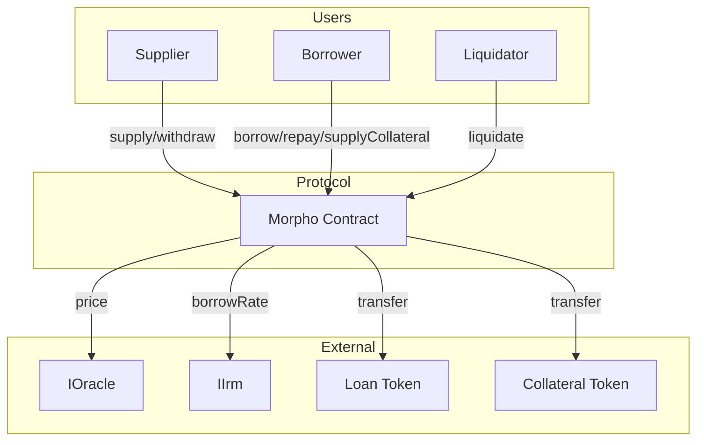
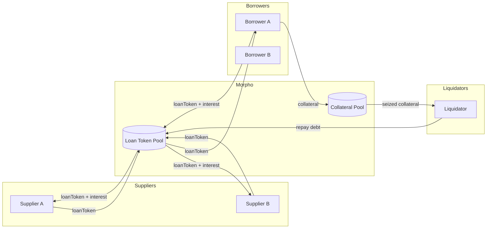

# System Overview

## What is Morpho Blue?

Morpho Blue is a noncustodial lending protocol that provides permissionless market creation with oracle-agnostic pricing, enabling isolated lending markets with customizable risk parameters (LLTV, IRM, oracle) in a single immutable contract.

## Core Mechanics

- **Isolated Markets**: Each market is defined by a unique combination of loan token, collateral token, oracle, IRM, and LLTV
- **Share-Based Accounting**: Supply and borrow positions tracked via shares to handle interest accrual
- **Virtual Shares**: 1e6 virtual shares prevent share price inflation attacks
- **Continuous Compounding**: Taylor expansion approximation for interest calculation
- **Permissionless Liquidation**: Anyone can liquidate unhealthy positions with incentive up to 15%

## Architecture

## Entry Points

| Function | Purpose | Risk Level | Notes |
|----------|---------|------------|-------|
| supply() | Deposit loan tokens | Low | Callback optional |
| withdraw() | Remove loan tokens | Medium | Requires authorization for on-behalf |
| borrow() | Take loan against collateral | High | Health check enforced |
| repay() | Return borrowed tokens | Low | Callback optional |
| supplyCollateral() | Deposit collateral | Low | Callback optional |
| withdrawCollateral() | Remove collateral | High | Health check enforced |
| liquidate() | Liquidate unhealthy position | High | Incentive-based, bad debt socialized |
| flashLoan() | Borrow without collateral | Medium | Must repay in same tx, no fee |
| createMarket() | Create new lending market | Low | Requires enabled IRM and LLTV |

## Trust Assumptions

| Trust | Who/What | Impact if Malicious/Broken |
|-------|----------|---------------------------|
| Owner | Protocol admin | Can enable malicious IRMs/LLTVs, set fees up to 25%, cannot steal funds |
| Oracle | Price feed provider | Incorrect liquidations, bad debt accumulation, price manipulation |
| IRM | Interest rate model | Interest manipulation, potential DoS if reverts |
| Loan Token | ERC20 token | Reentrancy (mitigated), transfer failures |
| Collateral Token | ERC20 token | Reentrancy (mitigated), transfer failures |

## External Dependencies

| Dependency | Type | Risk | Assumptions |
|------------|------|------|-------------|
| Oracle | IOracle | Price manipulation | Returns price scaled by 1e36, no instant large changes |
| IRM | IIrm | Rate manipulation | Returns rate per second scaled by WAD, doesn't revert |
| Tokens | ERC20 | Transfer issues | No fee-on-transfer, no rebasing, no reentrancy |

## Critical State Variables

| Variable | Type | Location | Controls |
|----------|------|----------|----------|
| position[id][user].supplyShares | uint256 | Position | User's supply in market |
| position[id][user].borrowShares | uint128 | Position | User's debt in market |
| position[id][user].collateral | uint128 | Position | User's collateral in market |
| market[id].totalSupplyAssets | uint128 | Market | Total supplied (without accrued interest) |
| market[id].totalSupplyShares | uint128 | Market | Total supply shares |
| market[id].totalBorrowAssets | uint128 | Market | Total borrowed (without accrued interest) |
| market[id].totalBorrowShares | uint128 | Market | Total borrow shares |
| market[id].lastUpdate | uint128 | Market | Last interest accrual timestamp |
| market[id].fee | uint128 | Market | Protocol fee (max 25%) |

## Value Flows

## Privileged Roles

| Role | Powers | Risk Assessment |
|------|--------|-----------------|
| Owner | Enable IRM, Enable LLTV, Set fee (max 25%), Set fee recipient, Transfer ownership | Medium - Cannot steal funds, cannot disable IRMs/LLTVs once enabled |
| Authorized | Withdraw, Borrow, Withdraw collateral on behalf of authorizer | Medium - Can drain authorizer's positions if malicious |

## Key Invariants

1. **Liquidity**: `market.totalBorrowAssets <= market.totalSupplyAssets` (enforced on borrow/withdraw)
2. **Health**: For any borrower, `collateral * price * lltv >= borrowed` (enforced on borrow/withdrawCollateral)
3. **Share consistency**: Position shares sum equals market total shares
4. **No negative balances**: All positions and totals are unsigned integers
5. **Interest monotonicity**: `totalSupplyAssets` and `totalBorrowAssets` only increase from interest
6. **Fee bounds**: `market.fee <= MAX_FEE` (25%)
7. **LLTV bounds**: `lltv < WAD` (100%)

## Attack Surface

| Area | Concern | Mitigation |
|------|---------|------------|
| Oracle manipulation | Price manipulation for unfair liquidation | External - user's responsibility to choose safe oracle |
| Flash loan attacks | Manipulate price within tx | External - oracle should use TWAP or resistant mechanism |
| Reentrancy | Callbacks before state finalized | State updates before callbacks (CEI pattern) |
| Share inflation | Donate to inflate share price | Virtual shares (1e6) prevent meaningful inflation |
| Interest rate manipulation | Malicious IRM returns extreme rates | Owner must enable trusted IRMs only |
| Front-running liquidations | MEV extraction | Incentive mechanism, anyone can liquidate |
| Bad debt socialization | Losses spread to suppliers | Incentive structure encourages timely liquidation |

## Known Edge Cases

- **Rounding**: Share conversions round in protocol's favor (down for user deposits, up for user withdrawals)
- **Dust amounts**: Very small positions may have rounding issues
- **Zero oracle price**: Division by zero if oracle returns 0 (external dependency)
- **Maximum values**: uint128 overflow possible with extremely large supplies (~3.4e38)
- **Same-block operations**: Interest accrual skipped if `elapsed == 0`
- **Fee recipient zero**: Fees accumulate to zero address and are lost

## Quick Reference

| Metric | Value |
|--------|-------|
| Max Fee | 25% (0.25e18) |
| Max LLTV | < 100% (< 1e18) |
| Max Liquidation Incentive | 15% (1.15e18) |
| Liquidation Cursor | 30% (0.3e18) |
| Oracle Price Scale | 1e36 |
| Virtual Shares | 1e6 |
| Virtual Assets | 1 |
| Flash Loan Fee | 0% |
