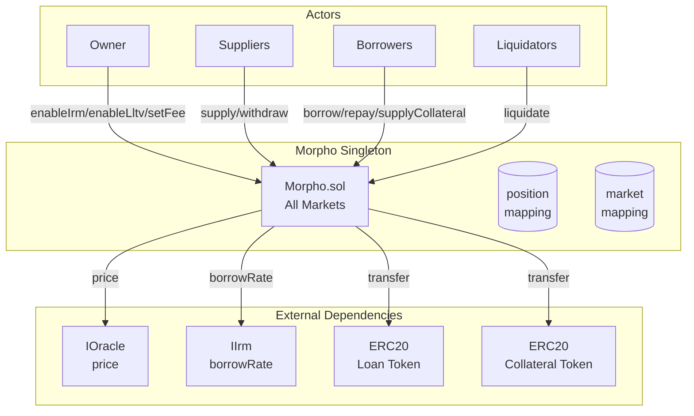
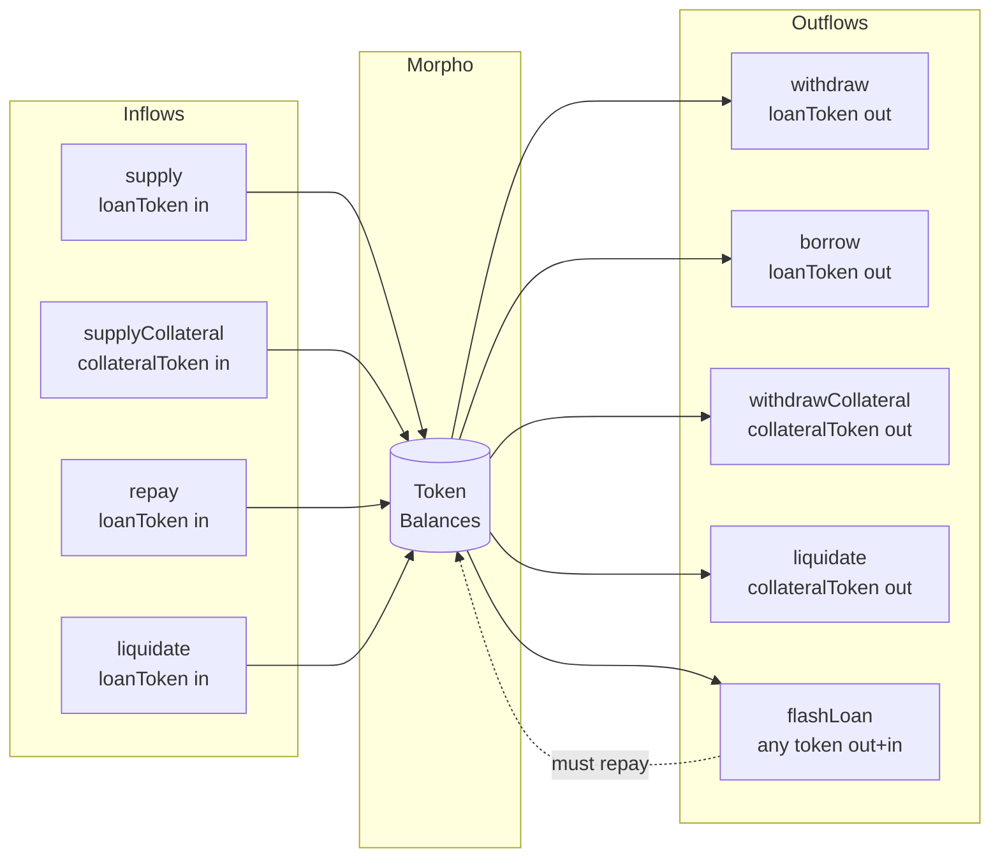

# Morpho Blue - Security Overview

Morpho Blue is a minimal, immutable singleton lending protocol enabling permissionless isolated markets for any ERC20 token pair, with share-based accounting and no cross-collateralization.

## Core Mechanics

- **Isolated Markets**: Each market (loanToken, collateralToken, oracle, irm, lltv) is independent
- **Share-based Accounting**: Virtual shares (1e6) and virtual assets (1) prevent inflation attacks
- **Permissionless Market Creation**: Anyone can create markets using owner-whitelisted IRMs/LLTVs
- **CEI Pattern**: All state updates before external calls for reentrancy safety
- **Bad Debt Socialization**: Underwater positions' remaining debt shared among suppliers

---

## Architecture

---

## Entry Points

| Function | Purpose | Auth | Risk Level |
|----------|---------|------|------------|
| `supply` | Deposit loan tokens, receive shares | None | Low |
| `withdraw` | Burn shares, receive loan tokens | Authorized | Medium |
| `borrow` | Create debt, receive loan tokens | Authorized | High |
| `repay` | Reduce debt | None | Low |
| `supplyCollateral` | Deposit collateral backing | None | Low |
| `withdrawCollateral` | Remove collateral | Authorized | High |
| `liquidate` | Seize collateral from unhealthy positions | None | High |
| `flashLoan` | Borrow any token atomically | None | High |
| `createMarket` | Create new isolated market | None | Medium |
| `setAuthorization` | Grant position management rights | None | Medium |
| `setAuthorizationWithSig` | Grant via EIP-712 signature | None | Medium |

**Owner-only:** `setOwner`, `enableIrm`, `enableLltv`, `setFee`, `setFeeRecipient`

---

## Trust Assumptions

| Entity | Impact if Malicious |
|--------|---------------------|
| Owner | Can enable dangerous IRMs/LLTVs, set max fees (25%), brick protocol by setting owner to address(0) |
| Oracle | Price manipulation enables unfair liquidations or blocks legitimate withdrawals |
| IRM | Can return extreme rates (DoS or drain), revert to block all operations |
| Loan Token | Non-standard behavior breaks accounting, fee-on-transfer causes insolvency |
| Collateral Token | Same as loan token, plus affects liquidation math |
| Authorized Manager | Full control over authorizer's positions (withdraw, borrow, remove collateral) |

---

## External Dependencies

| Dependency | Type | Risk |
|------------|------|------|
| `IOracle.price()` | Price feed | Manipulation, stale data, DoS |
| `IIrm.borrowRate()` | Interest rate | Extreme rates, revert DoS |
| `ERC20.transfer/transferFrom` | Token transfers | Reentrancy (mitigated), non-standard returns |
| Callbacks (5 interfaces) | User-provided | Reentrancy via callback (mitigated by CEI) |
| `ecrecover` | Signature verify | Invalid signature handling |

---

## Critical State Variables

| Variable | Location | Controls |
|----------|----------|----------|
| `owner` | Morpho.sol | All admin functions, no timelock, no 2-step transfer |
| `position[id][user]` | Morpho.sol | supplyShares, borrowShares (uint128), collateral (uint128) |
| `market[id]` | Morpho.sol | totalSupply/BorrowAssets/Shares, lastUpdate, fee |
| `isIrmEnabled[irm]` | Morpho.sol | IRM whitelist (irreversible) |
| `isLltvEnabled[lltv]` | Morpho.sol | LLTV whitelist (irreversible) |
| `isAuthorized[owner][mgr]` | Morpho.sol | Position management delegation |
| `nonce[authorizer]` | Morpho.sol | EIP-712 replay protection |

---

## Value Flows

---

## Privileged Roles

| Role | Powers | Risk |
|------|--------|------|
| Owner | Enable IRM/LLTV (irreversible), set fees (0-25%), set fee recipient, transfer ownership | Single admin, no timelock, can brick protocol |
| Authorized | Withdraw, borrow, withdraw collateral on behalf of authorizer | Full position control for authorizer |
| Fee Recipient | Receives supply shares from protocol fees | If address(0), fees are lost |

---

## Key Invariants

1. `totalBorrowAssets <= totalSupplyAssets` (liquidity constraint)
2. For healthy positions: `collateral * price * lltv >= borrowed`
3. `sum(position[id][*].supplyShares) == market[id].totalSupplyShares`
4. `sum(position[id][*].borrowShares) == market[id].totalBorrowShares`
5. All enabled LLTVs < WAD (100%)
6. All market fees <= MAX_FEE (25%)
7. Nonces strictly increment (no replay)
8. DOMAIN_SEPARATOR includes chainId (no cross-chain replay)
9. Virtual shares (1e6) + virtual assets (1) prevent first-depositor attacks

---

## Attack Surface

| Area | Concern | Mitigation |
|------|---------|------------|
| Oracle manipulation | Attacker manipulates price to liquidate healthy users or borrow excessively | User responsibility to choose safe oracles |
| IRM DoS | Malicious IRM reverts to block all market operations | Owner must vet IRMs before enabling |
| Share inflation | First depositor manipulates share price | Virtual shares (1e6) and virtual assets (1) |
| Callback reentrancy | Callbacks invoke Morpho functions | CEI pattern - state updated before callback |
| Flash loan attacks | Manipulate state within single tx | No persistent state change in flashLoan |
| Signature replay | Reuse authorization signature | Incrementing nonces, deadline check, chainId |
| Bad debt accumulation | Underwater positions not liquidated | Bad debt socialized to suppliers |
| Fee-on-transfer tokens | Received amount != sent amount | Not supported - causes accounting errors |
| Rebasing tokens | Balance changes unexpectedly | Not supported |

---

## Known Edge Cases

- **zeroFloorSub**: Repay/liquidate may exceed `totalBorrowAssets` by 1 due to rounding
- **Zero IRM**: `address(0)` is valid IRM (0% APR markets)
- **Fee recipient address(0)**: Fees are minted to zero address (lost)
- **Same-block accrual**: No interest if `elapsed == 0`
- **Self-authorization**: `msg.sender == onBehalf` always passes auth check
- **LLTV edge cases**: At LLTV=0.8, LIF~1.064 (6.4%); at LLTV=0.5, LIF capped at 1.15 (15%)
- **IRM not called if address(0)**: Skips `borrowRate` call, returns 0

---

## Quick Reference

| Constant | Value | Purpose |
|----------|-------|---------|
| MAX_FEE | 0.25e18 (25%) | Maximum protocol fee |
| ORACLE_PRICE_SCALE | 1e36 | Oracle price scaling |
| LIQUIDATION_CURSOR | 0.3e18 (30%) | Liquidation incentive calc |
| MAX_LIQUIDATION_INCENTIVE_FACTOR | 1.15e18 (15%) | Max liquidation bonus |
| VIRTUAL_SHARES | 1e6 | Anti-inflation attack |
| VIRTUAL_ASSETS | 1 | Anti-inflation attack |
| WAD | 1e18 | Fixed-point precision |

**Solidity Version**: 0.8.19 (main), ^0.8.0 (libraries)
**License**: BUSL-1.1 (main), GPL-2.0-or-later (libraries)
