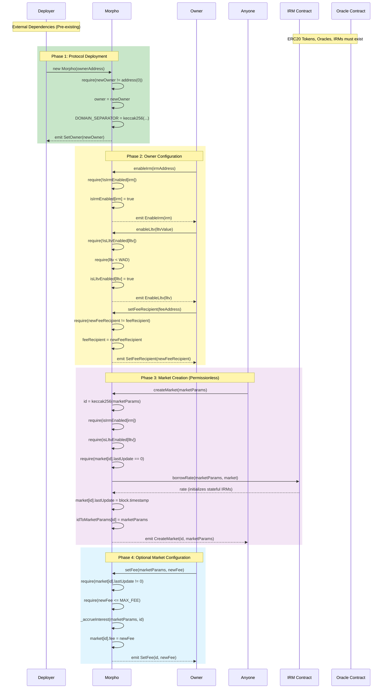
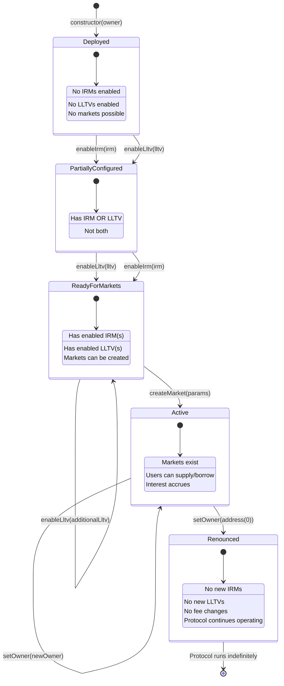
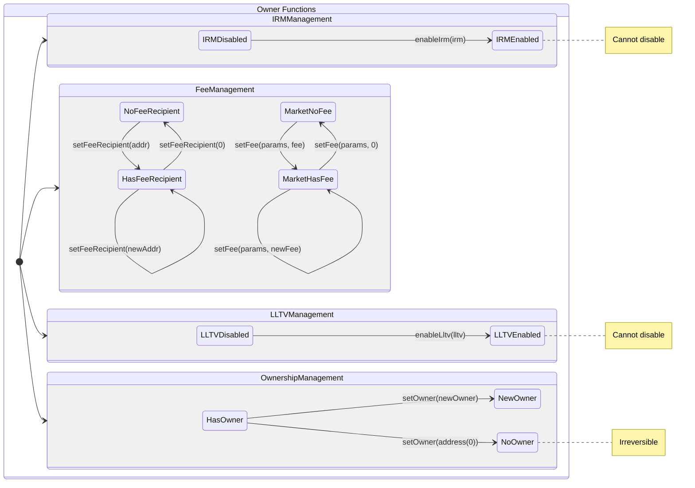
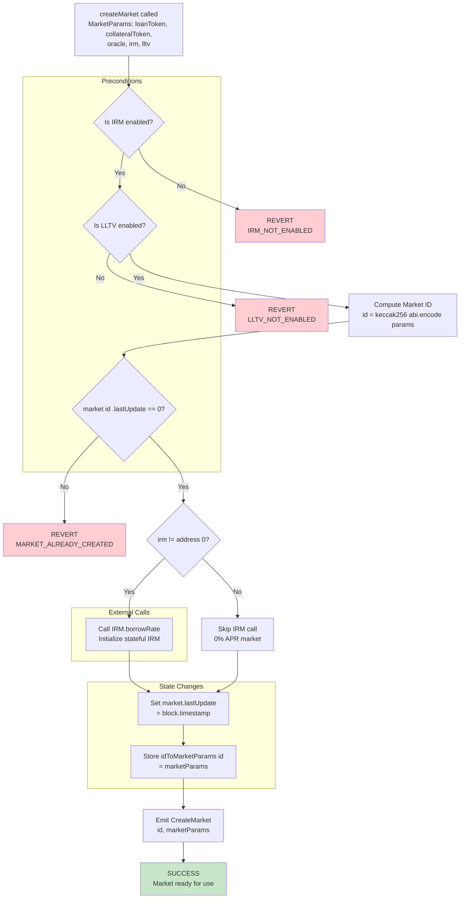
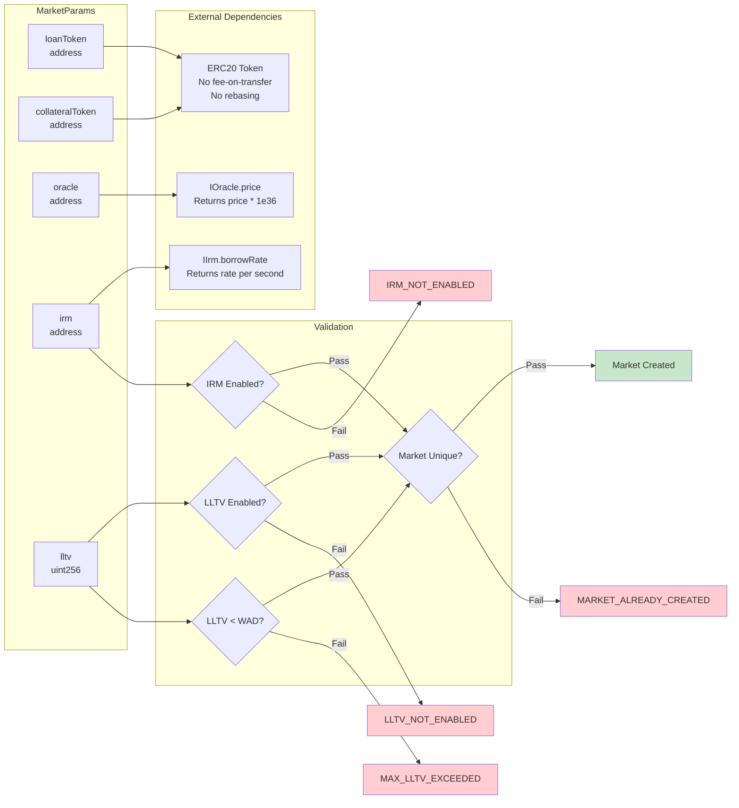
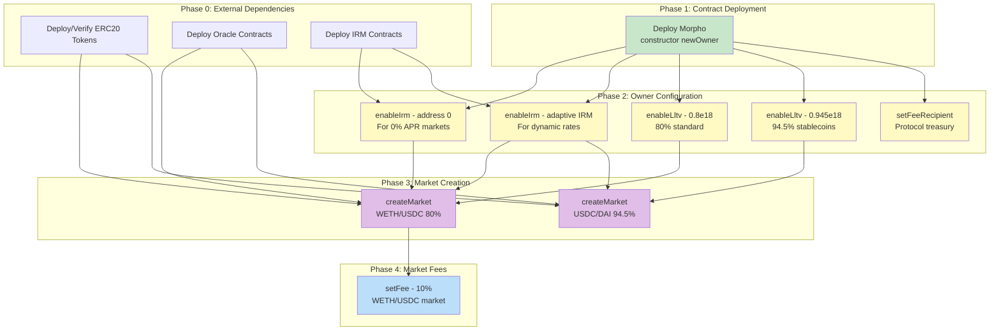

# Setup Charts

This document provides visual diagrams for the Morpho Blue protocol's deployment, configuration, and market creation phases.

---

## Deployment Sequence

The Morpho protocol deployment follows a phased approach: external dependencies must exist first, then the singleton contract is deployed, followed by owner configuration, and finally permissionless market creation.

---

## Configuration State Machine

The Morpho protocol transitions through distinct states from deployment to full operation. Once IRMs and LLTVs are enabled, they cannot be disabled.

---

## Owner Admin Functions State Diagram

Shows the state transitions enabled by owner-only administrative functions.

---

## Market Creation Flow

Detailed flowchart showing the createMarket function's preconditions, execution, and outcomes.

---

## Market Parameters Validation

Shows what makes a valid market configuration and the relationship between components.

---

## Protocol Initialization Checklist

Visual representation of the complete setup process with dependencies.

---

## Error Cases Summary

All revert conditions during setup and configuration.

| Function | Error | Condition |
|----------|-------|-----------|
| `constructor` | `ZERO_ADDRESS` | `newOwner == address(0)` |
| `setOwner` | `NOT_OWNER` | `msg.sender != owner` |
| `setOwner` | `ALREADY_SET` | `newOwner == owner` |
| `enableIrm` | `NOT_OWNER` | `msg.sender != owner` |
| `enableIrm` | `ALREADY_SET` | `isIrmEnabled[irm] == true` |
| `enableLltv` | `NOT_OWNER` | `msg.sender != owner` |
| `enableLltv` | `ALREADY_SET` | `isLltvEnabled[lltv] == true` |
| `enableLltv` | `MAX_LLTV_EXCEEDED` | `lltv >= WAD` |
| `setFeeRecipient` | `NOT_OWNER` | `msg.sender != owner` |
| `setFeeRecipient` | `ALREADY_SET` | `newFeeRecipient == feeRecipient` |
| `createMarket` | `IRM_NOT_ENABLED` | `isIrmEnabled[irm] == false` |
| `createMarket` | `LLTV_NOT_ENABLED` | `isLltvEnabled[lltv] == false` |
| `createMarket` | `MARKET_ALREADY_CREATED` | `market[id].lastUpdate != 0` |
| `setFee` | `NOT_OWNER` | `msg.sender != owner` |
| `setFee` | `MARKET_NOT_CREATED` | `market[id].lastUpdate == 0` |
| `setFee` | `ALREADY_SET` | `newFee == market[id].fee` |
| `setFee` | `MAX_FEE_EXCEEDED` | `newFee > MAX_FEE (0.25e18)` |
