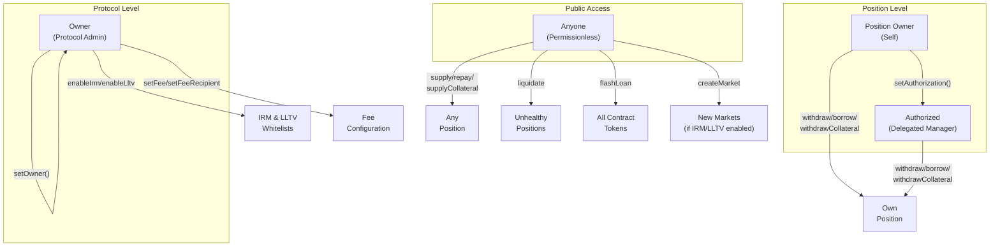
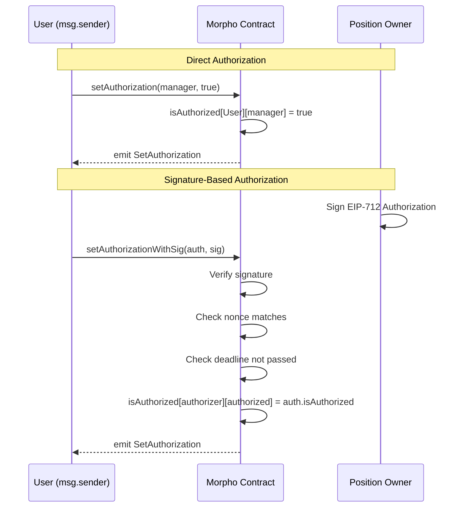

# Role Charts - Morpho Blue Protocol

## Roles Identified

| Role | Description | How Assigned |
|------|-------------|--------------|
| Owner | Protocol administrator with exclusive access to configuration functions. Can enable IRMs/LLTVs, set fees, and transfer ownership. | Set in constructor; transferable via `setOwner()` |
| Authorized | Delegated position manager. Can withdraw, borrow, and withdraw collateral on behalf of the authorizer. | Granted via `setAuthorization()` or `setAuthorizationWithSig()` |
| Position Owner | The address that owns a specific position (supply shares, borrow shares, collateral). | Implicit - whoever has assets in `position[id][address]` |
| Anyone | Permissionless access. Any address can call these functions. | No assignment required |

## Permission Matrix

### Owner-Only Functions

| Function | Owner | Authorized | Position Owner | Anyone |
|----------|-------|------------|----------------|--------|
| `setOwner` | Y | - | - | - |
| `enableIrm` | Y | - | - | - |
| `enableLltv` | Y | - | - | - |
| `setFee` | Y | - | - | - |
| `setFeeRecipient` | Y | - | - | - |

### Authorization-Required Functions

| Function | Owner | Authorized | Position Owner | Anyone |
|----------|-------|------------|----------------|--------|
| `withdraw` | - | Y (for authorizer) | Y (self) | - |
| `borrow` | - | Y (for authorizer) | Y (self) | - |
| `withdrawCollateral` | - | Y (for authorizer) | Y (self) | - |

### Permissionless Functions (Beneficial Actions)

| Function | Owner | Authorized | Position Owner | Anyone |
|----------|-------|------------|----------------|--------|
| `createMarket` | Y | Y | Y | Y |
| `supply` | Y | Y | Y | Y |
| `supplyCollateral` | Y | Y | Y | Y |
| `repay` | Y | Y | Y | Y |
| `liquidate` | Y | Y | Y | Y |
| `flashLoan` | Y | Y | Y | Y |
| `accrueInterest` | Y | Y | Y | Y |
| `setAuthorization` | Y | Y | Y | Y |
| `setAuthorizationWithSig` | Y | Y | Y | Y |
| `extSloads` | Y | Y | Y | Y |

## Role Hierarchy



## Authorization Flow



## Access Control Check Flow

```mermaid
flowchart TD
    A[External Call] --> B{Function Type?}

    B -->|Owner Functions| C{msg.sender == owner?}
    C -->|Yes| D[Execute Function]
    C -->|No| E[Revert: NOT_OWNER]

    B -->|Auth Functions| F{_isSenderAuthorized?}
    F --> G{msg.sender == onBehalf?}
    G -->|Yes| D
    G -->|No| H{isAuthorized<br/>[onBehalf][msg.sender]?}
    H -->|Yes| D
    H -->|No| I[Revert: UNAUTHORIZED]

    B -->|Permissionless| D
```

## Modifier Definitions

### onlyOwner

```solidity
// From Morpho.sol - line 75 (modifier)
modifier onlyOwner() {
    require(msg.sender == owner, ErrorsLib.NOT_OWNER);
    _;
}
```

**Applied to:**
- `setOwner(address newOwner)`
- `enableIrm(address irm)`
- `enableLltv(uint256 lltv)`
- `setFee(MarketParams memory marketParams, uint256 newFee)`
- `setFeeRecipient(address newFeeRecipient)`

### _isSenderAuthorized (Internal Check)

```solidity
// From Morpho.sol - internal function
function _isSenderAuthorized(address onBehalf) internal view returns (bool) {
    return msg.sender == onBehalf || isAuthorized[onBehalf][msg.sender];
}
```

**Used in:**
- `withdraw()` - requires `_isSenderAuthorized(onBehalf)`
- `borrow()` - requires `_isSenderAuthorized(onBehalf)`
- `withdrawCollateral()` - requires `_isSenderAuthorized(onBehalf)`

## State Variables for Access Control

| Variable | Type | Description |
|----------|------|-------------|
| `owner` | `address` | Single admin address, set in constructor |
| `isAuthorized` | `mapping(address => mapping(address => bool))` | `isAuthorized[owner][manager]` grants manager access to owner's positions |
| `nonce` | `mapping(address => uint256)` | Per-address nonce for EIP-712 signature replay protection |

## Authorization Security Properties

1. **Single Owner**: Only one owner at a time, no multi-sig built-in
2. **No Timelock**: Owner changes and IRM/LLTV enablement are immediate
3. **Irreversible Enablement**: Once IRM/LLTV is enabled, it cannot be disabled
4. **Revocable Authorization**: Users can revoke manager authorization at any time
5. **Signature Replay Protection**: Nonces strictly increment, preventing replay
6. **Chain-Specific**: DOMAIN_SEPARATOR includes chainId, preventing cross-chain replay
7. **Time-Bounded Signatures**: Authorization signatures have deadline for expiry

## Design Rationale

### Permissionless "Beneficial" Actions

The following actions are permissionless because they can only benefit the `onBehalf` address:
- `supply()` - Adds supply shares to recipient
- `supplyCollateral()` - Adds collateral backing to recipient
- `repay()` - Reduces debt of recipient

### Authorization-Required "Risky" Actions

These require authorization because they remove value from a position:
- `withdraw()` - Removes supply shares
- `borrow()` - Creates debt
- `withdrawCollateral()` - Removes collateral (may make position unhealthy)

### Liquidation is Permissionless

Anyone can liquidate unhealthy positions:
- Economic incentive via Liquidation Incentive Factor (LIF)
- Protects protocol from bad debt accumulation
- No authorization needed - unhealthy positions are fair game
