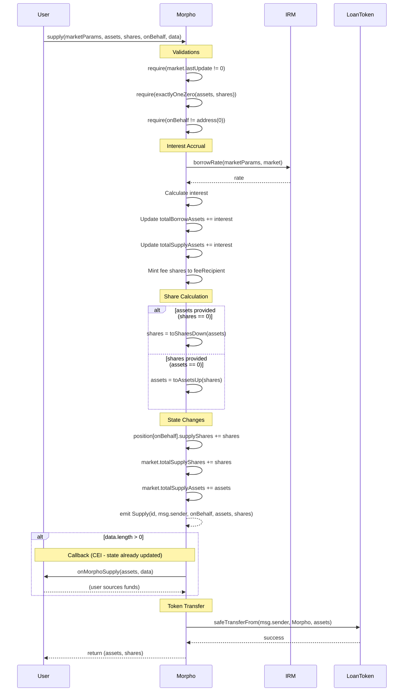
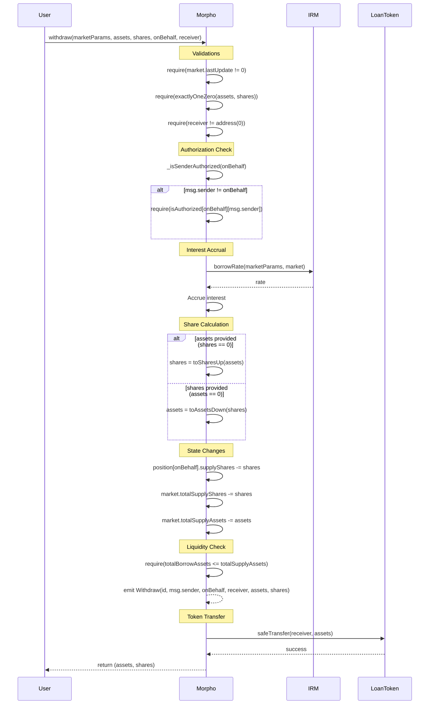
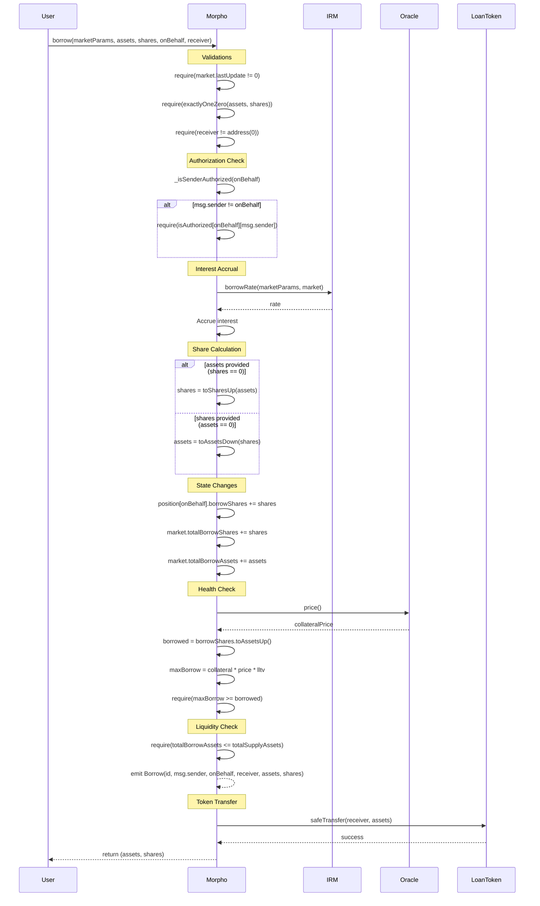
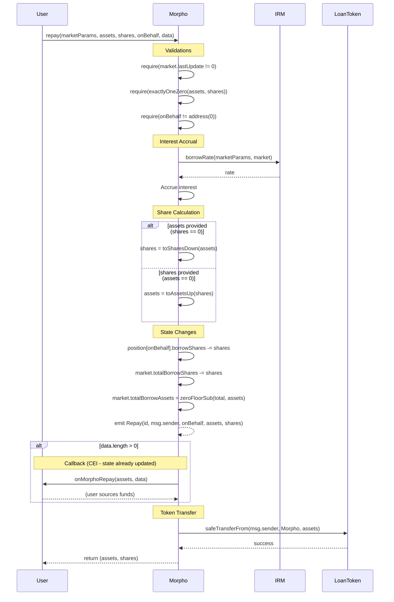
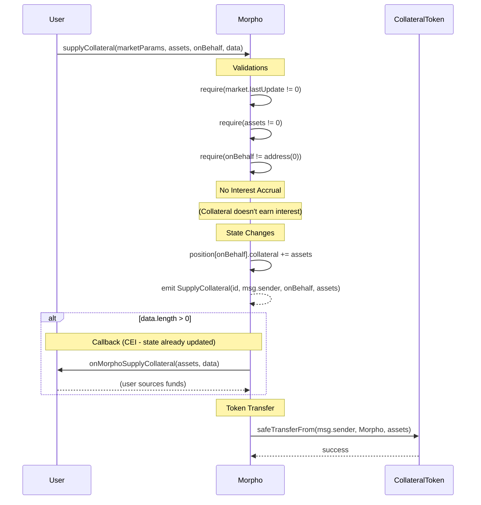
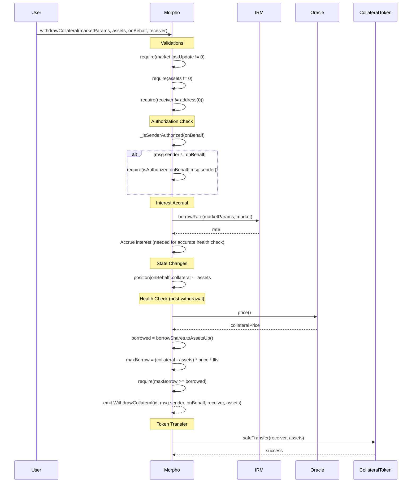
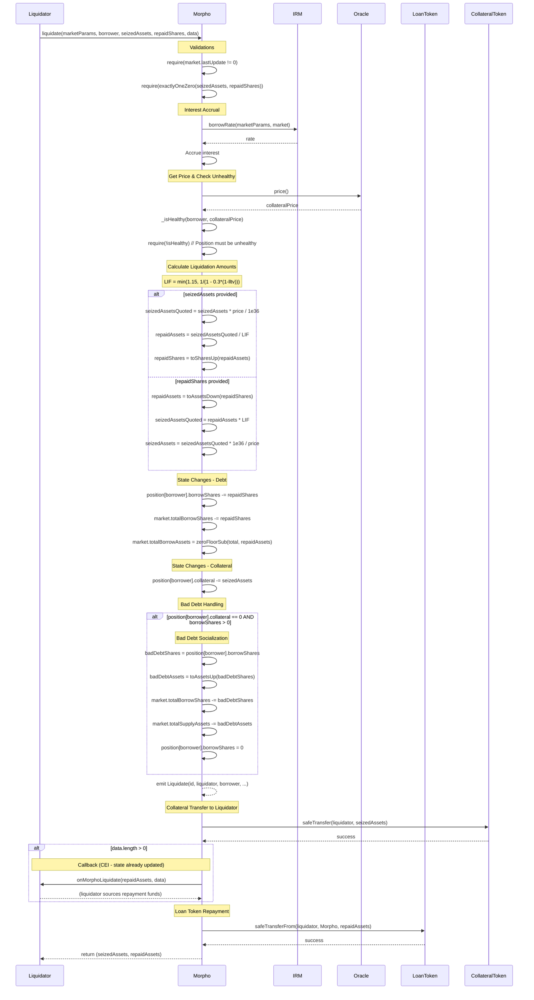
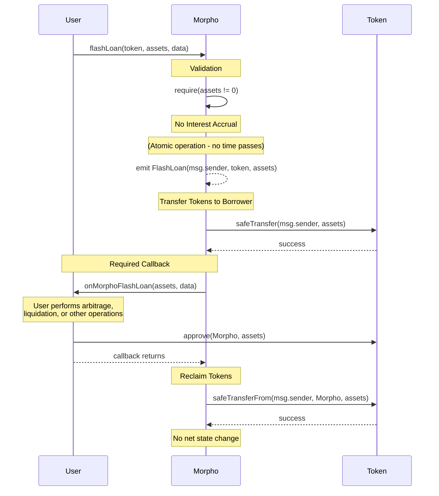
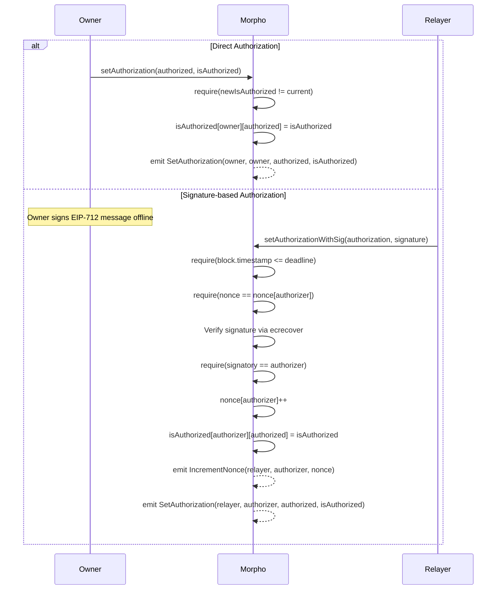
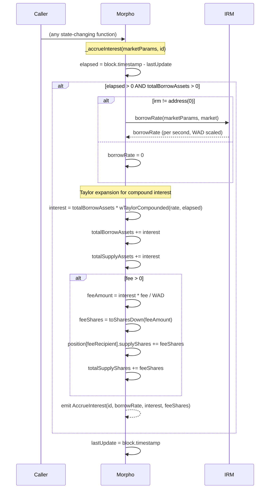

# Usage Flows

## Overview

| Operation | Function | Actors | Callback | Authorization Required |
|-----------|----------|--------|----------|------------------------|
| Supply | supply() | Any User | Optional (IMorphoSupplyCallback) | No |
| Withdraw | withdraw() | Position Owner / Authorized | No | Yes |
| Borrow | borrow() | Position Owner / Authorized | No | Yes |
| Repay | repay() | Any User | Optional (IMorphoRepayCallback) | No |
| Supply Collateral | supplyCollateral() | Any User | Optional (IMorphoSupplyCollateralCallback) | No |
| Withdraw Collateral | withdrawCollateral() | Position Owner / Authorized | No | Yes |
| Liquidate | liquidate() | Any User (Liquidator) | Optional (IMorphoLiquidateCallback) | No |
| Flash Loan | flashLoan() | Any User | Required (IMorphoFlashLoanCallback) | No |

---

## Supply Flow

Deposits loan tokens into a market and credits supply shares to the recipient.

---

## Withdraw Flow

Burns supply shares and withdraws loan tokens from the market.

---

## Borrow Flow

Creates a debt position by minting borrow shares and transferring loan tokens.

---

## Repay Flow

Repays borrowed tokens and reduces the debt position.

---

## Supply Collateral Flow

Deposits collateral tokens to back borrowing positions.

---

## Withdraw Collateral Flow

Withdraws collateral tokens while maintaining position health.

---

## Liquidate Flow

Liquidates unhealthy positions by repaying debt and seizing collateral at a discount.

---

## Flash Loan Flow

Borrows tokens atomically with no fee - must be repaid in same transaction.

---

## Authorization Flow

Grants or revokes authorization for position management.

---

## State Changes Summary

| Operation | User Position State | Market Global State |
|-----------|---------------------|---------------------|
| supply | +supplyShares | +totalSupplyShares, +totalSupplyAssets |
| withdraw | -supplyShares | -totalSupplyShares, -totalSupplyAssets |
| borrow | +borrowShares | +totalBorrowShares, +totalBorrowAssets |
| repay | -borrowShares | -totalBorrowShares, -totalBorrowAssets |
| supplyCollateral | +collateral | (none) |
| withdrawCollateral | -collateral | (none) |
| liquidate | -borrowShares, -collateral | -totalBorrowShares, -totalBorrowAssets, (bad debt: -totalSupplyAssets) |
| flashLoan | (none) | (none) |
| accrueInterest | (feeRecipient: +supplyShares) | +totalSupplyShares, +totalSupplyAssets, +totalBorrowAssets |

---

## Interest Accrual Detail

Interest accrues on all state-changing operations except supplyCollateral and flashLoan.

---

## Rounding Directions by Operation

| Operation | Conversion | Direction | Reason |
|-----------|------------|-----------|--------|
| supply | assets -> shares | DOWN | User gets fewer shares |
| supply | shares -> assets | UP | User pays more |
| withdraw | assets -> shares | UP | User burns more shares |
| withdraw | shares -> assets | DOWN | User gets fewer assets |
| borrow | assets -> shares | UP | Borrower owes more |
| borrow | shares -> assets | DOWN | Borrower receives less |
| repay | assets -> shares | DOWN | Slightly borrower favored |
| repay | shares -> assets | UP | Borrower pays more |
| liquidate (seized) | - | DOWN | Liquidator gets less |
| liquidate (repaid) | - | UP | Liquidator pays more |
| health check (borrowed) | - | UP | Stricter - appears to owe more |
| health check (maxBorrow) | - | DOWN | Stricter - can borrow less |

---

## Callback Execution Order

All callbacks follow the CEI (Checks-Effects-Interactions) pattern:

1. **Checks**: Validate inputs and authorization
2. **Effects**: Update all state (shares, collateral, totals)
3. **Interactions**:
   - First: Execute callback (if data provided)
   - Then: Transfer tokens

This ordering ensures:
- State is finalized before any external calls
- Callbacks cannot manipulate pending state changes
- Reentrancy is safe because state is already updated
