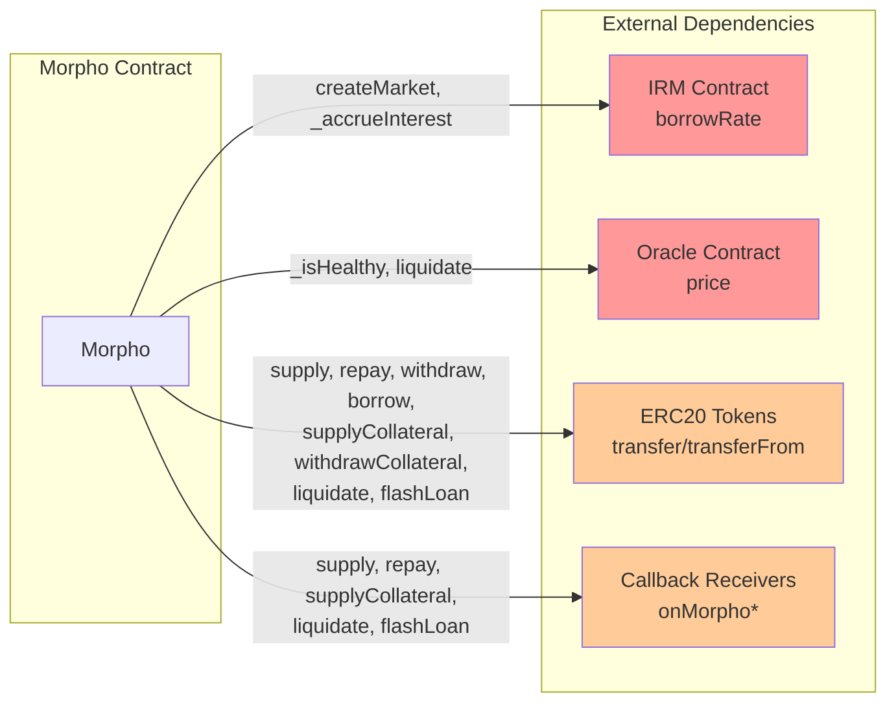

# Dependency Analysis

This document analyzes all dependencies between contracts in the Morpho Blue protocol, categorizing them by type: imports, inheritance, library usage, runtime external calls, and constructor parameters.

---

## Contract: Morpho
**File:** `src/Morpho.sol`

| Type | Dependency | Purpose |
|------|------------|---------|
| Import | IMorpho.sol | Core types: Id, IMorphoStaticTyping, IMorphoBase, MarketParams, Position, Market, Authorization, Signature |
| Import | IMorphoCallbacks.sol | Callback interfaces for supply, repay, collateral, liquidate, flashLoan |
| Import | IIrm.sol | Interest Rate Model interface |
| Import | IERC20.sol | Token interface (empty, forces safeTransfer usage) |
| Import | IOracle.sol | Price oracle interface |
| Import | ConstantsLib.sol | Protocol constants (MAX_FEE, ORACLE_PRICE_SCALE, etc.) |
| Import | UtilsLib.sol | Utility helpers |
| Import | EventsLib.sol | Event definitions |
| Import | ErrorsLib.sol | Error message strings |
| Import | MathLib.sol | Fixed-point arithmetic (WAD) |
| Import | SharesMathLib.sol | Share conversion with virtual shares |
| Import | MarketParamsLib.sol | Market ID computation |
| Import | SafeTransferLib.sol | Safe ERC20 transfers |
| Inherits | IMorphoStaticTyping | Interface with static-typed getters |
| Uses | MathLib for uint128 | Fixed-point math operations |
| Uses | MathLib for uint256 | Fixed-point math operations |
| Uses | UtilsLib for uint256 | toUint128, zeroFloorSub |
| Uses | SharesMathLib for uint256 | toSharesDown/Up, toAssetsDown/Up |
| Uses | SafeTransferLib for IERC20 | safeTransfer, safeTransferFrom |
| Uses | MarketParamsLib for MarketParams | id() function |
| Calls | IIrm | borrowRate() - interest calculation |
| Calls | IOracle | price() - health checks |
| Calls | IERC20 | safeTransfer/safeTransferFrom - token movements |
| Calls | IMorphoSupplyCallback | onMorphoSupply() - supply callback |
| Calls | IMorphoRepayCallback | onMorphoRepay() - repay callback |
| Calls | IMorphoSupplyCollateralCallback | onMorphoSupplyCollateral() - collateral callback |
| Calls | IMorphoLiquidateCallback | onMorphoLiquidate() - liquidation callback |
| Calls | IMorphoFlashLoanCallback | onMorphoFlashLoan() - flash loan callback |
| Constructor | address newOwner | Initial owner address (must be non-zero) |

---

## Interface: IMorpho
**File:** `src/interfaces/IMorpho.sol`

| Type | Dependency | Purpose |
|------|------------|---------|
| Import | None | Standalone interface defining core types and functions |

**Defines Types:** Id (bytes32), MarketParams, Position, Market, Authorization, Signature

**Contains:** IMorphoBase, IMorphoStaticTyping, IMorpho interfaces

---

## Interface: IIrm
**File:** `src/interfaces/IIrm.sol`

| Type | Dependency | Purpose |
|------|------------|---------|
| Import | IMorpho.sol | MarketParams, Market structs for function parameters |

---

## Interface: IERC20
**File:** `src/interfaces/IERC20.sol`

| Type | Dependency | Purpose |
|------|------------|---------|
| Import | None | Empty interface (forces safe transfer usage) |

---

## Interface: IMorphoCallbacks
**File:** `src/interfaces/IMorphoCallbacks.sol`

| Type | Dependency | Purpose |
|------|------------|---------|
| Import | None | Standalone callback interfaces |

**Contains:** IMorphoLiquidateCallback, IMorphoRepayCallback, IMorphoSupplyCallback, IMorphoSupplyCollateralCallback, IMorphoFlashLoanCallback

---

## Interface: IOracle
**File:** `src/interfaces/IOracle.sol`

| Type | Dependency | Purpose |
|------|------------|---------|
| Import | None | Standalone oracle interface |

---

## Library: ConstantsLib
**File:** `src/libraries/ConstantsLib.sol`

| Type | Dependency | Purpose |
|------|------------|---------|
| Import | None | Standalone constants library |

**Defines:** MAX_FEE (0.25e18), ORACLE_PRICE_SCALE (1e36), LIQUIDATION_CURSOR (0.3e18), MAX_LIQUIDATION_INCENTIVE_FACTOR (1.15e18), DOMAIN_TYPEHASH, AUTHORIZATION_TYPEHASH

---

## Library: MathLib
**File:** `src/libraries/MathLib.sol`

| Type | Dependency | Purpose |
|------|------------|---------|
| Import | None | Standalone math library |

**Defines:** WAD (1e18)

---

## Library: SharesMathLib
**File:** `src/libraries/SharesMathLib.sol`

| Type | Dependency | Purpose |
|------|------------|---------|
| Import | MathLib.sol | Uses mulDivDown, mulDivUp |

**Defines:** VIRTUAL_SHARES (1e6), VIRTUAL_ASSETS (1)

---

## Library: UtilsLib
**File:** `src/libraries/UtilsLib.sol`

| Type | Dependency | Purpose |
|------|------------|---------|
| Import | ErrorsLib.sol | MAX_UINT128_EXCEEDED error |

---

## Library: ErrorsLib
**File:** `src/libraries/ErrorsLib.sol`

| Type | Dependency | Purpose |
|------|------------|---------|
| Import | None | Standalone error strings library |

---

## Library: EventsLib
**File:** `src/libraries/EventsLib.sol`

| Type | Dependency | Purpose |
|------|------------|---------|
| Import | IMorpho.sol | Id, MarketParams types for event parameters |

---

## Library: SafeTransferLib
**File:** `src/libraries/SafeTransferLib.sol`

| Type | Dependency | Purpose |
|------|------------|---------|
| Import | IERC20.sol | IERC20 type |
| Import | ErrorsLib.sol | Error messages (NO_CODE, TRANSFER_*) |

---

## Library: MarketParamsLib
**File:** `src/libraries/MarketParamsLib.sol`

| Type | Dependency | Purpose |
|------|------------|---------|
| Import | IMorpho.sol | Id, MarketParams types |

---

## Library: MorphoLib (Periphery)
**File:** `src/libraries/periphery/MorphoLib.sol`

| Type | Dependency | Purpose |
|------|------------|---------|
| Import | IMorpho.sol | IMorpho, Id types |
| Import | MorphoStorageLib.sol | Storage slot computations |

---

## Library: MorphoBalancesLib (Periphery)
**File:** `src/libraries/periphery/MorphoBalancesLib.sol`

| Type | Dependency | Purpose |
|------|------------|---------|
| Import | IMorpho.sol | Id, MarketParams, Market, IMorpho |
| Import | IIrm.sol | borrowRateView() call |
| Import | MathLib.sol | wMulDown, wTaylorCompounded |
| Import | UtilsLib.sol | min function |
| Import | MorphoLib.sol | Storage access helpers |
| Import | SharesMathLib.sol | toSharesDown, toAssetsUp |
| Import | MarketParamsLib.sol | id() function |
| Calls | IIrm | borrowRateView() - simulated interest calculation |

---

## Library: MorphoStorageLib (Periphery)
**File:** `src/libraries/periphery/MorphoStorageLib.sol`

| Type | Dependency | Purpose |
|------|------------|---------|
| Import | IMorpho.sol | Id type |

---

## Mock: OracleMock
**File:** `src/mocks/OracleMock.sol`

| Type | Dependency | Purpose |
|------|------------|---------|
| Import | IOracle.sol | Oracle interface |
| Inherits | IOracle | Implements price() |

---

## Mock: IrmMock
**File:** `src/mocks/IrmMock.sol`

| Type | Dependency | Purpose |
|------|------------|---------|
| Import | IIrm.sol | IRM interface |
| Import | IMorpho.sol | MarketParams, Market |
| Import | MathLib.sol | wDivDown function |
| Inherits | IIrm | Implements borrowRate/borrowRateView |
| Uses | MathLib for uint128 | wDivDown |

---

## Mock: ERC20Mock
**File:** `src/mocks/ERC20Mock.sol`

| Type | Dependency | Purpose |
|------|------------|---------|
| Import | IERC20 (mock) | Full ERC20 interface |
| Inherits | IERC20 | Implements ERC20 functions |

---

## Mock: FlashBorrowerMock
**File:** `src/mocks/FlashBorrowerMock.sol`

| Type | Dependency | Purpose |
|------|------------|---------|
| Import | IERC20 (mock) | Token interface |
| Import | IMorpho.sol | IMorpho interface |
| Import | IMorphoCallbacks.sol | Flash loan callback |
| Inherits | IMorphoFlashLoanCallback | Implements onMorphoFlashLoan |
| Constructor | IMorpho newMorpho | Morpho contract address |
| Calls | IMorpho | flashLoan() |
| Calls | IERC20 | approve() - repayment approval |

---

## Dependency Graph

```mermaid
graph TD
    subgraph Core Contract
        Morpho[Morpho.sol]
    end

    subgraph Interfaces
        IMorpho[IMorpho.sol]
        IIrm[IIrm.sol]
        IERC20[IERC20.sol]
        IOracle[IOracle.sol]
        IMorphoCallbacks[IMorphoCallbacks.sol]
    end

    subgraph Libraries
        ConstantsLib[ConstantsLib.sol]
        MathLib[MathLib.sol]
        SharesMathLib[SharesMathLib.sol]
        UtilsLib[UtilsLib.sol]
        ErrorsLib[ErrorsLib.sol]
        EventsLib[EventsLib.sol]
        SafeTransferLib[SafeTransferLib.sol]
        MarketParamsLib[MarketParamsLib.sol]
    end

    subgraph Periphery Libraries
        MorphoLib[MorphoLib.sol]
        MorphoBalancesLib[MorphoBalancesLib.sol]
        MorphoStorageLib[MorphoStorageLib.sol]
    end

    subgraph Mocks
        OracleMock[OracleMock.sol]
        IrmMock[IrmMock.sol]
        ERC20Mock[ERC20Mock.sol]
        FlashBorrowerMock[FlashBorrowerMock.sol]
    end

    %% Morpho dependencies
    Morpho -->|inherits| IMorpho
    Morpho -->|imports| IIrm
    Morpho -->|imports| IERC20
    Morpho -->|imports| IOracle
    Morpho -->|imports| IMorphoCallbacks
    Morpho -->|uses| MathLib
    Morpho -->|uses| SharesMathLib
    Morpho -->|uses| UtilsLib
    Morpho -->|uses| SafeTransferLib
    Morpho -->|uses| MarketParamsLib
    Morpho -->|imports| ConstantsLib
    Morpho -->|imports| ErrorsLib
    Morpho -->|imports| EventsLib

    %% Library dependencies
    SharesMathLib -->|imports| MathLib
    UtilsLib -->|imports| ErrorsLib
    SafeTransferLib -->|imports| IERC20
    SafeTransferLib -->|imports| ErrorsLib
    EventsLib -->|imports| IMorpho
    MarketParamsLib -->|imports| IMorpho
    IIrm -->|imports| IMorpho

    %% Periphery dependencies
    MorphoLib -->|imports| IMorpho
    MorphoLib -->|imports| MorphoStorageLib
    MorphoBalancesLib -->|imports| IMorpho
    MorphoBalancesLib -->|imports| IIrm
    MorphoBalancesLib -->|imports| MathLib
    MorphoBalancesLib -->|imports| UtilsLib
    MorphoBalancesLib -->|imports| MorphoLib
    MorphoBalancesLib -->|imports| SharesMathLib
    MorphoBalancesLib -->|imports| MarketParamsLib
    MorphoStorageLib -->|imports| IMorpho

    %% Mock dependencies
    OracleMock -->|inherits| IOracle
    IrmMock -->|inherits| IIrm
    IrmMock -->|uses| MathLib
    FlashBorrowerMock -->|inherits| IMorphoCallbacks
    FlashBorrowerMock -->|imports| IMorpho
```

---

## Runtime External Calls (Trust Boundaries)

These are the most security-critical dependencies as they represent runtime trust relationships:

**Risk Assessment:**
- **IRM (High Risk):** Malicious IRM could return extreme rates or revert to block operations
- **Oracle (High Risk):** Oracle manipulation could enable unfair liquidations
- **Tokens (Medium Risk):** Non-standard tokens may behave unexpectedly; CEI pattern mitigates reentrancy
- **Callbacks (Medium Risk):** User-controlled code executes after state updates (CEI pattern)

---

## Deployment Order

Based on the dependency analysis, the deployment order is:

1. **No deployment needed:** Libraries (ConstantsLib, MathLib, SharesMathLib, UtilsLib, ErrorsLib, EventsLib, SafeTransferLib, MarketParamsLib) - linked at compile time
2. **External dependencies (pre-existing):** ERC20 tokens, Oracles, IRMs
3. **Core contract:** Morpho(ownerAddress)
4. **Post-deployment configuration:**
   - `enableIrm(irmAddress)` - whitelist interest rate models
   - `enableLltv(lltvValue)` - whitelist LLTV ratios
   - `setFeeRecipient(recipientAddress)` - set protocol fee recipient
   - `createMarket(marketParams)` - create lending markets
   - `setFee(marketParams, fee)` - set market fees
