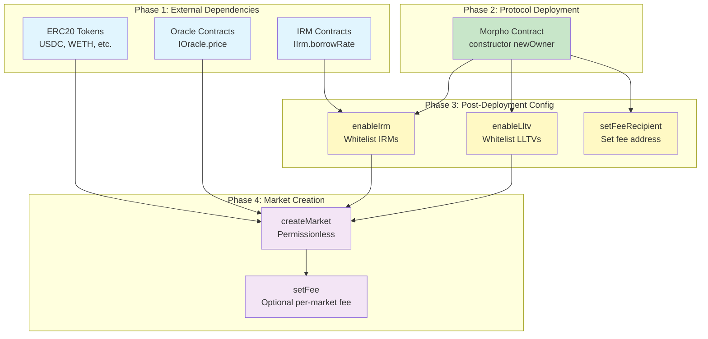
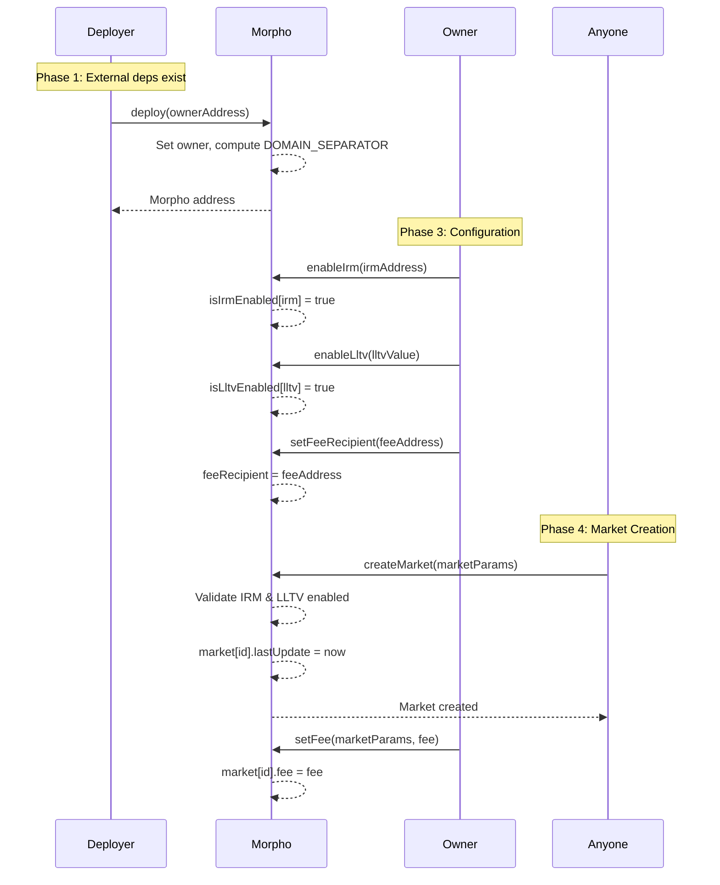

# Deployment Pattern

This document describes the deployment order, constructor parameters, and post-deployment configuration required for the Morpho Blue protocol.

---

## Deployment Order

### Phase 1: External Dependencies

These contracts must exist before Morpho deployment. They are not part of the Morpho protocol but are required for market creation and operation.

| Dependency | Purpose | Notes |
|------------|---------|-------|
| ERC20 Tokens | Loan and collateral tokens | Pre-existing tokens (USDC, WETH, etc.) |
| Oracle Contracts | Price feeds for health checks | Must implement `IOracle.price()` returning price scaled by 1e36 |
| IRM Contracts | Interest rate calculation | Must implement `IIrm.borrowRate()` and `borrowRateView()` |

**Notes:**
- Oracles must return `collateralToken/loanToken` price scaled by `1e36`
- IRMs can be stateful (borrowRate may modify storage) or stateless
- `address(0)` is a valid IRM (creates 0% APR markets)

### Phase 2: Protocol Contracts

| Order | Contract | Dependencies | Notes |
|-------|----------|--------------|-------|
| 1 | Morpho | None (libraries linked at compile) | Singleton contract managing all markets |

**Libraries (compile-time linked, no deployment):**
- ConstantsLib
- MathLib
- SharesMathLib
- UtilsLib
- ErrorsLib
- EventsLib
- SafeTransferLib
- MarketParamsLib

---

## Constructor Parameters

### Morpho

| Parameter | Type | Source | Description |
|-----------|------|--------|-------------|
| newOwner | address | Deployer/Multisig | Initial contract owner. Must be non-zero. |

**Constructor Logic:**
```solidity
constructor(address newOwner) {
    require(newOwner != address(0), ErrorsLib.ZERO_ADDRESS);
    owner = newOwner;
    DOMAIN_SEPARATOR = keccak256(abi.encode(DOMAIN_TYPEHASH, block.chainid, address(this)));
    emit EventsLib.SetOwner(newOwner);
}
```

**Immutables Set:**
- `DOMAIN_SEPARATOR` (bytes32): EIP-712 domain separator computed from chain ID and contract address

---

## Post-Deployment Setup

After deployment, the owner must configure the protocol before markets can be created and used.

### Required Configuration

| Order | Contract | Function | Purpose | Caller |
|-------|----------|----------|---------|--------|
| 1 | Morpho | `enableIrm(address irm)` | Whitelist interest rate model(s) | Owner |
| 2 | Morpho | `enableLltv(uint256 lltv)` | Whitelist LLTV ratio(s) | Owner |
| 3 | Morpho | `setFeeRecipient(address)` | Set protocol fee recipient | Owner |

### Market Creation (Permissionless)

| Order | Contract | Function | Purpose | Caller |
|-------|----------|----------|---------|--------|
| 4 | Morpho | `createMarket(MarketParams)` | Create lending market | Anyone |

### Optional Configuration

| Contract | Function | Purpose | Caller |
|----------|----------|---------|--------|
| Morpho | `setFee(MarketParams, uint256)` | Set market fee (0-25%) | Owner |
| Morpho | `setOwner(address)` | Transfer ownership | Owner |

---

## Configuration Details

### enableIrm(address irm)

- **Restriction:** Owner only
- **Requirement:** IRM not already enabled
- **Effect:** Permanently enables IRM for market creation (cannot be disabled)
- **Valid Values:** Any address including `address(0)` (0% APR markets)

### enableLltv(uint256 lltv)

- **Restriction:** Owner only
- **Requirement:** LLTV not already enabled, LLTV < WAD (1e18)
- **Effect:** Permanently enables LLTV for market creation (cannot be disabled)
- **Common Values:**
  - 0.5e18 (50%) - Conservative
  - 0.8e18 (80%) - Standard
  - 0.9e18 (90%) - Aggressive
  - 0.945e18 (94.5%) - Stablecoin pairs

### setFeeRecipient(address newFeeRecipient)

- **Restriction:** Owner only
- **Effect:** Sets address receiving protocol fee shares
- **Warning:** If set to `address(0)`, fees are lost (minted to zero address)

### createMarket(MarketParams memory marketParams)

- **Restriction:** None (permissionless)
- **Requirements:**
  - `marketParams.irm` must be enabled
  - `marketParams.lltv` must be enabled
  - Market must not already exist

**MarketParams Structure:**
```solidity
struct MarketParams {
    address loanToken;        // Token being lent/borrowed
    address collateralToken;  // Token used as collateral
    address oracle;           // Price oracle for health checks
    address irm;              // Interest rate model
    uint256 lltv;             // Loan-to-value ratio (scaled by 1e18)
}
```

### setFee(MarketParams memory marketParams, uint256 newFee)

- **Restriction:** Owner only
- **Requirements:**
  - Market must exist
  - newFee <= MAX_FEE (0.25e18 = 25%)
- **Effect:** Sets percentage of interest accrued as protocol fee
- **Note:** Accrues interest with old fee before applying new fee

---

## Deployment Diagram



---

## Deployment Sequence Diagram



---

## Trust Assumptions at Deployment

| Component | Trust Level | Risk |
|-----------|-------------|------|
| Owner | High | Single admin, no timelock, can enable IRMs/LLTVs, set fees |
| IRM | High | Must not revert or return extreme rates |
| Oracle | High | Must return correct, manipulation-resistant prices |
| Tokens | Medium | Must be ERC20 compliant, no fee-on-transfer, no rebasing |

---

## Example Deployment Script

```solidity
// Phase 2: Deploy Morpho
Morpho morpho = new Morpho(OWNER_ADDRESS);

// Phase 3: Configuration (as owner)
morpho.enableIrm(address(0));           // Enable 0% APR
morpho.enableIrm(ADAPTIVE_IRM_ADDRESS); // Enable adaptive IRM
morpho.enableLltv(0.8e18);              // Enable 80% LLTV
morpho.enableLltv(0.945e18);            // Enable 94.5% LLTV
morpho.setFeeRecipient(FEE_RECIPIENT);  // Set fee recipient

// Phase 4: Create markets (anyone can do this)
MarketParams memory params = MarketParams({
    loanToken: USDC,
    collateralToken: WETH,
    oracle: WETH_USDC_ORACLE,
    irm: ADAPTIVE_IRM_ADDRESS,
    lltv: 0.8e18
});
morpho.createMarket(params);

// Optional: Set fee for market
morpho.setFee(params, 0.1e18); // 10% of interest
```
