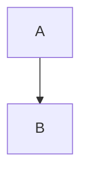
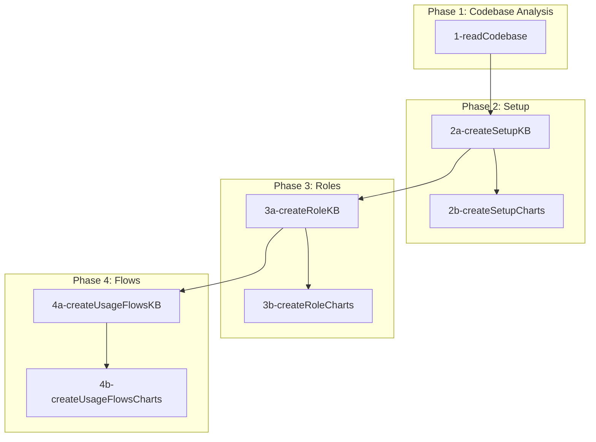

# Prompt Workflow

Execution order and dependencies between prompts.

---

## Formatting Rules

When generating markdown files, follow these rules:

1. **Never nest code blocks** - Don't wrap examples in \`\`\`markdown blocks
2. **Use 4-space indentation for examples** - This renders as a code block without nesting issues
3. **Mermaid diagrams** - Write directly with \`\`\`mermaid, not inside another code block

**Correct:**

    # Example Title

    ```mermaid
    graph TD
        A --> B
    ```

**Wrong:**
```markdown
# Example Title


```

---

## Pipeline

```
1-readCodebase
      │
      ▼
2a-createSetupKB ────► 2b-createSetupCharts
      │
      ▼
3a-createRoleKB ─────► 3b-createRoleCharts
      │
      ▼
4a-createUsageFlowsKB ► 4b-createUsageFlowsCharts
```

---

## Execution Order
```

| Phase | Prompt | Input | Output |
|-------|--------|-------|--------|
| 1 | 1-readCodebase.md | source .sol files | `kb/overview.md`<br>`kb/contracts.md`<br>`kb/dependencies.md` |
| 2a | 2a-createSetupKB.md | `kb/contracts.md` | `kb/setup/deployable-contracts.md`<br>`kb/setup/constructors.md`<br>`kb/setup/initializers.md`<br>`kb/setup/params-classified.md`<br>`kb/setup/dependency-graph.md`<br>`kb/setup/deployment-order.md`<br>`kb/setup/post-deploy-calls.md`<br>`kb/roles/actors.md` |
| 2b | 2b-createSetupCharts.md | `kb/setup/*.md` | `charts/setup-flow.md`<br>`charts/dependency-diagram.md`<br>`charts/setup-checklist.md` |
| 3a | 3a-createRoleKB.md | `kb/roles/actors.md`<br>`kb/setup/deployable-contracts.md` | `kb/roles/permissions.md`<br>`kb/roles/role-summaries.md` |
| 3b | 3b-createRoleCharts.md | `kb/roles/*.md` | `charts/access-control.md`<br>`charts/role-matrix.md`<br>`charts/authorization-flow.md` |
| 4a | 4a-createUsageFlowsKB.md | `kb/roles/actors.md`<br>`kb/roles/permissions.md`<br>`kb/setup/deployable-contracts.md` | `kb/flows/state-transitions.md`<br>`kb/flows/core-flows.md` |
| 4b | 4b-createUsageFlowsCharts.md | `kb/flows/*.md` | `charts/state-machine.md`<br>`charts/sequence-diagrams.md`<br>`charts/flow-quickref.md` |

---

## Dependencies Graph



---

## Final Folder Structure

```
kb/
├── overview.md
├── contracts.md
├── dependencies.md
├── setup/
│   ├── deployable-contracts.md
│   ├── constructors.md
│   ├── initializers.md
│   ├── params-classified.md
│   ├── dependency-graph.md
│   ├── deployment-order.md
│   └── post-deploy-calls.md
├── roles/
│   ├── actors.md
│   ├── permissions.md
│   └── role-summaries.md
├── flows/
│   ├── state-transitions.md
│   └── core-flows.md
└── prompts/
    ├── workflow.md
    ├── 1-readCodebase.md
    ├── 2a-createSetupKB.md
    ├── 2b-createSetupCharts.md
    ├── 3a-createRoleKB.md
    ├── 3b-createRoleCharts.md
    ├── 4a-createUsageFlowsKB.md
    └── 4b-createUsageFlowsCharts.md

charts/
├── setup-flow.md
├── dependency-diagram.md
├── setup-checklist.md
├── access-control.md
├── role-matrix.md
├── authorization-flow.md
├── state-machine.md
├── sequence-diagrams.md
└── flow-quickref.md
```
