# Morpho Blue -- Usage Flow Diagrams

## Operations Overview

| Operation | Access | Callbacks | External Calls | State Changes | CEI Adherence |
|---|---|---|---|---|---|
| `supply` | Permissionless | `onMorphoSupply` (optional) | IRM.borrowRate, ERC20.transferFrom | position.supplyShares, market totals | Yes |
| `withdraw` | Authorized | None | IRM.borrowRate, ERC20.transfer | position.supplyShares, market totals | Yes |
| `borrow` | Authorized | None | IRM.borrowRate, Oracle.price, ERC20.transfer | position.borrowShares, market totals | Yes |
| `repay` | Permissionless | `onMorphoRepay` (optional) | IRM.borrowRate, ERC20.transferFrom | position.borrowShares, market totals | Yes |
| `supplyCollateral` | Permissionless | `onMorphoSupplyCollateral` (optional) | ERC20.transferFrom | position.collateral | Yes |
| `withdrawCollateral` | Authorized | None | IRM.borrowRate, Oracle.price, ERC20.transfer | position.collateral, market totals (interest) | Yes |
| `liquidate` | Permissionless | `onMorphoLiquidate` (optional) | IRM.borrowRate, Oracle.price, ERC20.transfer, ERC20.transferFrom | position.borrowShares, position.collateral, market totals, bad debt socialization | Yes* |
| `flashLoan` | Permissionless | `onMorphoFlashLoan` (required) | ERC20.transfer, ERC20.transferFrom | None | N/A (no state) |
| `createMarket` | Permissionless | None | IRM.borrowRate (init) | market.lastUpdate, idToMarketParams | Yes |
| `setAuthorization` | msg.sender only | None | None | isAuthorized | N/A (no ext calls) |
| `setAuthorizationWithSig` | Anyone (with valid sig) | None | None | isAuthorized, nonce | N/A (no ext calls) |
| `accrueInterest` | Permissionless | None | IRM.borrowRate | market totals, fee shares | Yes |
| `setFee` | Owner | None | IRM.borrowRate (via accrual) | market.fee, market totals | Yes |

*`liquidate` sends collateral to liquidator BEFORE the callback and BEFORE the loan token transferFrom. This is intentional to enable flash liquidation patterns. State updates precede all external interactions.

## Shared Internal Functions

| Function | Called By | Purpose | External Calls |
|---|---|---|---|
| `_accrueInterest(marketParams, id)` | supply, withdraw, borrow, repay, withdrawCollateral, liquidate, accrueInterest, setFee | Updates market totals for elapsed interest; mints fee shares to feeRecipient | IRM.borrowRate |
| `_isSenderAuthorized(onBehalf)` | withdraw, borrow, withdrawCollateral | Returns true if msg.sender == onBehalf or isAuthorized[onBehalf][msg.sender] | None |
| `_isHealthy(marketParams, id, borrower)` | borrow, withdrawCollateral | 3-param: queries Oracle.price(), delegates to 4-param overload | Oracle.price |
| `_isHealthy(marketParams, id, borrower, collateralPrice)` | liquidate, _isHealthy(3-param) | 4-param: computes maxBorrow vs borrowed using provided price | None |

---

## Sequence Diagrams

### supply

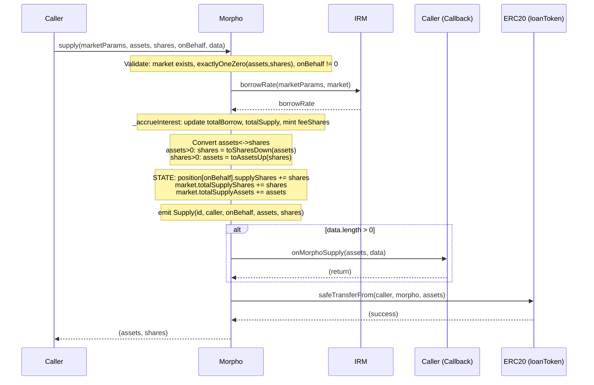

### withdraw

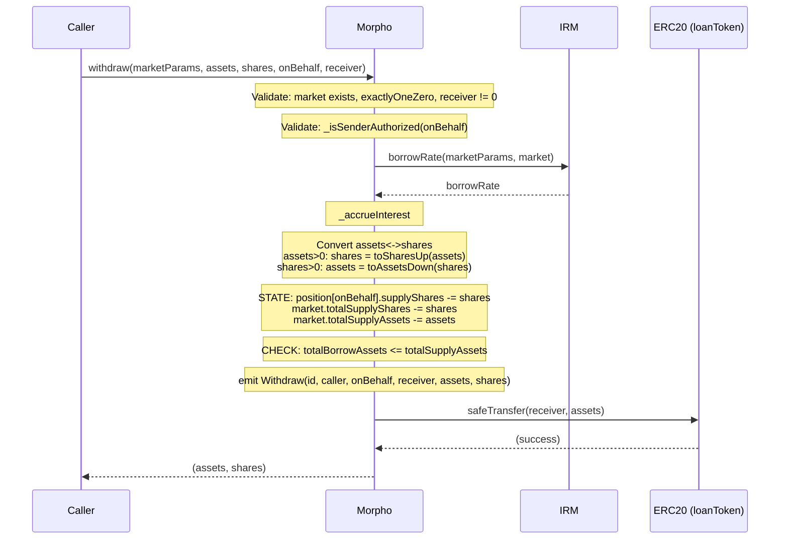

### borrow

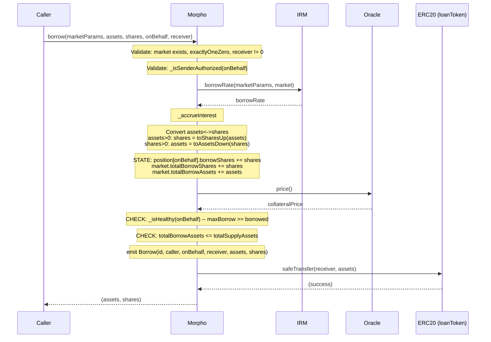

### repay

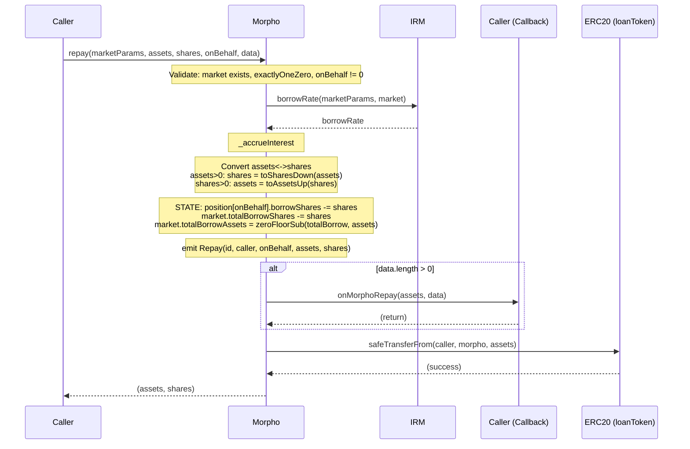

### supplyCollateral

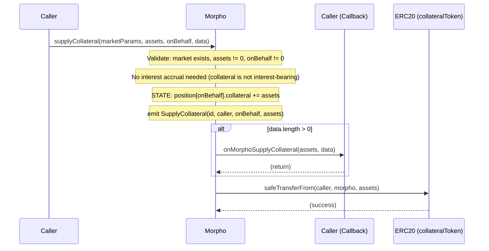

### withdrawCollateral

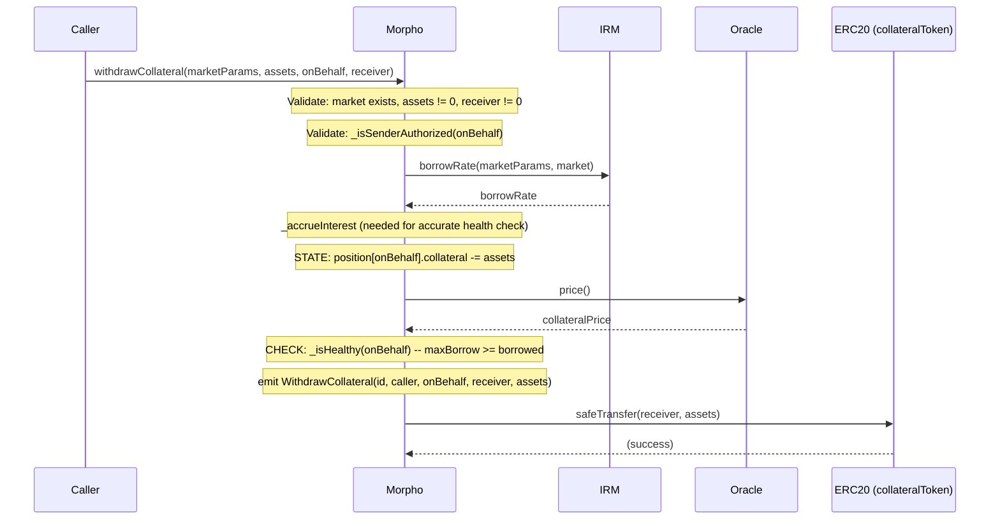

### liquidate

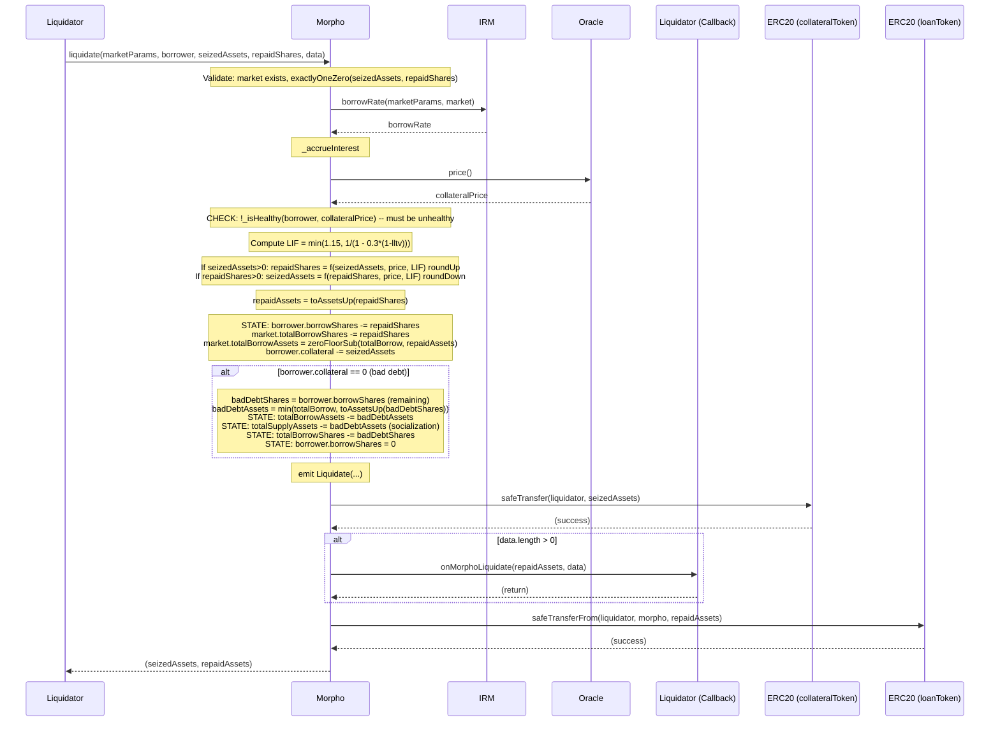

### flashLoan

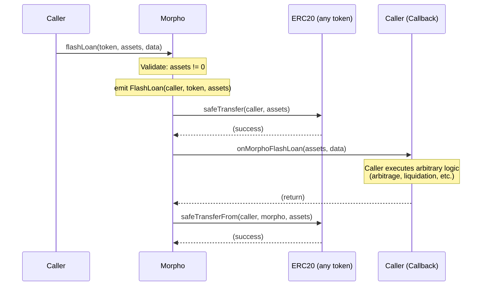

### setAuthorizationWithSig

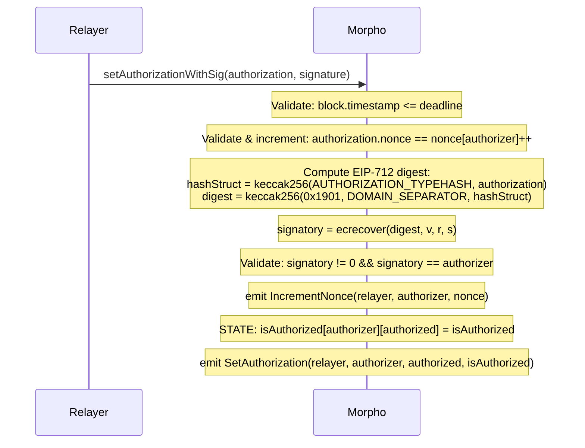

### createMarket

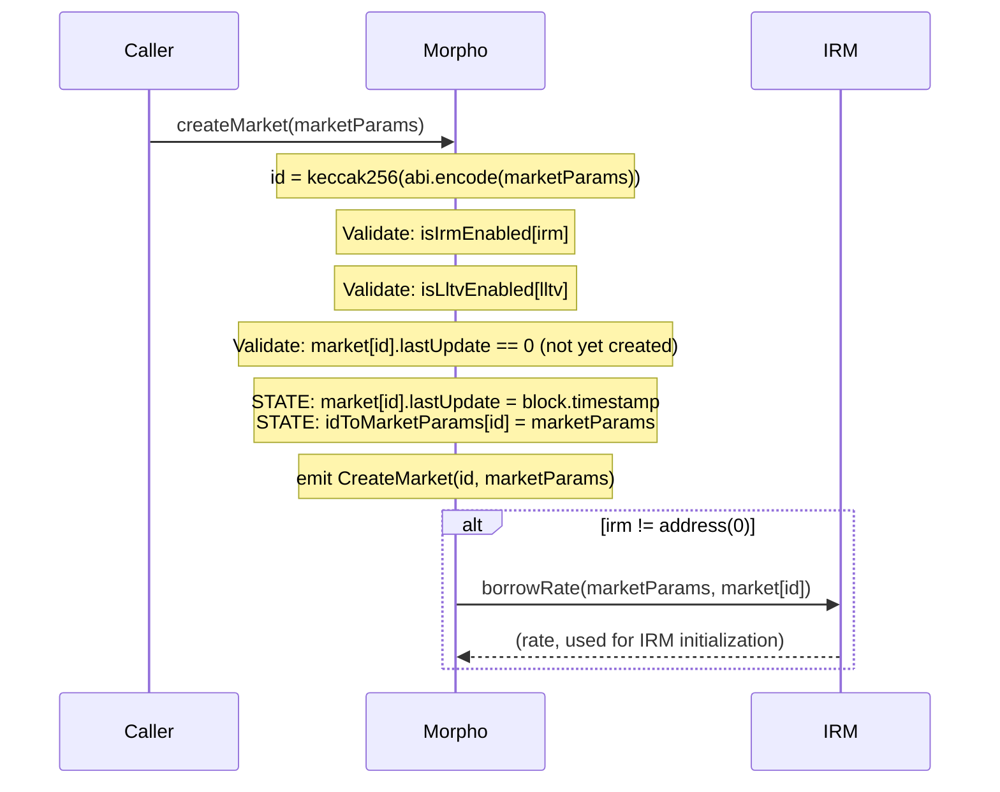

### _accrueInterest (shared internal)

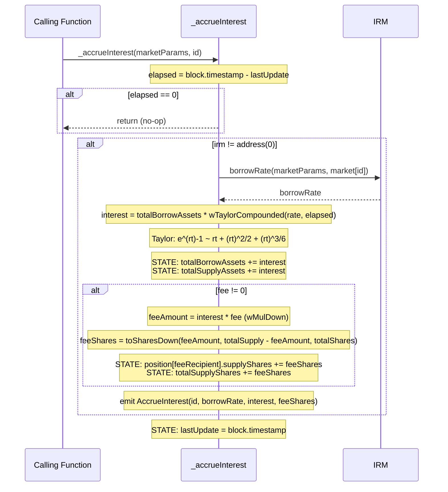

---

## Per-Operation Details

### supply

- **Access**: Permissionless. Anyone can supply on behalf of any address (depositing only benefits the recipient).
- **Validations**: Market exists (`lastUpdate != 0`). Exactly one of `assets`/`shares` is zero. `onBehalf != address(0)`.
- **State Changes**: `position[id][onBehalf].supplyShares += shares`. `market.totalSupplyShares += shares`. `market.totalSupplyAssets += assets`. Also all `_accrueInterest` state changes.
- **Rounding**: `assets > 0`: shares = `toSharesDown` (depositor gets fewer shares). `shares > 0`: assets = `toAssetsUp` (depositor pays more assets).
- **External Calls**: `IRM.borrowRate` (via `_accrueInterest`). Optional callback `onMorphoSupply`. `loanToken.safeTransferFrom`.
- **Events**: `AccrueInterest`, `Supply`.
- **CEI**: State updated before callback and before transferFrom. Callback is between state update and token pull.

### withdraw

- **Access**: Authorized. `msg.sender == onBehalf || isAuthorized[onBehalf][msg.sender]`.
- **Validations**: Market exists. Exactly one of `assets`/`shares` is zero. `receiver != address(0)`. Authorization check. Post-state liquidity check (`totalBorrow <= totalSupply`).
- **State Changes**: `position[id][onBehalf].supplyShares -= shares` (underflow reverts if insufficient). `market.totalSupplyShares -= shares`. `market.totalSupplyAssets -= assets`. Also `_accrueInterest` writes.
- **Rounding**: `assets > 0`: shares = `toSharesUp` (user burns more shares). `shares > 0`: assets = `toAssetsDown` (user receives fewer assets).
- **External Calls**: `IRM.borrowRate` (via `_accrueInterest`). `loanToken.safeTransfer`.
- **Events**: `AccrueInterest`, `Withdraw`.
- **CEI**: State updated and liquidity checked before token transfer.

### borrow

- **Access**: Authorized. `msg.sender == onBehalf || isAuthorized[onBehalf][msg.sender]`.
- **Validations**: Market exists. Exactly one of `assets`/`shares` is zero. `receiver != address(0)`. Authorization check. Post-state health check (oracle call). Post-state liquidity check.
- **State Changes**: `position[id][onBehalf].borrowShares += shares`. `market.totalBorrowShares += shares`. `market.totalBorrowAssets += assets`. Also `_accrueInterest` writes.
- **Rounding**: `assets > 0`: shares = `toSharesUp` (borrower owes more shares). `shares > 0`: assets = `toAssetsDown` (borrower receives fewer assets).
- **External Calls**: `IRM.borrowRate` (via `_accrueInterest`). `Oracle.price` (via `_isHealthy`). `loanToken.safeTransfer`.
- **Events**: `AccrueInterest`, `Borrow`.
- **CEI**: State updated, then health check (oracle call is a read), then token transfer.

### repay

- **Access**: Permissionless. Anyone can repay on behalf of any borrower (repaying only benefits the borrower).
- **Validations**: Market exists. Exactly one of `assets`/`shares` is zero. `onBehalf != address(0)`.
- **State Changes**: `position[id][onBehalf].borrowShares -= shares` (underflow reverts). `market.totalBorrowShares -= shares`. `market.totalBorrowAssets = zeroFloorSub(totalBorrow, assets)`. Also `_accrueInterest` writes.
- **Rounding**: `assets > 0`: shares = `toSharesDown` (borrower repays slightly fewer shares, mildly borrower-favored). `shares > 0`: assets = `toAssetsUp` (borrower pays more assets, protocol-favored).
- **Edge Case**: `zeroFloorSub` prevents underflow when rounding causes `assets` to exceed `totalBorrowAssets` by 1.
- **External Calls**: `IRM.borrowRate` (via `_accrueInterest`). Optional callback `onMorphoRepay`. `loanToken.safeTransferFrom`.
- **Events**: `AccrueInterest`, `Repay`.
- **CEI**: State updated before callback and before transferFrom.

### supplyCollateral

- **Access**: Permissionless. Anyone can deposit collateral for any address.
- **Validations**: Market exists. `assets != 0`. `onBehalf != address(0)`.
- **State Changes**: `position[id][onBehalf].collateral += assets`. No interest accrual (collateral is not interest-bearing).
- **Rounding**: None. Collateral is tracked as raw assets, not shares.
- **External Calls**: Optional callback `onMorphoSupplyCollateral`. `collateralToken.safeTransferFrom`.
- **Events**: `SupplyCollateral`.
- **CEI**: State updated before callback and before transferFrom.

### withdrawCollateral

- **Access**: Authorized. `msg.sender == onBehalf || isAuthorized[onBehalf][msg.sender]`.
- **Validations**: Market exists. `assets != 0`. `receiver != address(0)`. Authorization check. Post-state health check (oracle call).
- **State Changes**: `position[id][onBehalf].collateral -= assets` (underflow reverts). Also `_accrueInterest` writes (needed for accurate health check).
- **Rounding**: Health check rounds against borrower: borrowed rounds UP (`toAssetsUp`), maxBorrow rounds DOWN (`mulDivDown`, `wMulDown`).
- **External Calls**: `IRM.borrowRate` (via `_accrueInterest`). `Oracle.price` (via `_isHealthy`). `collateralToken.safeTransfer`.
- **Events**: `AccrueInterest`, `WithdrawCollateral`.
- **CEI**: State updated, then health check (oracle read), then token transfer.

### liquidate

- **Access**: Permissionless. Anyone can liquidate unhealthy positions.
- **Validations**: Market exists. Exactly one of `seizedAssets`/`repaidShares` is zero. Position must be unhealthy (oracle-dependent).
- **State Changes**: Borrower `borrowShares -= repaidShares`. Market `totalBorrowShares -= repaidShares`. Market `totalBorrowAssets = zeroFloorSub(totalBorrow, repaidAssets)`. Borrower `collateral -= seizedAssets`. If `collateral == 0` after seizure: bad debt socialization reduces `totalSupplyAssets` and clears remaining borrow. Also `_accrueInterest` writes.
- **Rounding (seizedAssets given)**: `seizedAssetsQuoted = mulDivUp`. `repaidShares = wDivUp then toSharesUp`. All round UP -- liquidator repays more (protocol-favored).
- **Rounding (repaidShares given)**: `seizedAssets = toAssetsDown, wMulDown, mulDivDown`. All round DOWN -- liquidator seizes less (protocol-favored).
- **Rounding (repaidAssets)**: `toAssetsUp` -- liquidator pays more assets (protocol-favored).
- **Bad Debt**: `badDebtAssets = min(totalBorrow, toAssetsUp(badDebtShares))`. Socialized to suppliers by reducing `totalSupplyAssets`.
- **External Calls**: `IRM.borrowRate` (via `_accrueInterest`). `Oracle.price`. `collateralToken.safeTransfer` (to liquidator). Optional callback `onMorphoLiquidate`. `loanToken.safeTransferFrom` (from liquidator).
- **Events**: `AccrueInterest`, `Liquidate`.
- **CEI**: All state is updated before any external transfer. Collateral transfer to liquidator, then callback, then loan token pull. This ordering enables flash liquidation (use seized collateral to fund repayment).

### flashLoan

- **Access**: Permissionless.
- **Validations**: `assets != 0`.
- **State Changes**: None. Stateless operation.
- **External Calls**: `token.safeTransfer` (send to caller). Mandatory callback `onMorphoFlashLoan`. `token.safeTransferFrom` (reclaim from caller).
- **Events**: `FlashLoan`.
- **CEI**: No state changes, so CEI is not strictly applicable. Token flow: send -> callback -> reclaim. If callback fails or caller lacks tokens/approval for reclaim, entire transaction reverts.
- **Note**: Can borrow ANY token held by the contract (all market loan tokens, all collateral tokens, donated tokens). No fee charged.

### setAuthorization

- **Access**: msg.sender only (authorizes others to manage msg.sender's positions).
- **Validations**: `newIsAuthorized != isAuthorized[msg.sender][authorized]` (no-op prevention).
- **State Changes**: `isAuthorized[msg.sender][authorized] = newIsAuthorized`.
- **Events**: `SetAuthorization`.

### setAuthorizationWithSig

- **Access**: Anyone can submit (relayer pattern). Valid EIP-712 signature from authorizer required.
- **Validations**: `block.timestamp <= deadline`. `authorization.nonce == nonce[authorizer]` (then increments). `ecrecover` must yield non-zero address matching authorizer.
- **State Changes**: `nonce[authorizer]++`. `isAuthorized[authorizer][authorized] = isAuthorized`.
- **Events**: `IncrementNonce`, `SetAuthorization`.
- **Note**: Does NOT check if authorization value is already set. Nonce increment is the intended side effect even for no-op authorization changes.

### createMarket

- **Access**: Permissionless. Anyone can create markets using owner-whitelisted IRM and LLTV.
- **Validations**: `isIrmEnabled[irm]`. `isLltvEnabled[lltv]`. `market[id].lastUpdate == 0` (not already created).
- **State Changes**: `market[id].lastUpdate = block.timestamp`. `idToMarketParams[id] = marketParams`.
- **External Calls**: `IRM.borrowRate` (if `irm != address(0)`) -- initializes stateful IRMs. Called AFTER state writes and event emission.
- **Events**: `CreateMarket`.

### accrueInterest

- **Access**: Permissionless.
- **Validations**: Market exists.
- **State Changes**: Delegates to `_accrueInterest` -- updates `totalBorrowAssets`, `totalSupplyAssets`, `totalSupplyShares`, `lastUpdate`, `feeRecipient.supplyShares`.
- **External Calls**: `IRM.borrowRate` (via `_accrueInterest`).
- **Events**: `AccrueInterest`.

---

## Callbacks and Reentrancy Surface

Five operations support optional callbacks. One (`flashLoan`) has a mandatory callback:

| Operation | Callback Interface | When Invoked | Token Flow Pattern |
|---|---|---|---|
| `supply` | `IMorphoSupplyCallback.onMorphoSupply` | After state update, before `transferFrom` | Callback then pull |
| `repay` | `IMorphoRepayCallback.onMorphoRepay` | After state update, before `transferFrom` | Callback then pull |
| `supplyCollateral` | `IMorphoSupplyCollateralCallback.onMorphoSupplyCollateral` | After state update, before `transferFrom` | Callback then pull |
| `liquidate` | `IMorphoLiquidateCallback.onMorphoLiquidate` | After collateral transfer to liquidator, before `transferFrom` | Push, callback, pull |
| `flashLoan` | `IMorphoFlashLoanCallback.onMorphoFlashLoan` | After token sent to caller, before `transferFrom` | Push, callback, pull |

**Reentrancy Safety**: Morpho has no reentrancy guard. Instead, it relies on the CEI (Checks-Effects-Interactions) pattern. All state mutations are finalized before any external call. A reentrant call would operate on already-updated state and would need to pass all validations again (market existence, authorization, health checks, liquidity checks). The protocol is designed to be safe under reentrancy because each operation is independently valid given current state.

**Callback caller trust**: Callbacks are always invoked on `msg.sender`. The caller controls the callback implementation. Callbacks with `data.length == 0` are skipped (gas optimization and opt-out).

---

## Rounding Direction Summary

| Operation | Conversion | Function | Direction | Favors |
|---|---|---|---|---|
| supply (assets given) | assets -> shares | `toSharesDown` | Down | Protocol (depositor gets fewer shares) |
| supply (shares given) | shares -> assets | `toAssetsUp` | Up | Protocol (depositor pays more) |
| withdraw (assets given) | assets -> shares | `toSharesUp` | Up | Protocol (user burns more shares) |
| withdraw (shares given) | shares -> assets | `toAssetsDown` | Down | Protocol (user gets fewer assets) |
| borrow (assets given) | assets -> shares | `toSharesUp` | Up | Protocol (borrower owes more shares) |
| borrow (shares given) | shares -> assets | `toAssetsDown` | Down | Protocol (borrower gets fewer assets) |
| repay (assets given) | assets -> shares | `toSharesDown` | Down | Borrower (repays slightly fewer shares) |
| repay (shares given) | shares -> assets | `toAssetsUp` | Up | Protocol (borrower pays more assets) |
| liquidate (seized given) | quote seized | `mulDivUp` | Up | Protocol (more repaid) |
| liquidate (seized given) | apply discount | `wDivUp` | Up | Protocol (more repaid) |
| liquidate (seized given) | value -> shares | `toSharesUp` | Up | Protocol (more repaid shares) |
| liquidate (repaid given) | shares -> assets | `toAssetsDown` | Down | Protocol (less seized) |
| liquidate (repaid given) | apply incentive | `wMulDown` | Down | Protocol (less seized) |
| liquidate (repaid given) | to collateral | `mulDivDown` | Down | Protocol (less seized) |
| liquidate repaidAssets | shares -> assets | `toAssetsUp` | Up | Protocol (liquidator pays more) |
| health check: borrowed | shares -> assets | `toAssetsUp` | Up | Protocol (borrower appears to owe more) |
| health check: maxBorrow | collateral * price | `mulDivDown` | Down | Protocol (borrower can borrow less) |
| health check: maxBorrow | * lltv | `wMulDown` | Down | Protocol (borrower can borrow less) |
| accrueInterest: interest | rate * time compound | `wMulDown` | Down | Borrowers (slightly less interest) |
| accrueInterest: feeShares | feeAmount -> shares | `toSharesDown` | Down | Suppliers (protocol takes slightly fewer fee shares) |

---

## State Changes Summary

| State Variable | Modified By |
|---|---|
| `owner` | `setOwner` |
| `feeRecipient` | `setFeeRecipient` |
| `isIrmEnabled[irm]` | `enableIrm` |
| `isLltvEnabled[lltv]` | `enableLltv` |
| `isAuthorized[a][b]` | `setAuthorization`, `setAuthorizationWithSig` |
| `nonce[authorizer]` | `setAuthorizationWithSig` |
| `market[id].lastUpdate` | `createMarket`, `_accrueInterest` (all ops that accrue) |
| `market[id].fee` | `setFee` |
| `market[id].totalSupplyAssets` | `supply`, `withdraw`, `_accrueInterest`, `liquidate` (bad debt) |
| `market[id].totalSupplyShares` | `supply`, `withdraw`, `_accrueInterest` (fee), `liquidate` (bad debt) |
| `market[id].totalBorrowAssets` | `borrow`, `repay`, `_accrueInterest`, `liquidate` |
| `market[id].totalBorrowShares` | `borrow`, `repay`, `liquidate` |
| `position[id][user].supplyShares` | `supply`, `withdraw`, `_accrueInterest` (feeRecipient only) |
| `position[id][user].borrowShares` | `borrow`, `repay`, `liquidate` |
| `position[id][user].collateral` | `supplyCollateral`, `withdrawCollateral`, `liquidate` |
| `idToMarketParams[id]` | `createMarket` |
