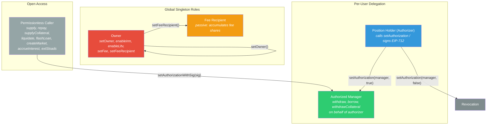
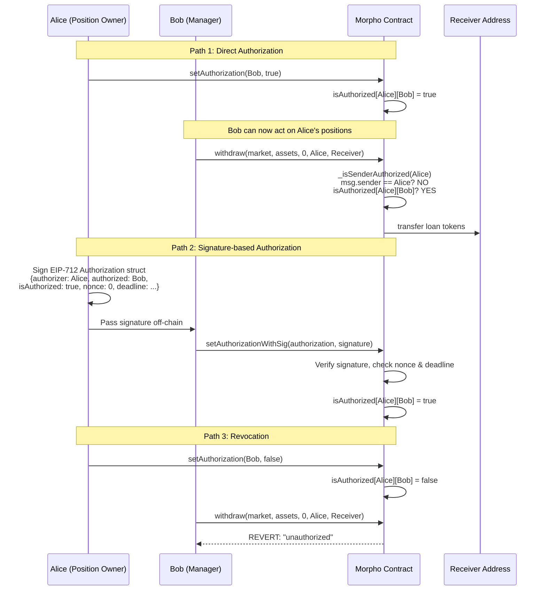

# Morpho Blue -- Roles & Access Control

## Roles Identified

| Role | Scope | How Assigned | Storage | Description |
|------|-------|--------------|---------|-------------|
| **Owner** | Global (singleton) | `constructor(newOwner)` then `setOwner(newOwner)` | `address owner` (slot 0) | Protocol governance. Controls allowlists and fee parameters. Cannot touch user funds directly. |
| **Fee Recipient** | Global (singleton) | `setFeeRecipient(newFeeRecipient)` (owner-only) | `address feeRecipient` (slot 1) | Passive recipient of accrued protocol fee shares. Has no callable privileges. |
| **Authorized Manager** | Per-authorizer (global across all markets) | `setAuthorization(authorized, true)` or `setAuthorizationWithSig(...)` | `isAuthorized[authorizer][manager]` (slot 6) | Can call withdraw, borrow, and withdrawCollateral on behalf of the authorizer across every market. |
| **Position Holder (Self)** | Per-address | Implicit (msg.sender == onBehalf) | N/A | Any address acting on its own positions. Always passes the `_isSenderAuthorized` check. |
| **Permissionless Caller** | Global | None required | N/A | Any address. Can call supply, repay, supplyCollateral, liquidate, flashLoan, createMarket, accrueInterest, extSloads. |

### Key observations

- There is **no role registry or allowlist for users**. The only allowlists are for IRM addresses (`isIrmEnabled`) and LLTV values (`isLltvEnabled`), both owner-gated.
- There are **no timelocks** on any operation. Owner actions (setOwner, enableIrm, enableLltv, setFee, setFeeRecipient) take effect immediately.
- Authorization is **all-or-nothing per authorizer**: once `isAuthorized[alice][bob] = true`, Bob can act on Alice's positions in every market. There is no per-market or per-function granularity.
- The Fee Recipient is a passive address, not a role with callable privileges. It simply accumulates supply shares when interest accrues.

---

## Permission Matrix

The table below maps every external function in `Morpho.sol` to its required access level.

| Function | Modifier / Check | Owner | Authorized Manager | Self (msg.sender) | Permissionless | Notes |
|----------|------------------|:-----:|:------------------:|:------------------:|:--------------:|-------|
| `setOwner` | `onlyOwner` | Y | - | - | - | Transfers ownership |
| `enableIrm` | `onlyOwner` | Y | - | - | - | One-way enable (no disable) |
| `enableLltv` | `onlyOwner` | Y | - | - | - | One-way enable (no disable) |
| `setFee` | `onlyOwner` | Y | - | - | - | Per-market fee, capped at MAX_FEE (25%) |
| `setFeeRecipient` | `onlyOwner` | Y | - | - | - | Changes global fee recipient |
| `createMarket` | none | - | - | - | Y | Requires IRM + LLTV pre-enabled by owner |
| `supply` | none | - | - | - | Y | Anyone can supply on behalf of any `onBehalf` |
| `withdraw` | `_isSenderAuthorized` | - | Y | Y | - | Moves funds from onBehalf to receiver |
| `borrow` | `_isSenderAuthorized` | - | Y | Y | - | Creates debt for onBehalf, sends to receiver |
| `repay` | none | - | - | - | Y | Anyone can repay on behalf of any `onBehalf` |
| `supplyCollateral` | none | - | - | - | Y | Anyone can supply collateral for any `onBehalf` |
| `withdrawCollateral` | `_isSenderAuthorized` | - | Y | Y | - | Removes collateral from onBehalf to receiver |
| `liquidate` | none | - | - | - | Y | Requires unhealthy position |
| `flashLoan` | none | - | - | - | Y | Atomic borrow + repay in one tx |
| `setAuthorization` | none (msg.sender is authorizer) | - | - | Y | - | msg.sender grants/revokes own authorization |
| `setAuthorizationWithSig` | none (EIP-712 signature) | - | - | - | Y | Anyone can submit a valid signature on behalf of authorizer |
| `accrueInterest` | none | - | - | - | Y | Permissionless interest accrual |
| `extSloads` | none | - | - | - | Y | Read-only storage access |

### Legend

- **Y** = function is callable by this role
- **-** = function is not callable / not relevant for this role

---

## Authorization Mechanism Detail

### The `_isSenderAuthorized` check

    function _isSenderAuthorized(address onBehalf) internal view returns (bool) {
        return msg.sender == onBehalf || isAuthorized[onBehalf][msg.sender];
    }

This is the sole authorization gate for position-modifying functions (`withdraw`, `borrow`, `withdrawCollateral`). It returns `true` if:

1. **Self-action**: `msg.sender == onBehalf` (the user is acting on their own position), OR
2. **Delegated action**: `isAuthorized[onBehalf][msg.sender]` is `true` (the user was explicitly authorized by the position owner).

There is no `address(0)` guard inside `_isSenderAuthorized` itself. However, `withdraw` validates `receiver != address(0)` (not `onBehalf`), while `borrow` also validates `receiver != address(0)`. The `onBehalf != address(0)` check is implicitly covered because `address(0)` cannot call `setAuthorization` and `msg.sender` is never `address(0)`.

### The `onlyOwner` modifier

    modifier onlyOwner() {
        require(msg.sender == owner, ErrorsLib.NOT_OWNER);
        _;
    }

Simple single-address ownership. No multi-sig, no timelock, no two-step transfer.

---

## "On Behalf Of" Patterns

Morpho Blue uses an `onBehalf` parameter extensively. The pattern splits into two categories:

### Permissionless "on behalf of" (beneficial actions)

These functions allow **any caller** to act on behalf of another address because the action is always beneficial to the `onBehalf` address:

| Function | What happens | Why permissionless |
|----------|-------------|-------------------|
| `supply(... onBehalf ...)` | Credits supply shares to `onBehalf` | Giving someone supply shares is never harmful |
| `repay(... onBehalf ...)` | Reduces `onBehalf`'s debt | Repaying someone's debt is never harmful |
| `supplyCollateral(... onBehalf ...)` | Adds collateral to `onBehalf`'s position | Adding collateral is never harmful |

These functions pull tokens from `msg.sender` (via callback or transferFrom) and credit the position of `onBehalf`.

### Authorized "on behalf of" (potentially harmful actions)

These functions require `_isSenderAuthorized(onBehalf)` because the action removes value from the `onBehalf` address:

| Function | What happens | Why gated |
|----------|-------------|-----------|
| `withdraw(... onBehalf, receiver)` | Debits supply shares from `onBehalf`, sends tokens to `receiver` | Removes value from onBehalf |
| `borrow(... onBehalf, receiver)` | Creates debt for `onBehalf`, sends tokens to `receiver` | Creates obligations for onBehalf |
| `withdrawCollateral(... onBehalf, receiver)` | Removes collateral from `onBehalf`, sends tokens to `receiver` | Reduces collateral, may make position unhealthy |

Note: `receiver` can differ from both `msg.sender` and `onBehalf`. An authorized manager can withdraw from Alice's position and send tokens to Charlie.

### Signature-based authorization

`setAuthorizationWithSig` enables gasless delegation via EIP-712 signatures:

- The **authorizer** signs an off-chain `Authorization` struct: `{ authorizer, authorized, isAuthorized, nonce, deadline }`
- **Any** address can submit this signature on-chain
- The nonce is strictly sequential (no out-of-order execution)
- The deadline prevents stale signatures from being replayed

---

## Role Hierarchy

---

## Authorization Flow

---

## Security Considerations for Auditors

### Authorization scope is global, not per-market
An authorized manager has access to the authorizer's positions in **all** markets simultaneously. A compromised or malicious manager can drain every position the authorizer holds. There is no way to limit delegation to a single market.

### One-way allowlists for IRM and LLTV
`enableIrm` and `enableLltv` are additive only. There is no `disableIrm` or `disableLltv`. Once an IRM or LLTV value is enabled, it remains enabled forever. New markets can always be created with previously-enabled parameters.

### No timelock on owner actions
`setFee` takes effect immediately after accruing interest. The fee can jump from 0% to 25% (MAX_FEE) in a single transaction. Similarly, `setOwner` transfers ownership atomically with no delay or two-step confirmation.

### Receiver separation from onBehalf
In `withdraw`, `borrow`, and `withdrawCollateral`, the `receiver` parameter is independent of both `msg.sender` and `onBehalf`. An authorized manager could send withdrawn assets to any arbitrary address.

### Nonce is strictly sequential
`setAuthorizationWithSig` requires `authorization.nonce == nonce[authorizer]++`. This means authorization signatures must be submitted in exact order. A pending signature becomes invalid if another signature (or `setAuthorizationWithSig` call) increments the nonce first.

### Beneficial actions have no authorization gate
`supply`, `repay`, and `supplyCollateral` can be called by anyone with any `onBehalf` address. While these are "beneficial", they could be used for griefing in edge cases (e.g., dust deposits to prevent position closure, or forced repayments that interact with accounting in unexpected ways).
