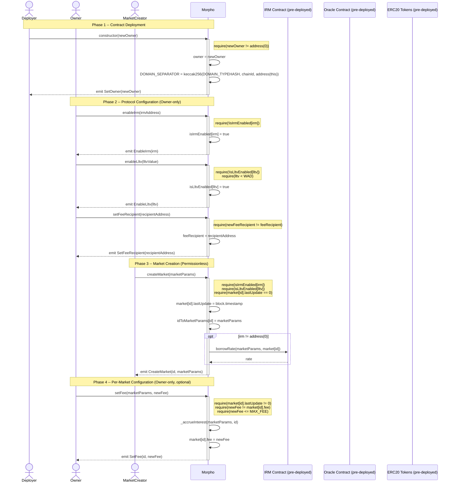
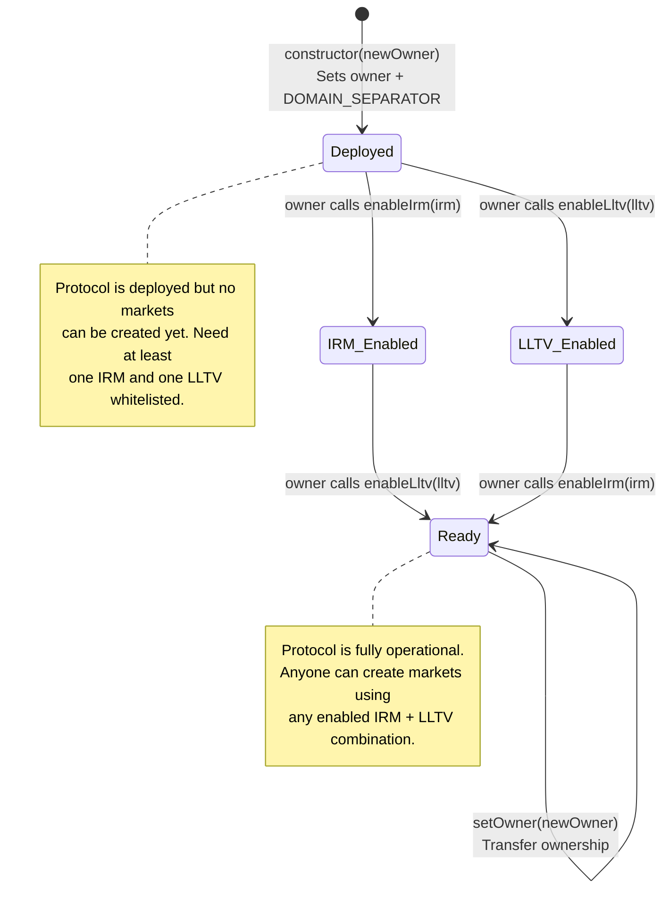
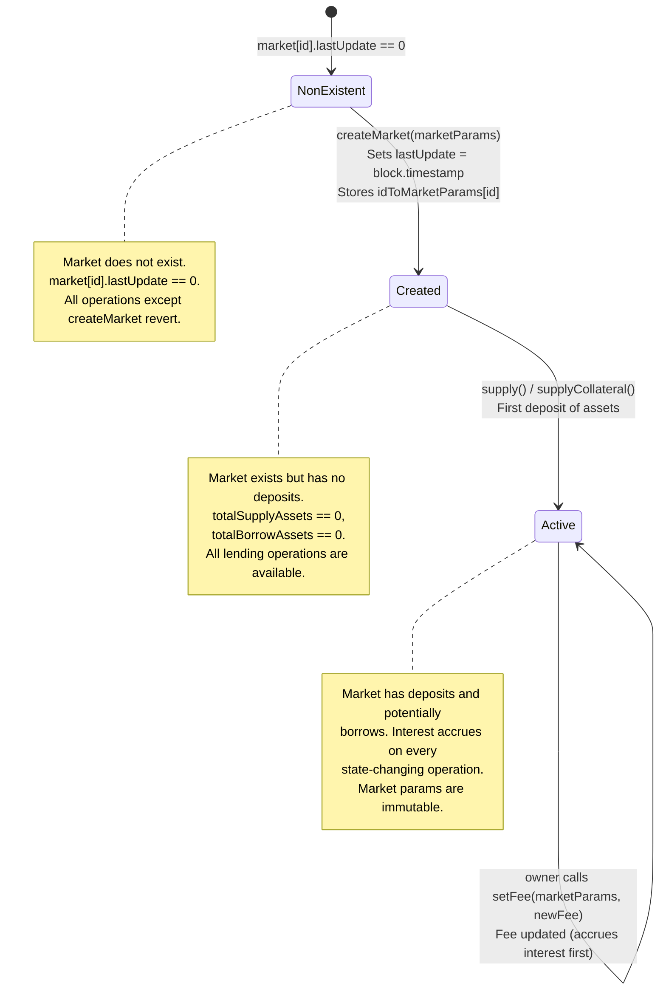

# Setup Charts

## 1. Deployment Sequence

Shows the order of operations to deploy and configure the protocol, including
which actors perform each step and what preconditions must hold.

## 2. Configuration State Machine

### 2a. Protocol-Level States

Tracks the overall protocol lifecycle from deployment through configuration to
operational readiness. The protocol is operational once at least one IRM and one
LLTV value are enabled.

### 2b. Per-Market States

Each market (identified by a unique Id derived from its MarketParams) follows
its own lifecycle. Markets are immutable once created -- only the fee can be
changed by the owner.

## 3. Market Creation Flow

Morpho uses a permissionless market creation pattern: anyone can call
`createMarket` as long as the IRM and LLTV values in the MarketParams have been
whitelisted by the owner. The market Id is deterministically derived from the
five MarketParams fields (loanToken, collateralToken, oracle, irm, lltv) via
keccak256 hashing.

```mermaid
flowchart TD
    A[Caller invokes createMarket<br/>with MarketParams] --> B{Is IRM enabled?<br/>isIrmEnabled&#91;irm&#93;}
    B -- No --> B_FAIL[REVERT: IRM_NOT_ENABLED]
    B -- Yes --> C{Is LLTV enabled?<br/>isLltvEnabled&#91;lltv&#93;}
    C -- No --> C_FAIL[REVERT: LLTV_NOT_ENABLED]
    C -- Yes --> D[Compute Id = keccak256<br/>&#40;loanToken, collateralToken,<br/>oracle, irm, lltv&#41;]
    D --> E{market&#91;id&#93;.lastUpdate == 0?}
    E -- No --> E_FAIL[REVERT: MARKET_ALREADY_CREATED]
    E -- Yes --> F[market&#91;id&#93;.lastUpdate = block.timestamp]
    F --> G[idToMarketParams&#91;id&#93; = marketParams]
    G --> H{irm != address&#40;0&#41;?}
    H -- Yes --> I[IRM.borrowRate&#40;marketParams, market&#41;<br/>Validate IRM compatibility]
    H -- No --> J[Skip IRM validation]
    I --> K[Emit CreateMarket&#40;id, marketParams&#41;]
    J --> K
    K --> L[Market is now active<br/>at this Id forever]

    style B_FAIL fill:#f66,stroke:#900,color:#fff
    style C_FAIL fill:#f66,stroke:#900,color:#fff
    style E_FAIL fill:#f66,stroke:#900,color:#fff
    style L fill:#6f6,stroke:#090,color:#000
```

## 4. Authorization Setup Flow

Users can authorize delegates to manage their positions across all markets.
This uses either direct calls or EIP-712 signature-based authorization.

```mermaid
flowchart TD
    A[User wants to authorize<br/>a delegate] --> B{Direct call or<br/>signature-based?}

    B -- Direct --> C[User calls setAuthorization<br/>&#40;authorized, isAuthorized&#41;]
    C --> D{newIsAuthorized !=<br/>current value?}
    D -- No --> D_FAIL[REVERT: ALREADY_SET]
    D -- Yes --> E[isAuthorized&#91;msg.sender&#93;&#91;authorized&#93;<br/>= newIsAuthorized]
    E --> F[Emit SetAuthorization]

    B -- Signature --> G[Relayer calls setAuthorizationWithSig<br/>&#40;authorization, signature&#41;]
    G --> H{deadline not expired?}
    H -- No --> H_FAIL[REVERT: SIGNATURE_EXPIRED]
    H -- Yes --> I{Nonce matches?}
    I -- No --> I_FAIL[REVERT: INVALID_NONCE]
    I -- Yes --> J[Recover signer via<br/>DOMAIN_SEPARATOR + EIP-712]
    J --> K{Valid signer ==<br/>authorizer?}
    K -- No --> K_FAIL[REVERT: INVALID_SIGNATURE]
    K -- Yes --> L[Increment nonce]
    L --> M[isAuthorized&#91;authorizer&#93;&#91;authorized&#93;<br/>= isAuthorized]
    M --> N[Emit IncrementNonce +<br/>SetAuthorization]

    style D_FAIL fill:#f66,stroke:#900,color:#fff
    style H_FAIL fill:#f66,stroke:#900,color:#fff
    style I_FAIL fill:#f66,stroke:#900,color:#fff
    style K_FAIL fill:#f66,stroke:#900,color:#fff
```

## 5. Key Constants & Limits

| Constant | Value | Purpose |
|----------|-------|---------|
| MAX_FEE | 0.25e18 (25%) | Maximum protocol fee per market |
| WAD | 1e18 | LLTV must be strictly less than this value |
| ORACLE_PRICE_SCALE | 1e36 | Scale factor for oracle prices |
| LIQUIDATION_CURSOR | 0.3e18 (30%) | Portion of collateral seized during liquidation |
| MAX_LIQUIDATION_INCENTIVE_FACTOR | 1.15e18 (115%) | Maximum bonus for liquidators |
| VIRTUAL_SHARES | 1e6 | Anti-inflation-attack constant in share math |
| VIRTUAL_ASSETS | 1 | Anti-inflation-attack constant in share math |
