# Deployment Dependencies

## Per-Contract Dependency Analysis

---

### src/Morpho.sol (contract: Morpho)

| Category | Dependencies |
|----------|-------------|
| **Imports** | IMorpho.sol (Id, IMorphoStaticTyping, IMorphoBase, MarketParams, Position, Market, Authorization, Signature), IMorphoCallbacks.sol (IMorphoLiquidateCallback, IMorphoRepayCallback, IMorphoSupplyCallback, IMorphoSupplyCollateralCallback, IMorphoFlashLoanCallback), IIrm.sol (IIrm), IERC20.sol (IERC20), IOracle.sol (IOracle), ConstantsLib.sol (wildcard), UtilsLib.sol (UtilsLib), EventsLib.sol (EventsLib), ErrorsLib.sol (ErrorsLib), MathLib.sol (MathLib, WAD), SharesMathLib.sol (SharesMathLib), MarketParamsLib.sol (MarketParamsLib), SafeTransferLib.sol (SafeTransferLib) |
| **Inherits** | IMorphoStaticTyping |
| **Uses (library for)** | MathLib for uint128, MathLib for uint256, UtilsLib for uint256, SharesMathLib for uint256, SafeTransferLib for IERC20, MarketParamsLib for MarketParams |
| **External Calls** | [typed] IIrm(marketParams.irm).borrowRate(marketParams, market[id]), [typed] IOracle(marketParams.oracle).price(), [typed] IMorphoSupplyCallback(msg.sender).onMorphoSupply(assets, data), [typed] IMorphoRepayCallback(msg.sender).onMorphoRepay(assets, data), [typed] IMorphoSupplyCollateralCallback(msg.sender).onMorphoSupplyCollateral(assets, data), [typed] IMorphoLiquidateCallback(msg.sender).onMorphoLiquidate(repaidAssets, data), [typed] IMorphoFlashLoanCallback(msg.sender).onMorphoFlashLoan(assets, data), [low-level] address(token).call(IERC20Internal.transfer) via SafeTransferLib, [low-level] address(token).call(IERC20Internal.transferFrom) via SafeTransferLib |
| **Constructor** | `(address newOwner)` -- sets owner, computes DOMAIN_SEPARATOR |

---

### src/interfaces/IMorpho.sol (interfaces: IMorphoBase, IMorphoStaticTyping, IMorpho)

| Category | Dependencies |
|----------|-------------|
| **Imports** | -- |
| **Inherits** | IMorphoStaticTyping is IMorphoBase; IMorpho is IMorphoBase |
| **Uses** | -- |
| **External Calls** | -- |
| **Constructor** | -- |

---

### src/interfaces/IIrm.sol (interface: IIrm)

| Category | Dependencies |
|----------|-------------|
| **Imports** | IMorpho.sol (MarketParams, Market) |
| **Inherits** | -- |
| **Uses** | -- |
| **External Calls** | -- |
| **Constructor** | -- |

---

### src/interfaces/IERC20.sol (interface: IERC20)

| Category | Dependencies |
|----------|-------------|
| **Imports** | -- |
| **Inherits** | -- |
| **Uses** | -- |
| **External Calls** | -- |
| **Constructor** | -- |

---

### src/interfaces/IMorphoCallbacks.sol (interfaces: IMorphoLiquidateCallback, IMorphoRepayCallback, IMorphoSupplyCallback, IMorphoSupplyCollateralCallback, IMorphoFlashLoanCallback)

| Category | Dependencies |
|----------|-------------|
| **Imports** | -- |
| **Inherits** | -- |
| **Uses** | -- |
| **External Calls** | -- |
| **Constructor** | -- |

---

### src/interfaces/IOracle.sol (interface: IOracle)

| Category | Dependencies |
|----------|-------------|
| **Imports** | -- |
| **Inherits** | -- |
| **Uses** | -- |
| **External Calls** | -- |
| **Constructor** | -- |

---

### src/libraries/MathLib.sol (library: MathLib)

| Category | Dependencies |
|----------|-------------|
| **Imports** | -- |
| **Inherits** | -- |
| **Uses** | -- |
| **External Calls** | -- |
| **Constructor** | -- |

---

### src/libraries/SharesMathLib.sol (library: SharesMathLib)

| Category | Dependencies |
|----------|-------------|
| **Imports** | MathLib.sol (MathLib) |
| **Inherits** | -- |
| **Uses** | MathLib for uint256 |
| **External Calls** | -- |
| **Constructor** | -- |

---

### src/libraries/UtilsLib.sol (library: UtilsLib)

| Category | Dependencies |
|----------|-------------|
| **Imports** | ErrorsLib.sol (ErrorsLib) |
| **Inherits** | -- |
| **Uses** | -- |
| **External Calls** | -- |
| **Constructor** | -- |

---

### src/libraries/SafeTransferLib.sol (library: SafeTransferLib)

| Category | Dependencies |
|----------|-------------|
| **Imports** | IERC20.sol (IERC20), ErrorsLib.sol (ErrorsLib) |
| **Inherits** | -- |
| **Uses** | -- |
| **External Calls** | [low-level] address(token).call(IERC20Internal.transfer), [low-level] address(token).call(IERC20Internal.transferFrom) |
| **Constructor** | -- |

---

### src/libraries/MarketParamsLib.sol (library: MarketParamsLib)

| Category | Dependencies |
|----------|-------------|
| **Imports** | IMorpho.sol (Id, MarketParams) |
| **Inherits** | -- |
| **Uses** | -- |
| **External Calls** | -- |
| **Constructor** | -- |

---

### src/libraries/ErrorsLib.sol (library: ErrorsLib)

| Category | Dependencies |
|----------|-------------|
| **Imports** | -- |
| **Inherits** | -- |
| **Uses** | -- |
| **External Calls** | -- |
| **Constructor** | -- |

---

### src/libraries/EventsLib.sol (library: EventsLib)

| Category | Dependencies |
|----------|-------------|
| **Imports** | IMorpho.sol (Id, MarketParams) |
| **Inherits** | -- |
| **Uses** | -- |
| **External Calls** | -- |
| **Constructor** | -- |

---

### src/libraries/ConstantsLib.sol (file-level constants)

| Category | Dependencies |
|----------|-------------|
| **Imports** | -- |
| **Inherits** | -- |
| **Uses** | -- |
| **External Calls** | -- |
| **Constructor** | -- |

---

### src/libraries/periphery/MorphoLib.sol (library: MorphoLib)

| Category | Dependencies |
|----------|-------------|
| **Imports** | IMorpho.sol (IMorpho, Id), MorphoStorageLib.sol (MorphoStorageLib) |
| **Inherits** | -- |
| **Uses** | -- |
| **External Calls** | [typed] morpho.extSloads(slot) -- calls into a deployed Morpho instance |
| **Constructor** | -- |

---

### src/libraries/periphery/MorphoBalancesLib.sol (library: MorphoBalancesLib)

| Category | Dependencies |
|----------|-------------|
| **Imports** | IMorpho.sol (Id, MarketParams, Market, IMorpho), IIrm.sol (IIrm), MathLib.sol (MathLib), UtilsLib.sol (UtilsLib), MorphoLib.sol (MorphoLib), SharesMathLib.sol (SharesMathLib), MarketParamsLib.sol (MarketParamsLib) |
| **Inherits** | -- |
| **Uses** | MathLib for uint256, MathLib for uint128, UtilsLib for uint256, MorphoLib for IMorpho, SharesMathLib for uint256, MarketParamsLib for MarketParams |
| **External Calls** | [typed] IIrm(marketParams.irm).borrowRateView(marketParams, market) |
| **Constructor** | -- |

---

### src/libraries/periphery/MorphoStorageLib.sol (library: MorphoStorageLib)

| Category | Dependencies |
|----------|-------------|
| **Imports** | IMorpho.sol (Id) |
| **Inherits** | -- |
| **Uses** | -- |
| **External Calls** | -- |
| **Constructor** | -- |

---

## External Dependencies (Runtime)

All Solidity imports resolve to files within the protocol codebase. There are **no external package imports** (no OpenZeppelin, no third-party libraries).

However, the protocol makes **runtime external calls** to contracts that must implement protocol-defined interfaces. These are external at the protocol boundary -- they are not shipped with the codebase but must exist at runtime:

| External Dependency | Interface | Called By | Call Type | Purpose |
|---------------------|-----------|-----------|-----------|---------|
| IRM implementation | IIrm | Morpho, MorphoBalancesLib | [typed] | Computes borrow interest rate per second |
| Oracle implementation | IOracle | Morpho | [typed] | Returns collateral price for health checks |
| ERC-20 tokens (loan + collateral) | IERC20 (low-level) | Morpho via SafeTransferLib | [low-level] | Token transfers (transfer, transferFrom) |
| Supply callback implementor | IMorphoSupplyCallback | Morpho | [typed] | Optional callback on supply |
| Repay callback implementor | IMorphoRepayCallback | Morpho | [typed] | Optional callback on repay |
| SupplyCollateral callback implementor | IMorphoSupplyCollateralCallback | Morpho | [typed] | Optional callback on supplyCollateral |
| Liquidate callback implementor | IMorphoLiquidateCallback | Morpho | [typed] | Optional callback on liquidate |
| FlashLoan callback implementor | IMorphoFlashLoanCallback | Morpho | [typed] | Required callback on flashLoan |

---

## Dependency Graph

```mermaid
graph TD
    subgraph Interfaces
        IMorpho["IMorpho.sol<br/>(IMorphoBase, IMorphoStaticTyping, IMorpho)"]
        IIrm["IIrm.sol"]
        IERC20["IERC20.sol"]
        IOracle["IOracle.sol"]
        IMorphoCallbacks["IMorphoCallbacks.sol"]
    end

    subgraph Core Libraries
        MathLib["MathLib.sol"]
        SharesMathLib["SharesMathLib.sol"]
        UtilsLib["UtilsLib.sol"]
        SafeTransferLib["SafeTransferLib.sol"]
        MarketParamsLib["MarketParamsLib.sol"]
        ErrorsLib["ErrorsLib.sol"]
        EventsLib["EventsLib.sol"]
        ConstantsLib["ConstantsLib.sol"]
    end

    subgraph Periphery Libraries
        MorphoLib["MorphoLib.sol"]
        MorphoBalancesLib["MorphoBalancesLib.sol"]
        MorphoStorageLib["MorphoStorageLib.sol"]
    end

    subgraph Core Contract
        Morpho["Morpho.sol"]
    end

    subgraph "Runtime External Dependencies"
        ExtIRM["IRM Implementation"]:::external
        ExtOracle["Oracle Implementation"]:::external
        ExtERC20["ERC-20 Tokens"]:::external
        ExtCallbacks["Callback Implementors"]:::external
    end

    %% Interface inheritance
    IIrm -->|imports| IMorpho
    IOracle
    IERC20
    IMorphoCallbacks

    %% Library imports
    SharesMathLib -->|imports + uses| MathLib
    UtilsLib -->|imports| ErrorsLib
    SafeTransferLib -->|imports| IERC20
    SafeTransferLib -->|imports| ErrorsLib
    MarketParamsLib -->|imports| IMorpho
    EventsLib -->|imports| IMorpho

    %% Periphery imports
    MorphoStorageLib -->|imports| IMorpho
    MorphoLib -->|imports| IMorpho
    MorphoLib -->|imports| MorphoStorageLib
    MorphoBalancesLib -->|imports| IMorpho
    MorphoBalancesLib -->|imports| IIrm
    MorphoBalancesLib -->|imports| MathLib
    MorphoBalancesLib -->|imports| UtilsLib
    MorphoBalancesLib -->|imports| MorphoLib
    MorphoBalancesLib -->|imports| SharesMathLib
    MorphoBalancesLib -->|imports| MarketParamsLib

    %% Morpho contract imports + inheritance
    Morpho ==>|inherits| IMorpho
    Morpho -->|imports| IMorphoCallbacks
    Morpho -->|imports| IIrm
    Morpho -->|imports| IERC20
    Morpho -->|imports| IOracle
    Morpho -->|uses| MathLib
    Morpho -->|uses| SharesMathLib
    Morpho -->|uses| UtilsLib
    Morpho -->|uses| SafeTransferLib
    Morpho -->|uses| MarketParamsLib
    Morpho -->|imports| ConstantsLib
    Morpho -->|imports| EventsLib
    Morpho -->|imports| ErrorsLib

    %% Runtime external calls (dashed)
    Morpho -.->|"[typed] borrowRate()"| ExtIRM
    Morpho -.->|"[typed] price()"| ExtOracle
    Morpho -.->|"[low-level] transfer / transferFrom"| ExtERC20
    Morpho -.->|"[typed] onMorpho*() callbacks"| ExtCallbacks
    MorphoBalancesLib -.->|"[typed] borrowRateView()"| ExtIRM

    %% Styles
    classDef external fill:#f9f,stroke:#333,stroke-width:2px,stroke-dasharray: 5 5
```

### Legend

- **Solid arrows** (`-->`) = compile-time dependency (import / uses library)
- **Bold arrows** (`==>`) = inheritance
- **Dashed arrows** (`-.->`) = runtime external calls
- **Pink dashed border** = external runtime dependency (not part of codebase)

---

## Summary

Morpho Blue has a flat, minimal dependency tree. The single deployable contract (`Morpho.sol`) pulls in 13 protocol files (interfaces, libraries, constants). There are **zero external Solidity package dependencies** -- every import resolves to a file within `src/`.

At runtime, Morpho delegates to external contracts through well-defined interfaces:
- **IIrm** for interest rate computation (called on every interest accrual)
- **IOracle** for collateral pricing (called on borrow, withdrawCollateral, liquidate)
- **IERC20** for token transfers (low-level calls via SafeTransferLib)
- **IMorphoCallbacks** for optional user callbacks (supply, repay, supplyCollateral, liquidate, flashLoan)

The periphery libraries (`MorphoLib`, `MorphoBalancesLib`, `MorphoStorageLib`) are not used by the core contract. They are view-only helpers intended for off-chain integrations or periphery contracts that read Morpho state via `extSloads`.
