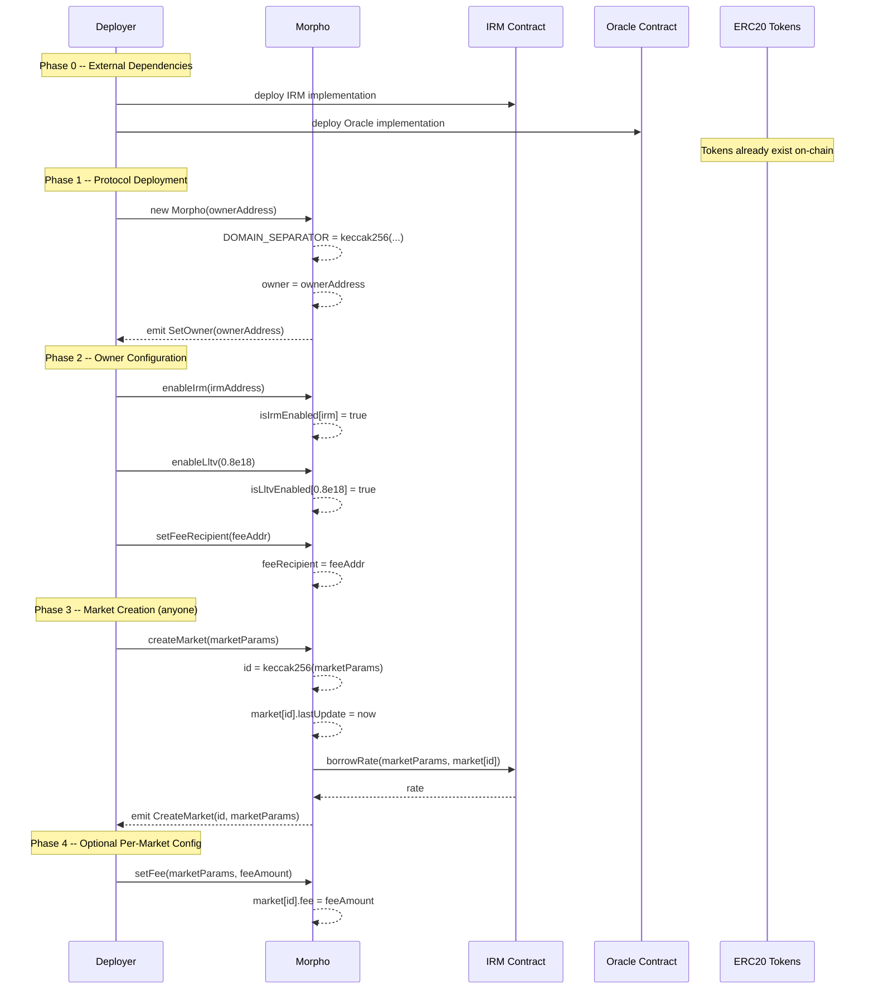
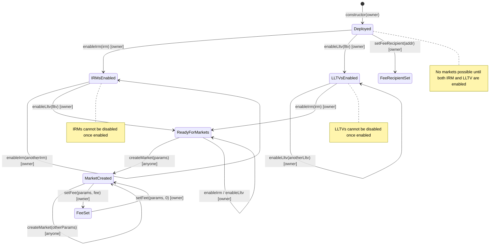

# Deployment Pattern -- Morpho Blue

## Architecture Summary

Morpho Blue follows a **singleton pattern**: a single `Morpho` contract holds all markets, positions, and funds. There is no factory, no proxy, and no upgradability. Individual lending markets are created within the singleton via `createMarket()` after the owner whitelists the required IRM and LLTV parameters.

The protocol has **no on-chain deployment scripts**. Deployment order is inferred from constructor dependencies, the test `Setup.sol`, and the enable/create call flow.

---

## Phase 0 -- External Dependencies (Pre-Protocol)

These contracts must exist before Morpho is deployed or before any market can be created. They are **out of scope** of the Morpho Blue codebase but are called at runtime.

| Dependency | Interface | Purpose | Deployment Timing |
|---|---|---|---|
| ERC20 Tokens | `IERC20` (empty; uses low-level `call`) | Loan tokens and collateral tokens for each market | Must exist before `createMarket` |
| Oracle(s) | `IOracle` -- single function `price()` returns `uint256` | Provides collateral price scaled by `1e36` for health checks and liquidations | Must exist before `createMarket` |
| Interest Rate Model(s) | `IIrm` -- `borrowRate()` and `borrowRateView()` | Returns per-second borrow rate scaled by WAD (`1e18`) | Must exist before `enableIrm` + `createMarket` |

---

## Phase 1 -- Protocol Deployment

There is exactly **one** protocol contract to deploy.

### Morpho (Singleton)

| Parameter | Type | Source | Validation |
|---|---|---|---|
| `newOwner` | `address` | Deployer-chosen admin address | `require(newOwner != address(0))` |

**Constructor effects:**
- Sets `owner = newOwner`
- Computes and stores `DOMAIN_SEPARATOR = keccak256(abi.encode(DOMAIN_TYPEHASH, block.chainid, address(this)))` as an immutable
- Emits `SetOwner(newOwner)`

**Immutables set at deploy time:**
- `DOMAIN_SEPARATOR` (bytes32) -- EIP-712 domain separator, chain-specific

**Initial state after deployment:**
- `owner` = newOwner
- `feeRecipient` = address(0) (no fee recipient)
- All mappings empty (no IRMs, no LLTVs, no markets, no positions)
- The contract is fully functional but has no markets yet

---

## Phase 2 -- Post-Deployment Configuration

All configuration functions are **owner-only**. The table below shows the required calls and their characteristics.

### Configuration Functions

| Function | Signature | Called By | Reversible? | Purpose |
|---|---|---|---|---|
| `enableIrm` | `enableIrm(address irm)` | owner | **NO** (one-way enable) | Whitelist an IRM for market creation |
| `enableLltv` | `enableLltv(uint256 lltv)` | owner | **NO** (one-way enable) | Whitelist an LLTV for market creation |
| `setFeeRecipient` | `setFeeRecipient(address)` | owner | Yes (two-way) | Set address to receive protocol fee shares |
| `setFee` | `setFee(MarketParams, uint256)` | owner | Yes (two-way) | Set fee for a specific market (0 to MAX_FEE) |
| `setOwner` | `setOwner(address)` | owner | Yes (two-way, but dangerous) | Transfer ownership |

### Enable Functions -- One-Way (Cannot Disable)

**`enableIrm(address irm)`**
- Validates: `!isIrmEnabled[irm]` (not already enabled)
- Effect: `isIrmEnabled[irm] = true` (permanent)
- Note: `address(0)` is a valid IRM, creating 0% APR markets

**`enableLltv(uint256 lltv)`**
- Validates: `!isLltvEnabled[lltv]` AND `lltv < WAD` (less than 100%)
- Effect: `isLltvEnabled[lltv] = true` (permanent)
- Note: Common values are `0.8e18` (80%), `0.9e18` (90%)

### Configuration Functions -- Two-Way (Can Change)

**`setFeeRecipient(address newFeeRecipient)`**
- Validates: `newFeeRecipient != feeRecipient` (must be different)
- Effect: updates `feeRecipient` storage
- Warning: Setting to `address(0)` causes fee shares to be minted to zero address (lost)

**`setFee(MarketParams memory marketParams, uint256 newFee)`**
- Validates: market exists, `newFee != currentFee`, `newFee <= MAX_FEE` (0.25e18 = 25%)
- Effect: accrues interest with old fee, then sets new fee
- Note: Per-market fee, can be set to 0

**`setOwner(address newOwner)`**
- Validates: `newOwner != owner` (must be different)
- Effect: immediate ownership transfer (no two-step)
- Warning: Can set to `address(0)`, permanently disabling all admin functions
- Warning: No confirmation step -- immediate and irrevocable

---

## Phase 3 -- Market Creation (Permissionless)

After IRMs and LLTVs are whitelisted, **anyone** can create markets.

**`createMarket(MarketParams memory marketParams)`**

| MarketParams Field | Type | Source | Notes |
|---|---|---|---|
| `loanToken` | `address` | Any ERC20 token | The token being lent and borrowed |
| `collateralToken` | `address` | Any ERC20 token | The token used as collateral |
| `oracle` | `address` | IOracle implementation | Must return price scaled by 1e36 |
| `irm` | `address` | IIrm implementation | Must be enabled via `enableIrm` |
| `lltv` | `uint256` | Loan-to-value ratio | Must be enabled via `enableLltv` |

**Validation:**
- `isIrmEnabled[marketParams.irm]` must be true
- `isLltvEnabled[marketParams.lltv]` must be true
- Market must not already exist (`market[id].lastUpdate == 0`)

**Effects:**
- `market[id].lastUpdate = block.timestamp`
- `idToMarketParams[id] = marketParams`
- If `irm != address(0)`: calls `IIrm(irm).borrowRate(marketParams, market[id])` to initialize stateful IRMs
- Market ID is deterministic: `id = keccak256(abi.encode(marketParams))`
- Markets are immutable once created -- parameters cannot change

---

## Admin Powers and Scope

| Power | Scope | Reversible | Risk Level |
|---|---|---|---|
| Enable IRM | Global whitelist | No | Medium -- bad IRM affects all markets using it |
| Enable LLTV | Global whitelist | No | Medium -- dangerous LLTVs cannot be undone |
| Set fee | Per-market | Yes (0 to 25%) | Low -- capped at MAX_FEE |
| Set fee recipient | Global | Yes | Low -- only affects fee destination |
| Transfer ownership | Global | Yes | High -- no two-step, can lock out admin |

**What the owner CANNOT do:**
- Pause or freeze the protocol
- Move user funds
- Modify existing market parameters
- Disable previously enabled IRMs or LLTVs
- Upgrade the contract
- Set fees above 25%

---

## Deployment Order from Test Setup

The test `Setup.sol` demonstrates the canonical deployment sequence:

    // Phase 1: Deploy protocol
    morpho = new Morpho(ownerAddress);

    // Phase 0 (external deps, in test context):
    irm = new IrmMock();
    oracle = new OracleMock();
    oracle.setPrice(1e36);

    // ERC20 tokens deployed and minted

    // Phase 2: Owner configuration
    morpho.enableIrm(address(irm));
    morpho.enableLltv(8e17);  // 80%

    // Phase 3: Market creation (permissionless)
    marketParams = MarketParams({
        loanToken: loanToken,
        collateralToken: collateralToken,
        oracle: address(oracle),
        irm: address(irm),
        lltv: 8e17
    });
    morpho.createMarket(marketParams);

---

## Deployment Sequence Diagram

---

## Configuration State Machine

---

## Key Deployment Observations for Auditors

1. **Single contract, no proxy**: The `Morpho` contract is deployed directly. There is no upgradeability, no proxy pattern, and no initializer. The constructor is the only initialization path.

2. **Immutable DOMAIN_SEPARATOR**: The EIP-712 domain separator is set once at deploy time using `block.chainid`. If the chain forks, the separator will match the original chain on the fork that keeps the same chain ID, which could enable cross-fork replay of authorization signatures.

3. **One-way enables are permanent**: `enableIrm` and `enableLltv` can never be undone. A compromised or buggy IRM that gets whitelisted cannot be removed from the whitelist. However, no existing markets are forced to use it -- only newly created markets that reference it are affected.

4. **Owner has no emergency powers**: There is no pause, no freeze, no emergency withdrawal. The owner's powers are limited to whitelisting (IRM, LLTV), fee management, and ownership transfer.

5. **No two-step ownership transfer**: `setOwner` takes immediate effect. Setting owner to `address(0)` permanently removes admin capability. This is a feature (immutable protocol) but also a risk (accidental lockout).

6. **Market creation is permissionless**: Once IRMs and LLTVs are enabled, anyone can create markets using any combination of whitelisted parameters plus any token addresses and oracle addresses. There is no validation that tokens or oracles are legitimate.

7. **Fee recipient defaults to address(0)**: If `setFeeRecipient` is never called and fees are set on a market, fee shares will be minted to `address(0)` and effectively burned.
