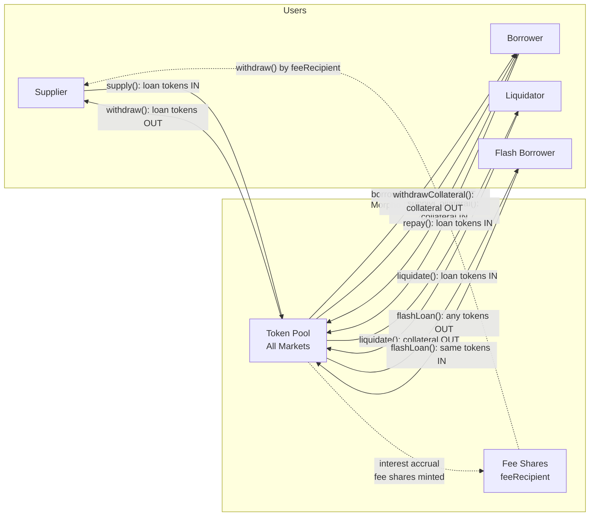

# Morpho Blue -- Security Overview

## What is Morpho Blue?

Morpho Blue is a minimalist, singleton lending protocol implemented as a single Solidity contract (`Morpho.sol`). It enables permissionless creation of isolated lending markets, each defined by a unique tuple of five parameters: loan token, collateral token, oracle, interest rate model (IRM), and liquidation loan-to-value ratio (LLTV). There is no cross-collateralization between markets. The protocol is deployed as a single immutable contract with no upgradeability pattern.

---

## Core Mechanics

1. **Isolated Markets**: Each market is identified by `keccak256(abi.encode(loanToken, collateralToken, oracle, irm, lltv))`. Markets are independent -- positions in one market cannot affect positions in another.

2. **Supply/Borrow with Shares**: Lenders deposit loan tokens and receive supply shares. Borrowers post collateral and take on borrow shares representing debt. Share-to-asset conversion rates change as interest accrues.

3. **Interest Accrual**: Interest compounds continuously using a 3-term Taylor expansion of `e^(rate * time) - 1`. The borrow rate is fetched from the market's IRM contract. Interest increases both `totalBorrowAssets` and `totalSupplyAssets` simultaneously.

4. **Health Checks**: A position is healthy when `collateral * oraclePrice * lltv >= borrowedAssets` (with rounding in protocol's favor). Health is checked after borrow, withdraw-collateral, and as a precondition for liquidation.

5. **Liquidation**: Unhealthy positions can be liquidated by anyone. The liquidator repays debt and seizes collateral at a discount determined by the Liquidation Incentive Factor (LIF). If collateral reaches zero with remaining debt, bad debt is socialized to suppliers.

6. **Flash Loans**: Free (no-fee) flash loans for any token held by the contract, requiring atomic repayment within the same transaction.

7. **Authorization**: Users can authorize other addresses to manage their positions (withdraw, borrow, withdraw-collateral). Supports both direct calls and EIP-712 signatures.

---

## Architecture

```mermaid
graph TB
    subgraph "Morpho Blue Singleton"
        M[Morpho.sol]
        subgraph "Core Libraries"
            ML[MathLib]
            SML[SharesMathLib]
            UL[UtilsLib]
            STL[SafeTransferLib]
            MPL[MarketParamsLib]
            CL[ConstantsLib]
            EL[ErrorsLib]
            EVL[EventsLib]
        end
        subgraph "Periphery Libraries"
            MLib[MorphoLib]
            MBL[MorphoBalancesLib]
            MSL[MorphoStorageLib]
        end
    end

    subgraph "External Dependencies"
        IRM[IRM Contract]
        ORC[Oracle Contract]
        LT[Loan Token ERC20]
        CT[Collateral Token ERC20]
    end

    subgraph "Callback Callers"
        SUP[Supply Callback]
        REP[Repay Callback]
        SCC[SupplyCollateral Callback]
        LIQ[Liquidate Callback]
        FL[FlashLoan Callback]
    end

    M --> ML
    M --> SML
    M --> UL
    M --> STL
    M --> MPL
    M --> CL
    M --> EL
    M --> EVL

    M -- "borrowRate()" --> IRM
    M -- "price()" --> ORC
    M -- "transfer/transferFrom" --> LT
    M -- "transfer/transferFrom" --> CT

    SUP -- "onMorphoSupply()" --> M
    REP -- "onMorphoRepay()" --> M
    SCC -- "onMorphoSupplyCollateral()" --> M
    LIQ -- "onMorphoLiquidate()" --> M
    FL -- "onMorphoFlashLoan()" --> M

    MLib -- "extSloads()" --> M
    MBL -- "extSloads()" --> M
```

---

## Entry Points with Risk Levels

| Function | Signature | Auth | Risk | Rationale |
|----------|-----------|------|------|-----------|
| `supply` | `supply(MarketParams,uint256,uint256,address,bytes)` | None | **HIGH** | Value transfer in (loan tokens), callback to msg.sender, state modification of positions and market totals |
| `withdraw` | `withdraw(MarketParams,uint256,uint256,address,address)` | Authorized | **HIGH** | Value transfer out (loan tokens), modifies positions, liquidity constraint check |
| `borrow` | `borrow(MarketParams,uint256,uint256,address,address)` | Authorized | **HIGH** | Value transfer out (loan tokens), creates debt, oracle call for health check, liquidity constraint |
| `repay` | `repay(MarketParams,uint256,uint256,address,bytes)` | None | **HIGH** | Value transfer in (loan tokens), callback to msg.sender, modifies debt positions |
| `supplyCollateral` | `supplyCollateral(MarketParams,uint256,address,bytes)` | None | **HIGH** | Value transfer in (collateral tokens), callback to msg.sender |
| `withdrawCollateral` | `withdrawCollateral(MarketParams,uint256,address,address)` | Authorized | **HIGH** | Value transfer out (collateral tokens), oracle call for health check |
| `liquidate` | `liquidate(MarketParams,address,uint256,uint256,bytes)` | None | **HIGH** | Value transfers both directions, oracle call, callback, bad debt socialization, complex math |
| `flashLoan` | `flashLoan(address,uint256,bytes)` | None | **HIGH** | Value transfer out/in of arbitrary tokens, mandatory callback, access to all contract balances |
| `createMarket` | `createMarket(MarketParams)` | None | **MEDIUM** | State modification (new market), external IRM call for initialization |
| `setFee` | `setFee(MarketParams,uint256)` | Owner | **MEDIUM** | Modifies fee parameter, triggers interest accrual, IRM external call |
| `setAuthorization` | `setAuthorization(address,bool)` | None | **MEDIUM** | Modifies authorization state, enables third-party position management |
| `setAuthorizationWithSig` | `setAuthorizationWithSig(Authorization,Signature)` | None | **MEDIUM** | EIP-712 signature verification, nonce management, authorization state change |
| `accrueInterest` | `accrueInterest(MarketParams)` | None | **MEDIUM** | External IRM call, modifies market totals and fee recipient shares |
| `setOwner` | `setOwner(address)` | Owner | **MEDIUM** | Ownership transfer, gated by onlyOwner |
| `enableIrm` | `enableIrm(address)` | Owner | **MEDIUM** | Permanently enables an IRM, cannot be undone |
| `enableLltv` | `enableLltv(uint256)` | Owner | **MEDIUM** | Permanently enables an LLTV, cannot be undone |
| `setFeeRecipient` | `setFeeRecipient(address)` | Owner | **LOW** | Simple admin setter, no external calls |
| `extSloads` | `extSloads(bytes32[])` | None | **LOW** | View-only, reads arbitrary storage slots |

---

## Trust Assumptions

1. **Oracle**: The oracle contract (`IOracle`) is fully trusted for price accuracy. A compromised or manipulated oracle can enable under-collateralized borrowing, prevent legitimate liquidations, or allow unfair liquidations. Each market has exactly one oracle -- there is no fallback.

2. **Interest Rate Model**: The IRM contract (`IIrm`) is trusted to return reasonable borrow rates. A malicious IRM could return extreme rates (causing overflow or draining suppliers), or revert to DOS the protocol. The `borrowRate()` function is non-view (stateful), meaning the IRM can modify its own state on each call.

3. **ERC20 Tokens**: Loan and collateral tokens are assumed to be standard ERC20 implementations. Fee-on-transfer tokens will cause accounting mismatches (contract records more assets than it holds). Rebasing tokens are incompatible. Tokens must have deployed code (EOA check in SafeTransferLib).

4. **Owner**: The contract owner can enable IRMs and LLTVs (permanently, cannot be disabled), set fees (up to 25%), set the fee recipient, and transfer ownership. The owner is a single address with no timelock, multisig requirement, or two-step transfer at the contract level.

5. **Callback Callers**: Callbacks are sent to `msg.sender` (not an arbitrary address). The protocol assumes state is finalized before callbacks execute. Reentrancy safety relies on CEI pattern, not reentrancy locks.

---

## External Dependencies

| Dependency | Interface | Call Sites | Trust Level |
|------------|-----------|------------|-------------|
| Oracle | `IOracle.price()` | `borrow`, `withdrawCollateral`, `liquidate`, `_isHealthy` | Critical -- single source of price truth per market |
| IRM | `IIrm.borrowRate()` | `_accrueInterest`, `createMarket` | Critical -- determines interest rates, stateful call |
| Loan Token | `IERC20.transfer/transferFrom` | `supply`, `withdraw`, `borrow`, `repay`, `liquidate`, `flashLoan` | High -- must be standard ERC20 |
| Collateral Token | `IERC20.transfer/transferFrom` | `supplyCollateral`, `withdrawCollateral`, `liquidate` | High -- must be standard ERC20 |
| Callback (msg.sender) | `IMorpho*Callback.onMorpho*()` | `supply`, `repay`, `supplyCollateral`, `liquidate`, `flashLoan` | Medium -- callback to caller, state already committed |

---

## Critical State Variables

| Variable | Type | Description | Modified By |
|----------|------|-------------|-------------|
| `owner` | `address` | Contract administrator | `constructor`, `setOwner` |
| `feeRecipient` | `address` | Receives protocol fee shares | `setFeeRecipient` |
| `market[id].totalSupplyAssets` | `uint128` | Total loan tokens supplied to market | `supply`, `withdraw`, `_accrueInterest`, `liquidate` (bad debt) |
| `market[id].totalSupplyShares` | `uint128` | Total supply shares outstanding | `supply`, `withdraw`, `_accrueInterest` (fee shares) |
| `market[id].totalBorrowAssets` | `uint128` | Total loan tokens borrowed from market | `borrow`, `repay`, `_accrueInterest`, `liquidate` |
| `market[id].totalBorrowShares` | `uint128` | Total borrow shares outstanding | `borrow`, `repay`, `liquidate` |
| `market[id].lastUpdate` | `uint128` | Timestamp of last interest accrual | `createMarket`, `_accrueInterest` |
| `market[id].fee` | `uint128` | Protocol fee as WAD fraction of interest | `setFee` |
| `position[id][user].supplyShares` | `uint256` | User's supply share balance | `supply`, `withdraw`, `_accrueInterest` (fee recipient) |
| `position[id][user].borrowShares` | `uint128` | User's borrow share balance | `borrow`, `repay`, `liquidate` |
| `position[id][user].collateral` | `uint128` | User's collateral balance | `supplyCollateral`, `withdrawCollateral`, `liquidate` |
| `isAuthorized[owner][manager]` | `bool` | Position management authorization | `setAuthorization`, `setAuthorizationWithSig` |
| `nonce[authorizer]` | `uint256` | EIP-712 replay protection counter | `setAuthorizationWithSig` |
| `isIrmEnabled[irm]` | `bool` | IRM whitelist (permanent once set) | `enableIrm` |
| `isLltvEnabled[lltv]` | `bool` | LLTV whitelist (permanent once set) | `enableLltv` |

---

## Value Flows

---

## Privileged Roles

### Owner

The `owner` address has exclusive access to the following functions:

| Function | Capability | Irreversible? |
|----------|-----------|---------------|
| `setOwner` | Transfer ownership to any address (including `address(0)`) | Yes -- no two-step transfer |
| `enableIrm` | Whitelist an IRM address for market creation | Yes -- cannot disable |
| `enableLltv` | Whitelist an LLTV value for market creation | Yes -- cannot disable |
| `setFee` | Set protocol fee (0 to 25%) for any market | No -- can be changed |
| `setFeeRecipient` | Set the address receiving fee shares | No -- can be changed |

### Authorized Managers

Users can authorize other addresses via `setAuthorization` or `setAuthorizationWithSig`. Authorized managers can:
- `withdraw` supply on behalf of the authorizer
- `borrow` on behalf of the authorizer (creating debt)
- `withdrawCollateral` on behalf of the authorizer

Authorization is global (all markets) and binary (full access or none). There is no per-market or per-function granularity.

---

## Key Invariants

### Solvency

- **[INFERRED]** `totalBorrowAssets <= totalSupplyAssets` for every market at all times. Reasoning: enforced by explicit `require` checks in `withdraw` and `borrow`. The only exception path is bad debt socialization in `liquidate`, which reduces both by equal amounts simultaneously.

- **[DOCUMENTED]** Virtual shares prevent share inflation attacks. Source: SharesMathLib NatSpec -- `"This implementation mitigates share price manipulations (inflation attacks)"` and `"Uses OpenZeppelin's method of virtual shares"`. VIRTUAL_SHARES = 1e6, VIRTUAL_ASSETS = 1.

### Health

- **[INFERRED]** After every `borrow` and `withdrawCollateral`, the affected position must satisfy `collateral * oraclePrice / 1e36 * lltv >= borrowedAssets`. Reasoning: both functions call `_isHealthy()` after state mutation and revert on failure.

- **[INFERRED]** A position with `borrowShares == 0` is always considered healthy regardless of collateral. Reasoning: `_isHealthy(3-param)` returns `true` immediately if `borrowShares == 0`, skipping the oracle call.

### Interest Accrual

- **[INFERRED]** Interest accrual increases `totalBorrowAssets` and `totalSupplyAssets` by the same amount. Reasoning: in `_accrueInterest`, the same `interest` value is added to both: `market[id].totalBorrowAssets += interest.toUint128()` and `market[id].totalSupplyAssets += interest.toUint128()`.

- **[INFERRED]** Interest accrual is idempotent within a single block. Reasoning: `_accrueInterest` returns early if `elapsed == 0`, and sets `lastUpdate = block.timestamp` at the end.

### Authorization

- **[DOCUMENTED]** EIP-712 nonces are strictly sequential. Source: code requires `authorization.nonce == nonce[authorization.authorizer]++` (ErrorsLib.INVALID_NONCE).

- **[INFERRED]** Self-authorization is always implicit. Reasoning: `_isSenderAuthorized` returns `true` when `msg.sender == onBehalf`, bypassing the `isAuthorized` mapping.

### Rounding

- **[DOCUMENTED]** All share conversions round in favor of the protocol. Source: Morpho.sol contract-level NatSpec -- `"Supply: assets->shares DOWN, shares->assets UP (user pays more)"`, `"Withdraw: assets->shares UP, shares->assets DOWN (user gets less)"`, `"Borrow: assets->shares UP, shares->assets DOWN"`, `"Health: borrowed UP, maxBorrow DOWN (harder to pass health check)"`.

### Market Immutability

- **[INFERRED]** Once created, a market's parameters cannot be changed and the market cannot be recreated. Reasoning: `createMarket` requires `market[id].lastUpdate == 0` and sets it to `block.timestamp`, making subsequent creation attempts fail.

---

## Attack Surface

### Oracle Manipulation
- **Impact**: Critical. Manipulated oracle prices can enable under-collateralized borrowing, prevent liquidations, or trigger unfair liquidations.
- **Entry Points**: `borrow`, `withdrawCollateral`, `liquidate` (all call `IOracle.price()`).
- **Mitigation**: Oracle selection is per-market at creation time. No on-chain oracle manipulation protection within Morpho itself.

### Callback Reentrancy
- **Impact**: Medium. Five functions issue callbacks to `msg.sender` before the final token transfer.
- **Entry Points**: `supply` (onMorphoSupply), `repay` (onMorphoRepay), `supplyCollateral` (onMorphoSupplyCollateral), `liquidate` (onMorphoLiquidate), `flashLoan` (onMorphoFlashLoan).
- **Mitigation**: CEI pattern -- all state is finalized before callbacks. However, cross-function reentrancy scenarios should be carefully reviewed since there is no reentrancy guard.

### Flash Loan Token Access
- **Impact**: Medium. `flashLoan` can borrow ANY token held by the contract, not just tokens belonging to a specific market. This includes collateral tokens from all markets and any tokens accidentally sent to the contract.
- **Mitigation**: Atomic repayment required in same transaction. `safeTransferFrom` at the end ensures tokens are returned.

### IRM Denial of Service
- **Impact**: High. If an enabled IRM reverts on `borrowRate()`, all operations requiring interest accrual on affected markets are blocked (supply, withdraw, borrow, repay, withdrawCollateral, liquidate).
- **Mitigation**: Owner should only enable trusted IRM implementations. IRM cannot be disabled once enabled.

### Bad Debt Socialization
- **Impact**: Medium. When a liquidated position has zero collateral remaining but outstanding debt, the bad debt reduces `totalSupplyAssets`, diluting all suppliers' positions.
- **Entry Point**: `liquidate` -- bad debt handling block.
- **Mitigation**: Design choice. Liquidation incentives are meant to prevent positions from reaching this state.

### EIP-712 Signature Replay
- **Impact**: Low. Mitigated by sequential nonces, chain-specific domain separator, and deadline enforcement.
- **Considerations**: Nonces are strictly sequential (no out-of-order execution). Cross-chain replay is prevented by DOMAIN_SEPARATOR including chainId.

### Fee-on-Transfer / Rebasing Tokens
- **Impact**: High if used. The protocol tracks assets via internal accounting, not actual balances. Fee-on-transfer tokens would cause the contract to believe it holds more tokens than it does, eventually making some withdrawals/borrows fail.
- **Mitigation**: None at contract level. Users/integrators must avoid creating markets with non-standard tokens.

---

## Known Edge Cases

1. **Zero-Address IRM**: Setting `irm = address(0)` creates a 0% APR market. `_accrueInterest` skips the IRM call entirely. `createMarket` also skips initialization. This is intentional behavior.

2. **Zero-Address Fee Recipient**: If `feeRecipient == address(0)`, fee shares are minted to `address(0)`. These shares are effectively burned -- they increase `totalSupplyShares` but the assets backing them are inaccessible.

3. **Rounding to Zero**: Very small operations (e.g., supplying 1 wei of assets to a market with high total supply) can result in 0 shares due to rounding down. The caller receives nothing for their deposit.

4. **zeroFloorSub in Repay/Liquidate**: `market[id].totalBorrowAssets` uses `zeroFloorSub` instead of direct subtraction because rounding can cause `repaidAssets` to exceed `totalBorrowAssets` by 1 wei. Without this, the operation would revert on underflow.

5. **Taylor Approximation Accuracy**: The 3-term Taylor expansion underestimates `e^(rt) - 1` for large `r * t` values. At very high interest rates or long accrual gaps, accrued interest will be slightly less than the true continuous compounding amount.

6. **uint128 Overflow**: All market totals and position values (except `supplyShares` which is `uint256`) use `uint128`. The `toUint128()` call reverts if a value exceeds `~3.4e38`. For tokens with 18 decimals, this is ~3.4e20 tokens.

7. **Ownership Transfer to Zero**: `setOwner` does not prevent setting owner to `address(0)`. This permanently disables all owner functions (enableIrm, enableLltv, setFee, setFeeRecipient, setOwner). Existing markets continue to function.

8. **Liquidation Incentive Calculation**: The LIF is computed as `min(1.15e18, WAD / (WAD - LIQUIDATION_CURSOR * (WAD - lltv)))`. At very low LLTVs, the raw formula would produce values > 1.15, so the cap applies. At high LLTVs (e.g., 0.98), the incentive is very small (~0.6%).

9. **Market Creation Oracle/Token Validation**: `createMarket` does not validate that the oracle, loan token, or collateral token addresses contain code or are functional. Markets can be created with non-functional parameters.

10. **Callback Data Length Check**: Callbacks are only invoked if `data.length > 0`. If `data` is empty, no callback occurs. For `flashLoan`, the callback is always invoked (no data length check).

---

## Quick Reference

### Constants

| Name | Value | Description |
|------|-------|-------------|
| `WAD` | `1e18` | Standard precision unit for fixed-point math |
| `MAX_FEE` | `0.25e18` (25%) | Maximum protocol fee as fraction of interest |
| `ORACLE_PRICE_SCALE` | `1e36` | Oracle price denominator |
| `LIQUIDATION_CURSOR` | `0.3e18` (30%) | Controls liquidation incentive curve |
| `MAX_LIQUIDATION_INCENTIVE_FACTOR` | `1.15e18` (115%) | Cap on liquidation bonus |
| `VIRTUAL_SHARES` | `1e6` | Virtual shares for inflation attack prevention |
| `VIRTUAL_ASSETS` | `1` | Virtual assets for inflation attack prevention |

### Storage Layout (Slot Indices)

| Slot | Variable |
|------|----------|
| 0 | `owner` |
| 1 | `feeRecipient` |
| 2 | `position` (mapping) |
| 3 | `market` (mapping) |
| 4 | `isIrmEnabled` (mapping) |
| 5 | `isLltvEnabled` (mapping) |
| 6 | `isAuthorized` (mapping) |
| 7 | `nonce` (mapping) |
| 8 | `idToMarketParams` (mapping) |

### Type Bounds

| Type | Field | Max Value |
|------|-------|-----------|
| `uint128` | totalSupplyAssets, totalBorrowAssets, totalSupplyShares, totalBorrowShares, borrowShares, collateral, lastUpdate, fee | ~3.4e38 |
| `uint256` | supplyShares | ~1.16e77 |

### Rounding Direction Summary

| Operation | Asset/Share Direction | Rounding | Favors |
|-----------|----------------------|----------|--------|
| Supply (assets given) | assets -> shares | Down | Protocol |
| Supply (shares given) | shares -> assets | Up | Protocol |
| Withdraw (assets given) | assets -> shares | Up | Protocol |
| Withdraw (shares given) | shares -> assets | Down | Protocol |
| Borrow (assets given) | assets -> shares | Up | Protocol |
| Borrow (shares given) | shares -> assets | Down | Protocol |
| Repay (assets given) | assets -> shares | Down | Borrower (marginal) |
| Repay (shares given) | shares -> assets | Up | Protocol |
| Health check (borrowed) | shares -> assets | Up | Protocol |
| Health check (maxBorrow) | collateral * price * lltv | Down | Protocol |
| Liquidation (seizedAssets given) | repaidShares | Up | Protocol |
| Liquidation (repaidShares given) | seizedAssets | Down | Protocol |
| Fee shares | fee amount -> shares | Down | Suppliers |
